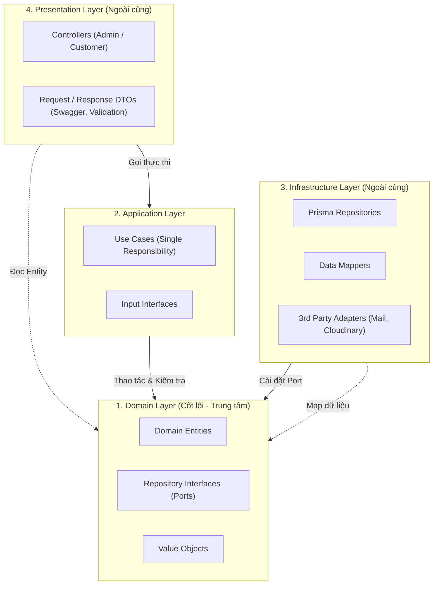
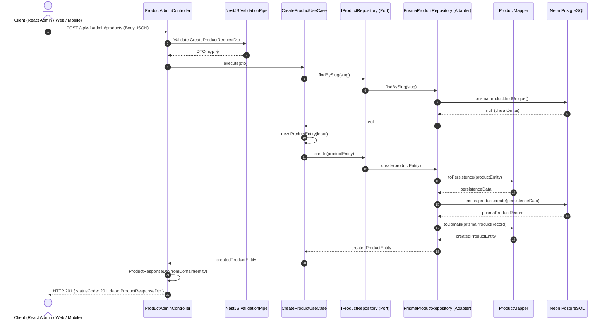

# Hướng Dẫn Kiến Trúc Clean Architecture — GlowUp Backend

> **Tài liệu nội bộ dành cho đội ngũ phát triển GlowUp Backend (PBL6)**  
> **Áp dụng cho:** NestJS 10, Prisma 6.4, PostgreSQL 17 (Neon Database)  
> **Module mẫu chuẩn (Golden Template):** `src/modules/products/`

---

## Mục Lục
1. [Tại sao dự án dùng Clean Architecture?](#1-tại-sao-dự-án-dùng-clean-architecture)
2. [Nguyên tắc cốt lõi: The Dependency Rule](#2-nguyên-tắc-cốt-lõi-the-dependency-rule)
3. [Cấu trúc 4 phân lớp (Deep Dive)](#3-cấu-trúc-4-phân-lớp-deep-dive)
   - [Lớp 1: Domain Layer (Cốt lõi nghiệp vụ)](#31-lớp-1-domain-layer-cốt-lõi-nghiệp-vụ)
   - [Lớp 2: Application Layer (Kịch bản nghiệp vụ / Use Cases)](#32-lớp-2-application-layer-kịch-bản-nghiệp-vụ--use-cases)
   - [Lớp 3: Infrastructure Layer (Kết nối CSDL & Bên ngoài)](#33-lớp-3-infrastructure-layer-kết-nối-csdl--bên-ngoài)
   - [Lớp 4: Presentation Layer (HTTP Controllers & DTOs)](#34-lớp-4-presentation-layer-http-controllers--dtos)
4. [Luồng hoạt động thực tế (End-to-End Request Flow)](#4-luồng-hoạt-động-thực-tế-end-to-end-request-flow)
5. [Cơ chế Đảo ngược phụ thuộc (Dependency Inversion) với NestJS](#5-cơ-chế-đảo-ngược-phụ-thuộc-dependency-inversion-với-nestjs)
6. [Hướng dẫn từng bước: Làm một Module mới](#6-hướng-dẫn-từng-bước-làm-một-module-mới)
7. [Những "Bẫy" sai lầm thường gặp (Anti-Patterns)](#7-những-bẫy-sai-lầm-thường-gặp-anti-patterns)
8. [Quy ước đặt tên (Naming Conventions)](#8-quy-ước-đặt-tên-naming-conventions)
9. [Checklist kiểm tra trước khi tạo Pull Request (PR Checklist)](#9-checklist-kiểm-tra-trước-khi-tạo-pull-request-pr-checklist)

---

## 1. Tại sao dự án dùng Clean Architecture?

Trong các đồ án trước đây, chúng ta thường làm theo mô hình 3 tầng truyền thống:
```
Controller ──> Service ──> Database (Prisma / TypeORM)
```
Mô hình này nhanh lúc đầu, nhưng khi hệ thống lớn lên (GlowUp có tới 62 bảng CSDL, 12 phân hệ), Service sẽ phình to hàng ngàn dòng, logic nghiệp vụ bị gắn chặt vào thư viện Prisma và NestJS, khiến:
- Không thể tái sử dụng logic giữa API Customer và API Admin.
- Rất khó viết Unit Test vì tầng nào cũng dính database.
- Đổi ORM hoặc sửa schema CSDL là phải sửa từ dưới lên trên tận Controller.

**Giải pháp Clean Architecture:**
Chia code thành các vòng tròn đồng tâm, tách biệt ranh giới rõ ràng. Nghiệp vụ kinh doanh của hệ thống GlowUp (tính giá, khuyến mãi, trừ kho, tính điểm thưởng) là **độc lập hoàn toàn** với NestJS, Prisma hay PostgreSQL.

---

## 2. Nguyên tắc cốt lõi: The Dependency Rule

> [!IMPORTANT]
> **Quy tắc vàng:** Chiều phụ thuộc của mã nguồn **CHỈ ĐƯỢC PHÉP ĐI TỪ NGOÀI VÀO TRONG**.  
> Tầng bên trong TUYỆT ĐỐI KHÔNG ĐƯỢC BIẾT gì về tầng bên ngoài.



- **Domain** nằm ở trung tâm: Không phụ thuộc bất kỳ ai (`nestjs`, `prisma`, `axios`...).
- **Application** phụ thuộc **Domain**.
- **Infrastructure** phụ thuộc **Domain** (cài đặt các Interface do Domain định nghĩa).
- **Presentation** phụ thuộc **Application** (để gọi Use Case) và **Domain** (để đọc dữ liệu Entity).

---

## 3. Cấu trúc 4 phân lớp (Deep Dive)

Mỗi module nằm trong `src/modules/<module-name>/` và có cấu trúc thư mục như sau:

```
src/modules/products/
├── domain/                         # LỚP 1: Cốt lõi nghiệp vụ
│   ├── entities/                   # Thực thể nghiệp vụ thuần TypeScript
│   │   └── product.entity.ts
│   └── repositories/               # Interface (Port) & Symbol Token cho DI
│       └── product.repository.interface.ts
│
├── application/                    # LỚP 2: Kịch bản ứng dụng
│   └── use-cases/                  # Mỗi file 1 Use Case duy nhất
│       ├── create-product.use-case.ts
│       ├── delete-product.use-case.ts
│       ├── get-product-detail.use-case.ts
│       └── get-products.use-case.ts
│
├── infrastructure/                 # LỚP 3: Cài đặt kỹ thuật & CSDL
│   ├── mappers/                    # Chuyển đổi Prisma Record <-> Domain Entity
│   │   └── product.mapper.ts
│   └── persistence/                # Cài đặt Repository bằng Prisma
│       └── prisma-product.repository.ts
│
├── presentation/                   # LỚP 4: Giao tiếp Client & HTTP
│   ├── controllers/                # Phân chia: Customer & Admin
│   │   ├── product-customer.controller.ts
│   │   └── product-admin.controller.ts
│   └── dtos/                       # DTOs cho Swagger & Validation
│       ├── create-product-request.dto.ts
│       └── product-response.dto.ts
│
└── products.module.ts              # Wire DI: ghép Use Cases và Repository
```

---

### 3.1 Lớp 1: Domain Layer (Cốt lõi nghiệp vụ)

**Vị trí:** `src/modules/<name>/domain/`  
**Nhiệm vụ:** Định nghĩa thực thể nghiệp vụ và hợp đồng truy xuất dữ liệu (Repository Interface).

#### 1. Entity (`domain/entities/product.entity.ts`)
- Là class TypeScript thuần túy đại diện cho khái niệm kinh doanh.
- Chứa thuộc tính và các **phương thức thay đổi trạng thái theo luật nghiệp vụ** (ví dụ: `activate()`, `deactivate()`, `updateBasicInfo()`).
- **Không dùng decorator** của Prisma hay Swagger ở đây.

```typescript
export class ProductEntity {
  id: string;
  name: string;
  slug: string;
  basePrice: number;
  isActive: boolean;
  // ...

  constructor(partial: Partial<ProductEntity>) {
    Object.assign(this, partial);
    if (this.isActive === undefined) this.isActive = true;
  }

  // Phương thức nghiệp vụ
  deactivate(): void {
    this.isActive = false;
  }

  activate(): void {
    this.isActive = true;
  }
}
```

#### 2. Repository Interface (`domain/repositories/product.repository.interface.ts`)
- Định nghĩa **hợp đồng (Port)**: Cần những thao tác gì với dữ liệu mà không quan tâm dữ liệu lưu ở đâu (PostgreSQL, MySQL hay In-Memory).
- Định nghĩa luôn `Symbol` token để NestJS Inject:

```typescript
export const PRODUCT_REPOSITORY = Symbol('PRODUCT_REPOSITORY');

export interface IProductRepository {
  findById(id: string): Promise<ProductEntity | null>;
  findBySlug(slug: string): Promise<ProductEntity | null>;
  findMany(params: { skip?: number; take?: number; search?: string }): Promise<{ items: ProductEntity[]; total: number }>;
  create(product: ProductEntity): Promise<ProductEntity>;
  update(id: string, product: Partial<ProductEntity>): Promise<ProductEntity>;
  delete(id: string): Promise<void>;
}
```

---

### 3.2 Lớp 2: Application Layer (Kịch bản nghiệp vụ / Use Cases)

**Vị trí:** `src/modules/<name>/application/`  
**Nhiệm vụ:** Điều phối luồng xử lý nghiệp vụ cho từng hành động cụ thể (Single Responsibility Principle).

- Mỗi hành động là 1 class riêng: `CreateProductUseCase`, `GetProductDetailUseCase`, `DeleteProductUseCase`...
- Nhận input qua `Interface` thuần túy (không dính dáng tới `@Body()` hay Swagger).
- Sử dụng `@Inject(PRODUCT_REPOSITORY)` để lấy repository thông qua Interface.
- Trả về `ProductEntity` hoặc kiểu dữ liệu Domain, **không trả về HTTP DTO**.

```typescript
// src/modules/products/application/use-cases/create-product.use-case.ts
export interface CreateProductInput {
  categoryId: string;
  brandId?: string;
  name: string;
  slug: string;
  sku: string;
  basePrice: number;
  description?: string;
}

@Injectable()
export class CreateProductUseCase {
  constructor(
    @Inject(PRODUCT_REPOSITORY)
    private readonly productRepository: IProductRepository,
  ) {}

  async execute(input: CreateProductInput): Promise<ProductEntity> {
    // 1. Kiểm tra nghiệp vụ: slug đã tồn tại chưa?
    const existing = await this.productRepository.findBySlug(input.slug);
    if (existing) {
      throw new ConflictException(`Sản phẩm với slug '${input.slug}' đã tồn tại.`);
    }

    // 2. Khởi tạo Entity
    const entity = new ProductEntity({ ...input });

    // 3. Lưu xuống repository
    return this.productRepository.create(entity);
  }
}
```

---

### 3.3 Lớp 3: Infrastructure Layer (Kết nối CSDL & Bên ngoài)

**Vị trí:** `src/modules/<name>/infrastructure/`  
**Nhiệm vụ:** Cài đặt thực tế các Repository Port bằng Prisma ORM và thực hiện chuyển đổi dữ liệu.

#### 1. Data Mapper (`infrastructure/mappers/product.mapper.ts`)
- **Tại sao cần Mapper?** Vì kiểu dữ liệu trong DB (Prisma) và kiểu dữ liệu nghiệp vụ (Domain Entity) không giống nhau 100%:
  - Prisma dùng `Decimal` cho giá tiền, Domain Entity dùng `number`.
  - Prisma lưu JSON thô, Domain Entity tổ chức theo object rõ ràng.
- Mapper chịu trách nhiệm chuyển đổi 2 chiều:
  - `toDomain(prismaRecord)`: Prisma Model ➔ `ProductEntity`
  - `toPersistence(domainEntity)`: `ProductEntity` ➔ Dữ liệu chuẩn để Prisma lưu

```typescript
export class ProductMapper {
  static toDomain(raw: ProductWithRelations): ProductEntity {
    return new ProductEntity({
      id: raw.id,
      name: raw.name,
      slug: raw.slug,
      basePrice: Number(raw.basePrice), // Decimal -> number
      isActive: raw.isActive,
      category: raw.category ? { id: raw.category.id, name: raw.category.name } : undefined,
    });
  }

  static toPersistence(entity: ProductEntity): ProductPersistenceData {
    return {
      categoryId: entity.categoryId,
      name: entity.name,
      slug: entity.slug,
      basePrice: entity.basePrice,
      isActive: entity.isActive,
    };
  }
}
```

#### 2. Prisma Repository (`infrastructure/persistence/prisma-product.repository.ts`)
- `implements IProductRepository` (tuân thủ hợp đồng ở Domain).
- Inject `PrismaService` để truy vấn CSDL PostgreSQL.
- Gọi `ProductMapper` trước khi trả kết quả ra ngoài.

```typescript
@Injectable()
export class PrismaProductRepository implements IProductRepository {
  constructor(private readonly prisma: PrismaService) {}

  async findById(id: string): Promise<ProductEntity | null> {
    const raw = await this.prisma.product.findUnique({
      where: { id },
      include: { category: true, brand: true },
    });
    return raw ? ProductMapper.toDomain(raw) : null;
  }

  async create(entity: ProductEntity): Promise<ProductEntity> {
    const data = ProductMapper.toPersistence(entity);
    const created = await this.prisma.product.create({ data, include: { category: true } });
    return ProductMapper.toDomain(created);
  }
}
```

---

### 3.4 Lớp 4: Presentation Layer (HTTP Controllers & DTOs)

**Vị trí:** `src/modules/<name>/presentation/`  
**Nhiệm vụ:** Tiếp nhận HTTP Request từ Client, validate dữ liệu, gọi Use Case, và format dữ liệu trả về cho Client.

#### 1. Phân chia Controllers theo vai trò người dùng
Dự án GlowUp phân định rõ ràng:
- `product-customer.controller.ts` (Việt Trung): Các API public, xem danh mục, tìm kiếm cho Web và Mobile. Route: `/api/v1/products/...`
- `product-admin.controller.ts` (Thành Lập): Các API thêm/sửa/xóa, quản lý kho cho Dashboard Admin. Route: `/api/v1/admin/products/...`

> [!CAUTION]
> **Controller KHÔNG ĐƯỢC inject Repository trực tiếp!**  
> Controller chỉ được phép inject và gọi các **Use Cases**. Mọi nghiệp vụ phải nằm trong Use Case.

#### 2. DTOs (Data Transfer Objects)
- **Request DTO (`create-product-request.dto.ts`):** Chứa validation (`@IsNotEmpty()`, `@Min()`, `@IsUUID()`) và Swagger metadata (`@ApiProperty()`).
- **Response DTO (`product-response.dto.ts`):** Định nghĩa cấu trúc JSON trả về Client, kèm hàm static `fromDomain(entity: ProductEntity)`.

```typescript
// Controller gọi Use Case và map kết quả trả về
@Post()
@ApiOperation({ summary: 'Admin - Thêm mới sản phẩm' })
async createProduct(@Body() dto: CreateProductRequestDto) {
  // 1. Gọi Use Case
  const productEntity = await this.createProductUseCase.execute(dto);

  // 2. Map Entity -> Response DTO để trả về Client
  return ProductResponseDto.fromDomain(productEntity);
}
```

---

## 4. Luồng hoạt động thực tế (End-to-End Request Flow)

Khi một Admin gửi request tạo sản phẩm: `POST /api/v1/admin/products`



### Giải thích 10 chặng:
1. **Client** gửi HTTP Request với body JSON.
2. **NestJS ValidationPipe** tự động kiểm tra kiểu dữ liệu và ràng buộc qua `class-validator`.
3. **Controller** nhận DTO đã validate, chuyển tiếp dữ liệu vào `CreateProductUseCase.execute()`.
4. **Use Case** thực hiện logic nghiệp vụ: kiểm tra trùng slug bằng cách gọi Repository Port.
5. **Repository Adapter** gọi database qua Prisma.
6. Khi kiểm tra hợp lệ, **Use Case** tạo instance `ProductEntity` và ra lệnh lưu.
7. **Prisma Repository** dùng `ProductMapper.toPersistence()` để chuyển Entity thành format Prisma hiểu được, rồi lưu vào PostgreSQL.
8. **Prisma** trả về record thô, Repository dùng `ProductMapper.toDomain()` để bọc lại thành `ProductEntity`.
9. **Use Case** nhận Entity từ Repository và trả về cho Controller.
10. **Controller** dùng `ProductResponseDto.fromDomain(entity)` để format dữ liệu đầu ra chuẩn cho Client.

---

## 5. Cơ chế Đảo ngược phụ thuộc (Dependency Inversion) với NestJS

Tại sao Use Case lại không phụ thuộc vào `PrismaProductRepository`?

```typescript
// Trong Use Case: Chỉ phụ thuộc Interface (Domain)
constructor(
  @Inject(PRODUCT_REPOSITORY)
  private readonly productRepository: IProductRepository,
) {}
```

Bí quyết nằm ở file `<module-name>.module.ts`:

```typescript
// src/modules/products/products.module.ts
@Module({
  controllers: [ProductCustomerController, ProductAdminController],
  providers: [
    // 1. Khai báo các Use Cases
    GetProductsUseCase,
    GetProductDetailUseCase,
    CreateProductUseCase,
    DeleteProductUseCase,

    // 2. Ghép Interface Token với Adapter thực tế
    {
      provide: PRODUCT_REPOSITORY,
      useClass: PrismaProductRepository, // <-- Đổi CSDL chỉ cần đổi dòng này!
    },
  ],
  exports: [
    // Chỉ export các Use Cases cho module khác dùng
    GetProductsUseCase,
    GetProductDetailUseCase,
  ],
})
export class ProductsModule {}
```

Khi ứng dụng chạy, NestJS DI Container sẽ:
1. Thấy `CreateProductUseCase` cần một đối tượng có token `PRODUCT_REPOSITORY`.
2. Khởi tạo một instance của `PrismaProductRepository`.
3. Tự động tiêm (inject) instance đó vào constructor của `CreateProductUseCase`.

👉 **Lợi ích:** Khi viết Unit Test cho Use Case, bạn chỉ cần tạo một `MockProductRepository` (mảng in-memory) tiêm vào, không cần chạy Prisma hay kết nối database thật!

---

## 6. Hướng dẫn từng bước: Làm một Module mới

Giả sử bạn được giao làm module **Categories (Danh mục sản phẩm)** trong Sprint 1. Hãy làm theo 6 bước chuẩn sau:

### Bước 1: Tạo cấu trúc thư mục
Tạo các thư mục theo chuẩn:
```
src/modules/categories/
├── domain/
│   ├── entities/
│   └── repositories/
├── application/
│   └── use-cases/
├── infrastructure/
│   ├── mappers/
│   └── persistence/
└── presentation/
    ├── controllers/
    └── dtos/
```

### Bước 2: Viết Domain Layer (Cốt lõi trước)
1. **Entity:** `domain/entities/category.entity.ts`
   ```typescript
   export class CategoryEntity {
     id: string;
     name: string;
     slug: string;
     parentId?: string;
     isActive: boolean;

     constructor(partial: Partial<CategoryEntity>) {
       Object.assign(this, partial);
       if (this.isActive === undefined) this.isActive = true;
     }
   }
   ```
2. **Repository Port:** `domain/repositories/category.repository.interface.ts`
   ```typescript
   export const CATEGORY_REPOSITORY = Symbol('CATEGORY_REPOSITORY');

   export interface ICategoryRepository {
     findById(id: string): Promise<CategoryEntity | null>;
     findAll(): Promise<CategoryEntity[]>;
     create(category: CategoryEntity): Promise<CategoryEntity>;
   }
   ```

### Bước 3: Viết Infrastructure Layer (Database & Mapper)
1. **Mapper:** `infrastructure/mappers/category.mapper.ts` (Chuyển Prisma Category <-> CategoryEntity)
2. **Prisma Repository:** `infrastructure/persistence/prisma-category.repository.ts` (`implements ICategoryRepository`)

### Bước 4: Viết Application Layer (Use Cases)
Tạo từng file cho từng hành động:
- `application/use-cases/get-categories.use-case.ts`
- `application/use-cases/create-category.use-case.ts`

### Bước 5: Viết Presentation Layer (Controllers & DTOs)
1. **DTOs:**
   - `presentation/dtos/create-category-request.dto.ts` (Có class-validator & @ApiProperty)
   - `presentation/dtos/category-response.dto.ts` (Có `fromDomain()`)
2. **Controllers:**
   - `presentation/controllers/category-customer.controller.ts` (Xem danh mục cho khách)
   - `presentation/controllers/category-admin.controller.ts` (Thêm/Sửa/Xóa cho admin)

### Bước 6: Đăng ký trong Module & App
1. Tạo `categories.module.ts`, đăng ký Controller, Use Cases, và Repository provider.
2. Import `CategoriesModule` vào `src/app.module.ts`.
3. Chạy kiểm tra:
   ```bash
   npm run build
   # hoặc
   npx tsc --noEmit
   ```

---

## 7. Những "Bẫy" sai lầm thường gặp (Anti-Patterns)

Dưới đây là các lỗi dễ mắc phải nhất và cách tránh:

| ❌ Sai lầm (Anti-Pattern) | Hậu quả | ✅ Cách làm đúng |
| :--- | :--- | :--- |
| **Controller inject thẳng Repository**<br>`constructor(@Inject(REPO) private repo)` | Bỏ qua Use Case, logic bị phân mảnh, khó tái sử dụng giữa Admin & Customer. | **Controller chỉ inject Use Case**.<br>Mọi hành động dù đơn giản đều qua Use Case. |
| **Nhét Swagger `@ApiProperty` vào Application DTO** | Tầng Application bị dính chặt với HTTP framework (NestJS/Swagger). | Tách biệt: Request/Response DTO nằm ở `presentation/dtos/`. Input của Use Case là interface thuần. |
| **Dùng `any` trong Mapper**<br>`static toDomain(raw: any)` | Mất type safety. Sửa schema CSDL không báo lỗi lúc build, gây crash khi chạy. | Dùng type từ Prisma:<br>`Prisma.ProductGetPayload<{ include: ... }>` |
| **Domain Entity import Prisma** | Phá vỡ Dependency Rule (Domain bị phụ thuộc công nghệ bên ngoài). | Domain Entity **chỉ dùng TypeScript thuần**, không import Prisma hay NestJS. |
| **Export Repository ra ngoài Module**<br>`exports: [PRODUCT_REPOSITORY]` | Module khác có thể inject thẳng Repo và can thiệp trái phép vào CSDL. | **Chỉ export Use Case**.<br>Module khác muốn thao tác phải gọi Use Case. |
| **Use Case trả về HTTP Response DTO** | Tầng Application bị phụ thuộc ngược vào Presentation Layer. | Use Case luôn trả về `Entity` hoặc `Primitive type`. Controller tự map sang Response DTO. |

---

## 8. Quy ước đặt tên (Naming Conventions)

| Đối tượng | Quy ước đặt tên file | Quy ước tên Class / Symbol | Ví dụ |
| :--- | :--- | :--- | :--- |
| **Domain Entity** | `<singular>.entity.ts` | `<Name>Entity` | `product.entity.ts` ➔ `ProductEntity` |
| **Repository Port** | `<singular>.repository.interface.ts` | `I<Name>Repository`<br>`<NAME>_REPOSITORY` | `product.repository.interface.ts` ➔ `IProductRepository`, `PRODUCT_REPOSITORY` |
| **Use Case** | `<verb>-<noun>.use-case.ts` | `<Verb><Noun>UseCase` | `create-product.use-case.ts` ➔ `CreateProductUseCase` |
| **Mapper** | `<singular>.mapper.ts` | `<Name>Mapper` | `product.mapper.ts` ➔ `ProductMapper` |
| **Prisma Repository** | `prisma-<singular>.repository.ts` | `Prisma<Name>Repository` | `prisma-product.repository.ts` ➔ `PrismaProductRepository` |
| **Customer Controller** | `<singular>-customer.controller.ts` | `<Name>CustomerController` | `product-customer.controller.ts` |
| **Admin Controller** | `<singular>-admin.controller.ts` | `<Name>AdminController` | `product-admin.controller.ts` |
| **Request DTO** | `<action>-request.dto.ts` | `<Action>RequestDto` | `create-product-request.dto.ts` |
| **Response DTO** | `<singular>-response.dto.ts` | `<Name>ResponseDto` | `product-response.dto.ts` |

---

## 9. Checklist kiểm tra trước khi tạo Pull Request (PR Checklist)

Trước khi commit code hoặc mở Pull Request, mỗi thành viên hãy tự kiểm tra 8 câu hỏi sau:

- [ ] **1. Chiều phụ thuộc:** `domain/` của bạn có import bất kỳ thứ gì từ `@nestjs/*`, `@prisma/*` hay `presentation/` không? *(Phải là KHÔNG)*
- [ ] **2. Controller:** Controller của bạn có gọi thẳng Repository nào không? *(Tất cả phải gọi qua Use Case)*
- [ ] **3. Phân vai Controller:** API cho khách hàng nằm trong `*-customer.controller.ts`? API quản trị nằm trong `*-admin.controller.ts`?
- [ ] **4. Use Case:** Mỗi Use Case chỉ giải quyết đúng 1 việc (Single Responsibility)?
- [ ] **5. Mapper:** Mapper có bị dùng `any` không? *(Phải dùng type sinh bởi Prisma)*
- [ ] **6. DTO & Swagger:** Request DTO có đủ validation (`class-validator`) và `@ApiProperty()` cho Swagger không?
- [ ] **7. Module Exports:** `<module>.module.ts` có chỉ export các Use Case chứ KHÔNG export Repository không?
- [ ] **8. Build sạch:** Chạy `npx tsc --noEmit` hoặc `npm run build` có 0 lỗi không?
