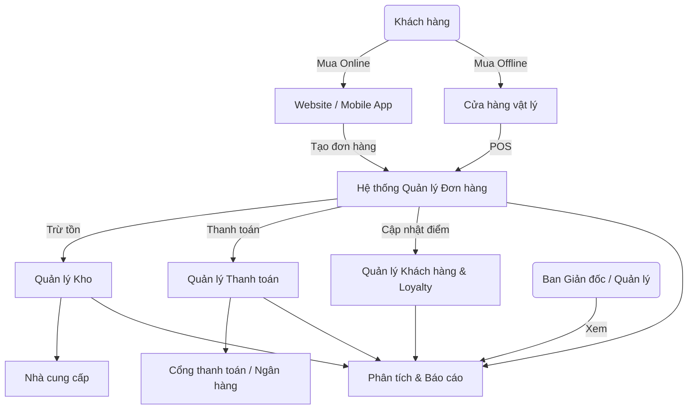
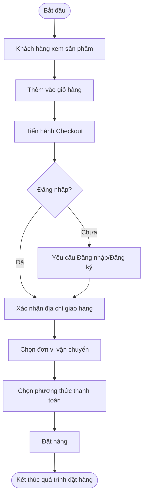
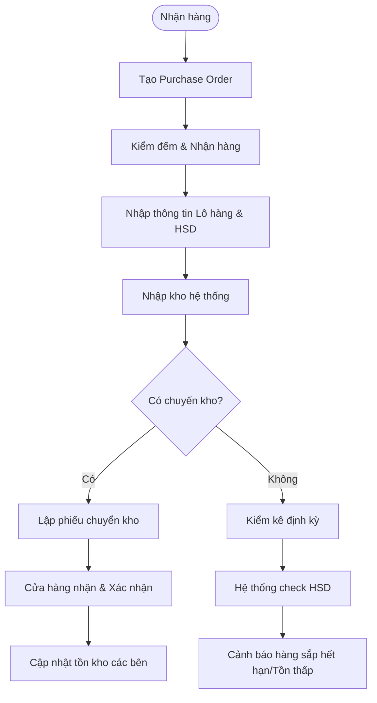
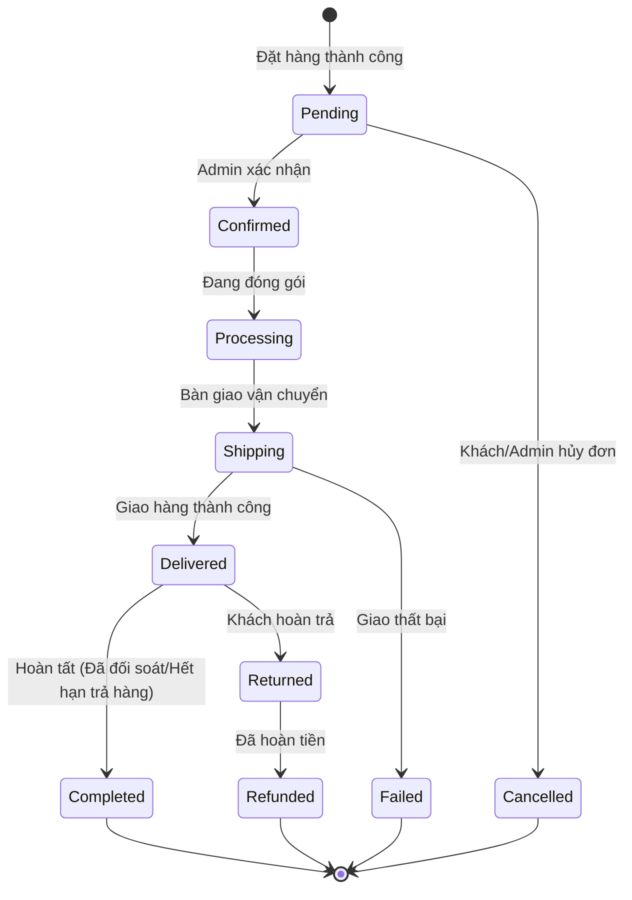
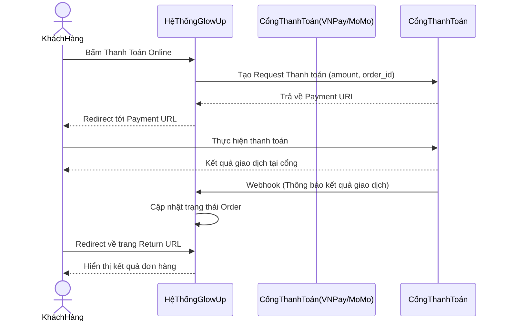
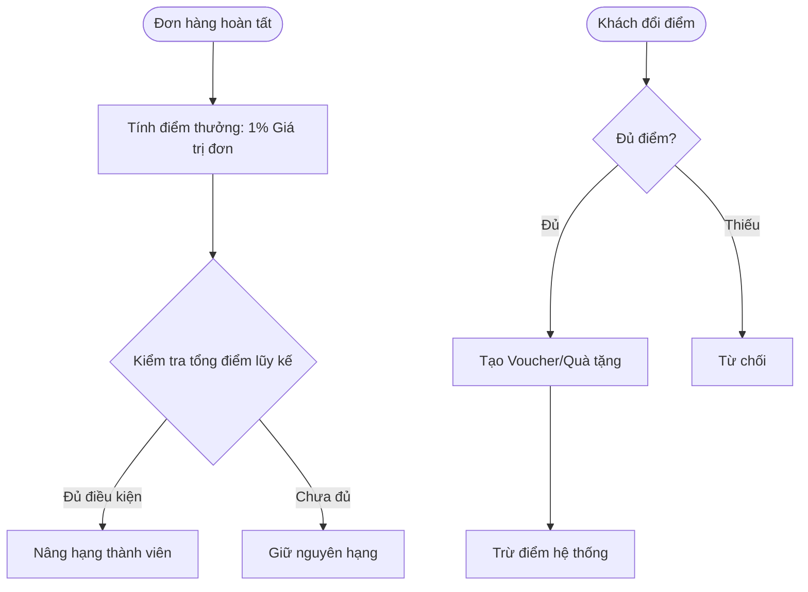

# Tài liệu Tổng Quan Dự Án & Phân Tích Yêu Cầu Nghiệp Vụ
**Dự án:** GlowUp - Hệ thống quản lý bán hàng và phân tích kinh doanh mỹ phẩm
**Phiên bản:** 1.0

## Mục lục
1. [Giới thiệu](#1-giới-thiệu)
2. [Tổng quan dự án](#2-tổng-quan-dự-án)
3. [Mô hình nghiệp vụ](#3-mô-hình-nghiệp-vụ)
4. [Yêu cầu chức năng](#4-yêu-cầu-chức-năng)
5. [Yêu cầu phi chức năng](#5-yêu-cầu-phi-chức-năng)
6. [Quy tắc nghiệp vụ (Business Rules)](#6-quy-tắc-nghiệp-vụ-business-rules)

---

## 1. Giới thiệu

### 1.1 Mục đích tài liệu
Tài liệu này cung cấp một cái nhìn tổng quan về hệ thống **GlowUp** – một giải pháp quản lý bán hàng đa kênh (omnichannel) và phân tích kinh doanh dành riêng cho chuỗi cửa hàng bán lẻ mỹ phẩm. Tài liệu nhằm xác định rõ các yêu cầu nghiệp vụ, chức năng, phi chức năng và các quy tắc kinh doanh, làm cơ sở để đội ngũ phát triển, kiểm thử và các bên liên quan (stakeholders) hiểu rõ, thống nhất và triển khai dự án một cách đồng bộ.

### 1.2 Phạm vi dự án
Dự án bao gồm việc xây dựng một hệ thống phần mềm toàn diện bao gồm:
- **Hệ thống Backend (API Server):** Quản lý toàn bộ logic nghiệp vụ, xử lý dữ liệu và giao tiếp với cơ sở dữ liệu.
- **Frontend Admin Portal:** Bảng điều khiển (Dashboard) dành cho người quản lý, admin, nhân viên kế toán, nhân viên kho,... để quản trị hệ thống, báo cáo và phân tích.
- **Frontend End-user (Website):** Giao diện mua sắm trực tuyến dành cho khách hàng với các tính năng xem sản phẩm, giỏ hàng, thanh toán, blog.
- **Mobile App:** Ứng dụng di động giúp khách hàng mua sắm, tích điểm, nhận thông báo khuyến mãi.

### 1.3 Đối tượng sử dụng tài liệu
- **Ban quản lý dự án (Project Managers):** Theo dõi tiến độ và phạm vi công việc.
- **Đội ngũ phát triển (Developers):** Hiểu rõ yêu cầu hệ thống để thiết kế và viết code (Backend, Frontend, Mobile).
- **Đội ngũ kiểm thử (QA/QC/Testers):** Xây dựng kịch bản kiểm thử (Test cases) dựa trên các yêu cầu được định nghĩa.
- **Các bên liên quan (Stakeholders/Clients):** Nắm bắt các tính năng của hệ thống để đánh giá nghiệm thu sản phẩm.

### 1.4 Thuật ngữ & Viết tắt
| Thuật ngữ / Viết tắt | Giải nghĩa |
|----------------------|------------|
| **POS (Point of Sale)** | Hệ thống bán hàng tại quầy. |
| **CRM (Customer Relationship Management)** | Quản lý quan hệ khách hàng. |
| **Omnichannel** | Mô hình bán lẻ đa kênh, kết hợp trải nghiệm giữa cửa hàng vật lý và trực tuyến. |
| **CMS (Content Management System)** | Hệ thống quản lý nội dung (bài viết, blog, trang tĩnh). |
| **KPI (Key Performance Indicator)** | Chỉ số đánh giá hiệu suất. |
| **RFM (Recency, Frequency, Monetary)** | Mô hình phân tích khách hàng dựa trên thời gian, tần suất và giá trị mua hàng. |
| **AOV (Average Order Value)** | Giá trị trung bình của một đơn hàng. |
| **SEO (Search Engine Optimization)** | Tối ưu hóa công cụ tìm kiếm. |
| **COD (Cash on Delivery)** | Giao hàng nhận tiền. |

---

## 2. Tổng quan dự án

### 2.1 Bối cảnh kinh doanh
Thị trường mỹ phẩm Việt Nam đang phát triển mạnh mẽ với nhu cầu làm đẹp không ngừng tăng cao. Tuy nhiên, sự cạnh tranh cũng ngày càng gay gắt. Các chuỗi bán lẻ mỹ phẩm hiện nay đang dần chuyển dịch sang mô hình **omnichannel** nhằm mang lại trải nghiệm liền mạch cho khách hàng từ việc mua sắm online trên website/app cho đến trải nghiệm offline tại cửa hàng. Việc đồng bộ hóa dữ liệu tồn kho, thông tin khách hàng, đơn hàng và các chương trình khuyến mãi giữa các kênh này đang là một thách thức lớn đối với nhiều doanh nghiệp.

### 2.2 Mô tả hệ thống
**GlowUp** là hệ thống quản lý bán lẻ mỹ phẩm toàn diện, được thiết kế đặc thù cho các chuỗi cửa hàng (quy mô 5-20 chi nhánh). Hệ thống giải quyết bài toán cốt lõi là quản trị dữ liệu tập trung, giúp doanh nghiệp:
- Bán hàng đa kênh một cách mượt mà.
- Kiểm soát hàng tồn kho chính xác tới từng lô hàng và hạn sử dụng (yếu tố sống còn của ngành mỹ phẩm).
- Phân tích dữ liệu kinh doanh đa chiều, hỗ trợ ra quyết định.
- Nuôi dưỡng khách hàng trung thành thông qua hệ thống CRM và Loyalty tích hợp sâu.

### 2.3 Mục tiêu dự án
1. **Số hóa 100% quy trình bán hàng:** Tích hợp bán hàng online và POS tại cửa hàng trong vòng 4 tháng (16 tuần).
2. **Quản lý hàng tồn kho chính xác:** Đạt tỷ lệ chính xác tồn kho 99%, giảm thiểu 50% hàng hóa bị quá date nhờ cảnh báo hạn sử dụng.
3. **Tăng trưởng doanh thu online:** Hỗ trợ đẩy doanh thu từ các kênh online (Web/App) chiếm ít nhất 30% tổng doanh thu sau 6 tháng triển khai.
4. **Nâng cao trải nghiệm khách hàng:** Giảm thời gian xử lý một đơn hàng online xuống dưới 2 giờ (từ lúc đặt đến lúc đóng gói).
5. **Giữ chân khách hàng:** Tăng tỷ lệ khách hàng quay lại (retention rate) lên 20% thông qua chương trình thành viên (Loyalty).
6. **Ra quyết định dựa trên dữ liệu:** Cung cấp hệ thống Dashboard realtime với độ trễ dữ liệu dưới 5 phút cho Ban giám đốc.

### 2.4 Các bên liên quan (Stakeholders)
| Stakeholder | Vai trò trong dự án | Mức độ ảnh hưởng |
|-------------|-------------------|------------------|
| **Ban Giám đốc (Board of Directors)** | Định hướng, phê duyệt ngân sách, nghiệm thu dự án. | Cao |
| **Quản lý cửa hàng (Store Managers)** | Sử dụng hệ thống để quản lý vận hành chi nhánh, nhân sự. | Cao |
| **Nhân viên bán hàng (Sales Staff)** | Trực tiếp sử dụng POS, phục vụ khách hàng. | Trung bình |
| **Nhân viên kho (Warehouse Staff)** | Thực hiện nghiệp vụ nhập/xuất/kiểm kê trên hệ thống. | Cao |
| **Khách hàng (Customers)** | Sử dụng hệ thống Web/App để mua sắm. | Rất Cao |
| **Đội ngũ phát triển (Dev Team)** | Xây dựng, bảo trì và phát triển tính năng. | Cao |

### 2.5 Phạm vi hệ thống
| Hạng mục (In Scope) | Hạng mục ngoài phạm vi (Out of Scope) |
|---------------------|--------------------------------------|
| Quản lý thông tin sản phẩm, danh mục, biến thể | Hệ thống kế toán nội bộ chuyên sâu (chỉ có báo cáo đối soát) |
| Bán hàng đa kênh (Web, App, POS) | Tính lương nhân viên phức tạp (chỉ tính KPI hoa hồng) |
| Quản lý tồn kho (Đa cửa hàng, Lô hàng, Hạn sử dụng) | Hệ thống quản trị quan hệ nhà cung cấp (SRM) quy mô lớn |
| Thanh toán online & Tích hợp vận chuyển | App dành riêng cho nhân viên giao hàng nội bộ |
| Quản lý khách hàng, Loyalty, Khuyến mãi | Tích hợp bán hàng trên các sàn TMĐT (Shopee, Lazada) trong phase 1 |
| Phân tích dữ liệu & Dashboard | |
| Quản lý nội dung cơ bản (Blog/CMS/SEO) | |

---

## 3. Mô hình nghiệp vụ

### 3.1 Quy trình nghiệp vụ tổng quan


### 3.2 Quy trình bán hàng tại cửa hàng (POS)
```mermaid
flowchart TD
    Start([Bắt đầu]) --> Scan[Nhân viên quét Barcode sản phẩm]
    Scan --> CheckStock{Kiểm tra tồn kho?}
    CheckStock -->|Còn hàng| AddToCart[Thêm vào giỏ hàng POS]
    CheckStock -->|Hết hàng| Reject[Thông báo hết hàng]
    AddToCart --> ScanCust[Nhập SĐT khách hàng]
    ScanCust --> CheckCust{Khách hàng cũ?}
    CheckCust -->|Đã có| ApplyLoyalty[Áp dụng điểm thưởng/Hạng thành viên]
    CheckCust -->|Chưa có| SuggestReg[Gợi ý đăng ký]
    ApplyLoyalty --> CalTotal[Tính tổng tiền & Áp mã khuyến mãi]
    SuggestReg --> CalTotal
    CalTotal --> Payment[Thanh toán (Tiền mặt/Thẻ/Ví)]
    Payment --> PrintBill[In hóa đơn]
    PrintBill --> End([Kết thúc])
```

### 3.3 Quy trình bán hàng online


### 3.4 Quy trình quản lý kho hàng


### 3.5 Quy trình xử lý đơn hàng


### 3.6 Quy trình thanh toán online


### 3.7 Quy trình chương trình khách hàng thân thiết


---

## 4. Yêu cầu chức năng

### M01 - Quản lý sản phẩm & danh mục
| Mã yêu cầu | Tên yêu cầu | Mô tả chi tiết | Độ ưu tiên | Actor liên quan |
|---|---|---|---|---|
| FR-M01-001 | Quản lý danh mục | Thêm, sửa, xóa, tìm kiếm danh mục sản phẩm (hỗ trợ phân cấp cha-con đa cấp). | Cao | Admin |
| FR-M01-002 | Quản lý thương hiệu | Quản lý danh sách các thương hiệu mỹ phẩm (Tên, logo, mô tả, quốc gia). | Cao | Admin |
| FR-M01-003 | Quản lý sản phẩm | CRUD thông tin sản phẩm: Tên, SKU, giá bán, giá gốc, thương hiệu, mô tả chi tiết, hướng dẫn sử dụng. | Cao | Admin |
| FR-M01-004 | Quản lý biến thể (Variants) | Tạo các biến thể sản phẩm theo màu sắc, dung tích, kích thước, với SKU, giá và hình ảnh riêng cho từng biến thể. | Cao | Admin |
| FR-M01-005 | Quản lý thành phần (Ingredients) | Cho phép gắn danh sách các thành phần vào sản phẩm (rất quan trọng trong mỹ phẩm để khách hàng tra cứu dị ứng). | Trung bình | Admin |
| FR-M01-006 | Quản lý hình ảnh sản phẩm | Tải lên, sắp xếp nhiều hình ảnh cho một sản phẩm/biến thể. | Cao | Admin |
| FR-M01-007 | Quản lý Tags / Labels | Gắn nhãn sản phẩm (New, Hot, Bestseller, Thuần chay) để hiển thị nổi bật trên giao diện. | Trung bình | Admin |
| FR-M01-008 | Tối ưu SEO Sản phẩm | Hỗ trợ nhập Meta Title, Meta Description, và URL thân thiện cho từng sản phẩm. | Cao | Admin |

### M02 - Quản lý kho hàng (đa cửa hàng)
| Mã yêu cầu | Tên yêu cầu | Mô tả chi tiết | Độ ưu tiên | Actor liên quan |
|---|---|---|---|---|
| FR-M02-001 | Quản lý nhiều kho/cửa hàng | Hệ thống định nghĩa được nhiều kho hàng tương ứng với các chi nhánh, cửa hàng vật lý. | Cao | Admin, Quản lý CH |
| FR-M02-002 | Quản lý Lô (Batch) & HSD (Expiry Date) | Khi nhập hàng, bắt buộc phải nhập số lô sản xuất và ngày hết hạn. Hàng xuất kho tuân theo nguyên tắc FEFO (Hết hạn trước xuất trước). | Cao | NV Kho, Admin |
| FR-M02-003 | Nhập kho / Xuất kho | Tạo phiếu nhập kho, phiếu xuất kho với lý do cụ thể. | Cao | NV Kho |
| FR-M02-004 | Chuyển kho (Transfer) | Lập phiếu điều chuyển hàng hóa giữa các chi nhánh, có xác nhận từ chi nhánh nhận. | Cao | NV Kho, Quản lý CH |
| FR-M02-005 | Kiểm kê định kỳ | Tạo phiếu kiểm kê, cập nhật số lượng thực tế so với hệ thống và ghi nhận chênh lệch. | Cao | NV Kho |
| FR-M02-006 | Cảnh báo tồn kho thấp | Cấu hình mức tồn kho tối thiểu, hệ thống tự động thông báo khi số lượng dưới ngưỡng. | Trung bình | Quản lý CH, NV Kho |
| FR-M02-007 | Cảnh báo hết hạn sử dụng | Báo cáo danh sách hàng hóa sắp hết hạn (trong vòng 3, 6 tháng) để có phương án thanh lý/khuyến mãi. | Cao | Quản lý CH, Admin |
| FR-M02-008 | Thẻ kho (Lịch sử biến động) | Xem chi tiết lịch sử xuất/nhập/chuyển/bán của từng SKU tại từng kho. | Cao | NV Kho, Kế toán |

### M03 - Quản lý bán hàng (POS + Online)
| Mã yêu cầu | Tên yêu cầu | Mô tả chi tiết | Độ ưu tiên | Actor liên quan |
|---|---|---|---|---|
| FR-M03-001 | Giao diện POS bán hàng | Giao diện tối ưu cho máy tính bảng/PC tại quầy, hỗ trợ tìm nhanh sản phẩm hoặc quét mã vạch (Barcode/SKU). | Cao | NV Bán hàng |
| FR-M03-002 | Tích hợp giỏ hàng POS | Thêm/xóa sản phẩm, thay đổi số lượng, tính tổng tiền tự động trên màn hình POS. | Cao | NV Bán hàng |
| FR-M03-003 | Tìm kiếm thông tin khách hàng tại POS | Tìm khách hàng bằng Số điện thoại để tích điểm, áp dụng khuyến mãi thành viên. | Cao | NV Bán hàng |
| FR-M03-004 | Áp dụng Voucher/Discount | Nhập mã giảm giá, áp dụng chương trình khuyến mãi tự động cho đơn hàng POS và Online. | Cao | NV Bán hàng, Khách |
| FR-M03-005 | In hóa đơn (Receipt) | Kết nối máy in nhiệt, in hóa đơn bán lẻ với thông tin chi tiết (Sản phẩm, VAT, Điểm tích lũy, Nhân viên phục vụ). | Cao | NV Bán hàng |
| FR-M03-006 | Quản lý ca làm việc (Shift) | Mở ca (nhập tiền lẻ ban đầu), kết ca (tổng kết doanh thu, tiền mặt, thẻ) và bàn giao. | Cao | NV Bán hàng, Quản lý |

### M04 - Quản lý đơn hàng
| Mã yêu cầu | Tên yêu cầu | Mô tả chi tiết | Độ ưu tiên | Actor liên quan |
|---|---|---|---|---|
| FR-M04-001 | Quản lý danh sách đơn hàng | Xem, lọc, tìm kiếm đơn hàng theo trạng thái, ngày đặt, kênh bán (Web, App, POS). | Cao | Admin, Quản lý CH |
| FR-M04-002 | Cập nhật trạng thái đơn hàng | Chuyển đổi trạng thái đơn hàng (Pending -> Confirmed -> Processing -> Shipping -> Delivered/Completed). | Cao | Admin, Quản lý CH |
| FR-M04-003 | Xử lý hoàn trả/Hủy đơn | Hỗ trợ hủy đơn (trước khi giao), tạo phiếu hoàn trả (Return) và hoàn tiền (Refund). | Cao | Admin, Kế toán |
| FR-M04-004 | Tích hợp API vận chuyển | Đẩy đơn hàng sang các đối tác vận chuyển (GHN, GHTK, Viettel Post) để lấy mã vận đơn. | Cao | Admin |
| FR-M04-005 | Tracking đơn hàng | Tự động cập nhật trạng thái giao hàng từ đối tác vận chuyển, hiển thị cho khách hàng xem. | Trung bình | Khách, Admin |
| FR-M04-006 | Giao việc đóng gói | Phân bổ đơn hàng online cho chi nhánh gần nhất có hàng để đóng gói và giao. | Cao | Admin, Quản lý CH |

### M05 - Quản lý khách hàng & CRM
| Mã yêu cầu | Tên yêu cầu | Mô tả chi tiết | Độ ưu tiên | Actor liên quan |
|---|---|---|---|---|
| FR-M05-001 | Đăng ký & Đăng nhập | Đăng ký/đăng nhập bằng Email, SĐT (OTP) hoặc Social Login (Google, Facebook). | Cao | Khách |
| FR-M05-002 | Quản lý hồ sơ (Profile) | Khách hàng cập nhật thông tin cá nhân, địa chỉ giao hàng mặc định, sổ địa chỉ. | Cao | Khách |
| FR-M05-003 | Lịch sử mua hàng | Khách xem lại toàn bộ đơn hàng (cả Online lẫn POS nếu có cung cấp SĐT). | Cao | Khách |
| FR-M05-004 | Hạng thành viên (Tiers) | Định nghĩa các mức hạng (Bronze, Silver, Gold, Diamond) và điều kiện nâng hạng dựa trên chi tiêu. | Cao | Admin, Khách |
| FR-M05-005 | Tích và Đổi điểm (Loyalty Points) | Tự động cộng điểm sau khi hoàn tất đơn. Cho phép khách dùng điểm đổi Voucher hoặc trừ tiền. | Cao | Admin, Khách |
| FR-M05-006 | Wishlist | Khách hàng thêm các sản phẩm yêu thích vào Wishlist để mua sau. | Thấp | Khách |
| FR-M05-007 | Phân nhóm khách hàng (Segmentation) | Lọc khách hàng theo RFM (mua gần đây, tần suất cao, chi tiêu lớn) để phục vụ Marketing. | Trung bình | Admin |

### M06 - Quản lý nhân sự
| Mã yêu cầu | Tên yêu cầu | Mô tả chi tiết | Độ ưu tiên | Actor liên quan |
|---|---|---|---|---|
| FR-M06-001 | Quản lý hồ sơ nhân viên | Thêm, sửa thông tin nhân viên, gán nhân viên vào cửa hàng/phòng ban cụ thể. | Cao | Admin, Quản lý CH |
| FR-M06-002 | Phân quyền (RBAC) | Tạo các vai trò (Roles) và cấp quyền (Permissions) chi tiết cho từng màn hình, chức năng. | Cao | Admin |
| FR-M06-003 | Chấm công | Ghi nhận giờ làm việc thực tế của nhân viên thông qua chức năng check-in/out trên POS hoặc Admin. | Trung bình | NV, Quản lý CH |
| FR-M06-004 | Tính hoa hồng (Commission) | Thiết lập % hoa hồng bán hàng cho từng nhân viên/sản phẩm để tính KPI tháng. | Trung bình | Admin, Kế toán |
| FR-M06-005 | Quản lý ca làm việc | Sắp xếp lịch làm việc (Ca sáng, chiều, tối) cho nhân viên chi nhánh. | Trung bình | Quản lý CH |

### M07 - Thanh toán online
| Mã yêu cầu | Tên yêu cầu | Mô tả chi tiết | Độ ưu tiên | Actor liên quan |
|---|---|---|---|---|
| FR-M07-001 | Tích hợp VNPay | Thanh toán qua cổng VNPay (ATM nội địa, Visa, Master). | Cao | Khách |
| FR-M07-002 | Tích hợp Ví điện tử | Thanh toán qua MoMo, ZaloPay. | Cao | Khách |
| FR-M07-003 | Thanh toán COD | Tùy chọn thanh toán bằng tiền mặt khi nhận hàng. | Cao | Khách |
| FR-M07-004 | Lịch sử giao dịch | Quản lý danh sách các giao dịch thanh toán, trạng thái thành công/thất bại, mã giao dịch đối tác. | Cao | Kế toán, Admin |
| FR-M07-005 | Yêu cầu hoàn tiền (Refund) | Hỗ trợ lưu thông tin và thực hiện hoàn tiền qua tài khoản ngân hàng khi hủy đơn đã thanh toán. | Trung bình | Kế toán |

### M08 - Phân tích kinh doanh & Dashboard
| Mã yêu cầu | Tên yêu cầu | Mô tả chi tiết | Độ ưu tiên | Actor liên quan |
|---|---|---|---|---|
| FR-M08-001 | Dashboard Tổng quan | Xem các KPI cards: Doanh thu ngày/tháng, Đơn hàng mới, Khách hàng mới, AOV. | Cao | Admin, Quản lý |
| FR-M08-002 | Báo cáo doanh thu | Biểu đồ doanh thu theo thời gian, theo kênh (Online/POS), theo cửa hàng. | Cao | Admin, Kế toán |
| FR-M08-003 | Báo cáo sản phẩm | Danh sách Top sản phẩm bán chạy nhất, sản phẩm tồn kho lâu/ế hàng. | Cao | Admin, Quản lý |
| FR-M08-004 | Phân tích khách hàng | Báo cáo tỷ lệ giữ chân khách hàng (Retention rate), tỷ lệ chuyển đổi. | Trung bình | Admin |
| FR-M08-005 | Báo cáo hiệu suất nhân viên | Thống kê doanh thu mang lại của từng nhân viên bán hàng. | Trung bình | Quản lý CH |
| FR-M08-006 | Export báo cáo | Xuất các số liệu báo cáo ra file Excel, PDF. | Cao | Kế toán, Admin |

### M09 - Quản lý khuyến mãi & Marketing
| Mã yêu cầu | Tên yêu cầu | Mô tả chi tiết | Độ ưu tiên | Actor liên quan |
|---|---|---|---|---|
| FR-M09-001 | Tạo Campaign Khuyến mãi | Thiết lập giảm giá % hoặc số tiền cố định cho từng sản phẩm/danh mục trong thời gian nhất định. | Cao | Admin |
| FR-M09-002 | Quản lý Voucher / Coupon | Tạo mã giảm giá với các điều kiện: Đơn tối thiểu, giảm tối đa, giới hạn lượt dùng, hạng thành viên. | Cao | Admin |
| FR-M09-003 | Khuyến mãi quà tặng/Combo | Thiết lập chương trình "Mua X tặng Y", hoặc mua theo Bundle/Combo giá rẻ hơn. | Trung bình | Admin |
| FR-M09-004 | Flash Sale | Cấu hình sự kiện Flash Sale hiển thị đồng hồ đếm ngược trên web/app. | Trung bình | Admin |
| FR-M09-005 | Push Notification | Gửi thông báo đẩy đến Mobile App cho các chiến dịch marketing. | Trung bình | Admin |
| FR-M09-006 | Quản lý Banner | Thay đổi banner quảng cáo trên trang chủ Web/App. | Cao | Admin |

### M10 - Quản lý nhà cung cấp & nhập hàng
| Mã yêu cầu | Tên yêu cầu | Mô tả chi tiết | Độ ưu tiên | Actor liên quan |
|---|---|---|---|---|
| FR-M10-001 | Quản lý nhà cung cấp | Thông tin công ty, liên hệ, thời gian giao hàng dự kiến của các đối tác cung cấp mỹ phẩm. | Cao | Admin, NV Kho |
| FR-M10-002 | Đơn đặt hàng (Purchase Order) | Tạo PO gửi nhà cung cấp, theo dõi trạng thái hàng về. | Cao | NV Kho, Quản lý |
| FR-M10-003 | Quản lý công nợ | Theo dõi công nợ, lịch sử thanh toán với từng nhà cung cấp. | Cao | Kế toán |

### M11 - Quản lý nội dung (CMS/Blog/SEO)
| Mã yêu cầu | Tên yêu cầu | Mô tả chi tiết | Độ ưu tiên | Actor liên quan |
|---|---|---|---|---|
| FR-M11-001 | Quản lý Trang tĩnh | Soạn thảo nội dung (Rich text) cho các trang Giới thiệu, Chính sách bảo mật, Điều khoản. | Trung bình | Admin |
| FR-M11-002 | Quản lý Blog | Viết, xuất bản các bài viết tư vấn làm đẹp, review mỹ phẩm, phân mục Blog. | Trung bình | Admin |
| FR-M11-003 | Cấu hình SEO toàn cục | Thiết lập Sitemap.xml, Robots.txt, Cấu hình Google Analytics/Pixel. | Trung bình | Admin |
| FR-M11-004 | Quản lý FAQ | Thêm các câu hỏi thường gặp để hỗ trợ khách hàng. | Thấp | Admin |

---

## 5. Yêu cầu phi chức năng

| Hạng mục | Tiêu chí đánh giá (Measurable Criteria) |
|---|---|
| **NFR-01: Hiệu năng (Performance)** | - Thời gian tải trang End-user (Web/App) dưới 3 giây.<br>- Thời gian phản hồi API (API response time) dưới 500ms.<br>- Hệ thống chịu tải đồng thời (Concurrent users) ít nhất 1000 users mà không suy giảm hiệu năng. |
| **NFR-02: Bảo mật (Security)** | - Mã hóa toàn bộ mật khẩu bằng Bcrypt/Argon2.<br>- Giao tiếp dữ liệu 100% qua HTTPS.<br>- Sử dụng JWT cho xác thực, có cơ chế Refresh Token.<br>- Phòng chống OWASP Top 10 (SQL Injection, XSS, CSRF). |
| **NFR-03: Khả năng mở rộng (Scalability)** | - Kiến trúc ứng dụng không trạng thái (Stateless) cho phép Horizontal Scaling.<br>- Database có khả năng Read Replica, sử dụng Connection Pooling.<br>- Dùng CDN (CloudFront) để phân phối ảnh, tĩnh. |
| **NFR-04: Tính sẵn sàng (Availability)** | - Cam kết thời gian hoạt động (Uptime) đạt 99.9%.<br>- Hệ thống tự động phục hồi (Auto-recovery) sau khi crash.<br>- Có cơ chế sao lưu Database hàng ngày (Daily Backup). |
| **NFR-05: SEO** | - Web Frontend hỗ trợ Server-Side Rendering (SSR) bằng Next.js.<br>- HTML đảm bảo Semantic, điểm Lighthouse SEO > 90.<br>- Tích hợp JSON-LD Structured Data cho Sản phẩm. |
| **NFR-06: Tương thích (Compatibility)** | - Giao diện Web Responsive hỗ trợ các kích thước màn hình từ 320px đến 4K.<br>- Hỗ trợ các trình duyệt phổ biến: Chrome, Safari, Firefox, Edge (2 phiên bản mới nhất).<br>- Mobile App chạy tốt trên Android 8.0+ và iOS 13+. |
| **NFR-07: Khả năng bảo trì (Maintainability)** | - Mã nguồn tuân thủ Clean Code, có Linting (ESLint) và Prettier.<br>- Cover các luồng chính bằng Unit Test / Integration Test (Độ phủ > 60%).<br>- Kiến trúc chia Module rõ ràng. |
| **NFR-08: Trải nghiệm người dùng (UX)** | - Thiết kế giao diện tuân thủ chuẩn Accessibility WCAG 2.1 AA.<br>- Thông báo lỗi rõ ràng, có ngữ cảnh thay vì mã lỗi kỹ thuật.<br>- Chức năng tìm kiếm sản phẩm trả kết quả trong dưới 1 giây. |

---

## 6. Quy tắc nghiệp vụ (Business Rules)

- **BR-01:** Giá trị đơn hàng trực tuyến tối thiểu để thanh toán là 100,000 VNĐ.
- **BR-02:** Tỷ lệ tích điểm áp dụng chung là 1% tổng giá trị đơn hàng (sau khi đã trừ khuyến mãi), 1 điểm = 1 VNĐ.
- **BR-03:** Khách hàng không được dùng điểm thưởng để thanh toán quá 50% giá trị của đơn hàng mới.
- **BR-04:** Mỹ phẩm có hạn sử dụng còn dưới 3 tháng sẽ tự động bị đánh dấu là "Cận date" và không được phép xuất kho cho đơn đặt hàng Online (chỉ bán thanh lý tại POS).
- **BR-05:** Mỹ phẩm đã hết hạn sử dụng không được phép bán (POS/Online tự động chặn).
- **BR-06:** Khách hàng có thể hủy đơn hàng Online chỉ khi trạng thái đơn hàng là "Pending".
- **BR-07:** Đơn hàng có phương thức thanh toán Online (VNPay/MoMo) nếu trong vòng 15 phút không thanh toán sẽ tự động bị hủy.
- **BR-08:** Phiếu xuất kho hoặc chuyển kho phải được tạo dựa trên nguyên tắc FEFO (Hàng hết hạn trước xuất trước).
- **BR-09:** Mỗi một số điện thoại chỉ được liên kết với một tài khoản khách hàng duy nhất.
- **BR-10:** Nhân viên bán hàng chỉ được phép mở ca làm việc khi đã đóng ca trước đó.
- **BR-11:** Một hóa đơn bán hàng chỉ được áp dụng tối đa 01 mã Voucher giảm giá.
- **BR-12:** Điểm thưởng của khách hàng sẽ có thời hạn sử dụng là 12 tháng kể từ lần phát sinh giao dịch cuối cùng.
- **BR-13:** Đơn hàng được miễn phí giao hàng (Free Shipping) khi giá trị đơn hàng từ 500,000 VNĐ trở lên.
- **BR-14:** Hàng hóa hoàn trả chỉ được chấp nhận trong vòng 7 ngày kể từ ngày giao hàng thành công và phải có video unbox.
- **BR-15:** Số lượng tồn kho online hiển thị cho khách hàng sẽ bằng (Tồn kho thực tế - Số lượng đang chờ đóng gói của các đơn pending).
