# Document 2: Đặc Tả Use Case & Thiết Kế Tương Tác

## Mục lục
1. [Tổng quan Actors](#1-tổng-quan-actors)
2. [Use Case Diagrams](#2-use-case-diagrams)
3. [Đặc tả Use Case chi tiết](#3-đặc-tả-use-case-chi-tiết)
4. [Activity Diagrams](#4-activity-diagrams)
5. [Sequence Diagrams](#5-sequence-diagrams)

---

## 1. Tổng quan Actors

### 1.1 Bảng mô tả Actors

| Mã | Tên Actor | Mô tả | Nền tảng sử dụng |
|---|---|---|---|
| A01 | Khách vãng lai (Guest) | Người dùng truy cập hệ thống nhưng chưa đăng nhập hoặc chưa có tài khoản. | Web End-user, Mobile App |
| A02 | Khách hàng (Customer) | Người dùng đã đăng ký tài khoản thành công trên hệ thống. | Web End-user, Mobile App |
| A03 | Nhân viên bán hàng (Sales Staff) | Nhân viên trực tiếp bán hàng tại các chi nhánh cửa hàng vật lý. | Web Admin (POS module) |
| A04 | Nhân viên kho (Warehouse Staff) | Nhân viên phụ trách quản lý hàng hóa, xuất nhập tồn tại kho. | Web Admin |
| A05 | Quản lý cửa hàng (Store Manager) | Người chịu trách nhiệm quản lý hoạt động kinh doanh và nhân sự của một chi nhánh cụ thể. | Web Admin |
| A06 | Kế toán (Accountant) | Nhân viên phụ trách theo dõi dòng tiền, công nợ, đối soát thanh toán và báo cáo tài chính. | Web Admin |
| A07 | Admin hệ thống (System Admin) | Quản trị viên cấp cao nhất, có toàn quyền quản lý cấu hình hệ thống, người dùng và dữ liệu tổng hợp. | Web Admin |

### 1.2 Sơ đồ phân cấp Actors

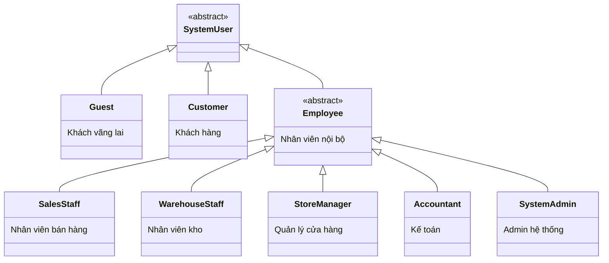

---

## 2. Use Case Diagrams

### 2.1 Package: Quản lý tài khoản & Xác thực

```mermaid
flowchart LR
    Guest((Khách\nvãng lai))
    Customer((Khách hàng))
    Employee((Nhân viên\n(Nói chung)))
    
    subgraph Xác_thực [Quản lý tài khoản & Xác thực]
        UC01(UC01: Đăng ký tài khoản)
        UC02(UC02: Đăng nhập End-user)
        UC13(UC13: Đăng nhập POS / Admin)
        UC_QMK(Quên mật khẩu)
        UC_CAP_NHAT(Cập nhật thông tin cá nhân)
    end
    
    Guest --> UC01
    Guest --> UC02
    Customer --> UC02
    Customer --> UC_QMK
    Customer --> UC_CAP_NHAT
    Employee --> UC13
    Employee --> UC_QMK
    Employee --> UC_CAP_NHAT
```

### 2.2 Package: Mua hàng Online (Customer)

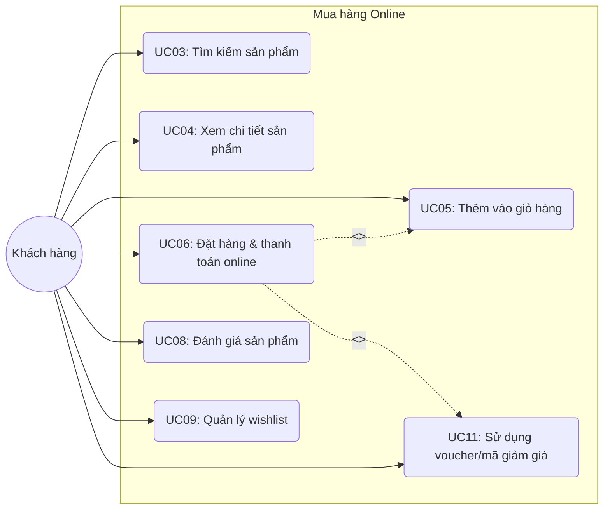

### 2.3 Package: Bán hàng POS (Sales Staff)

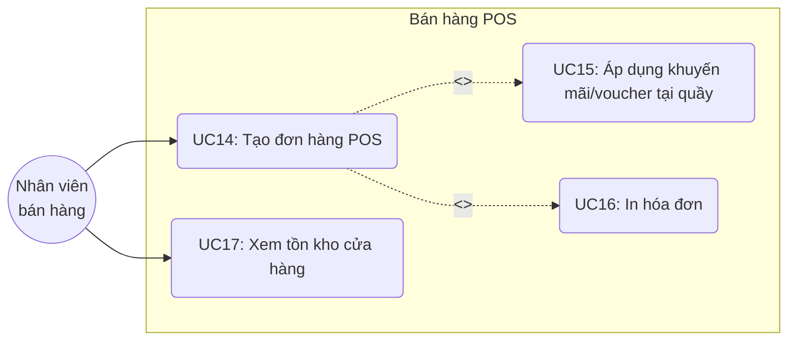

### 2.4 Package: Quản lý kho hàng

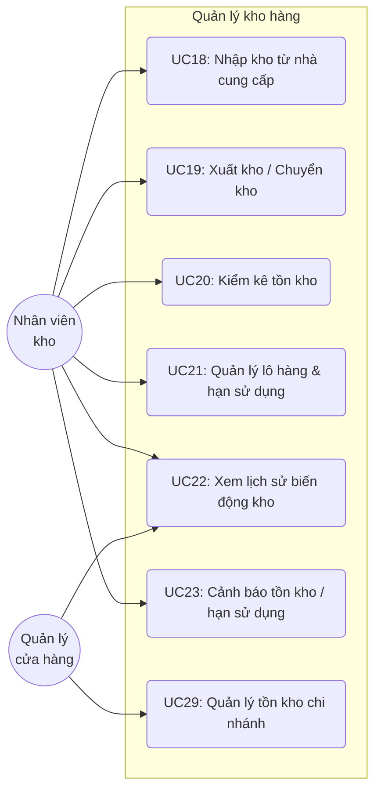

### 2.5 Package: Quản lý đơn hàng

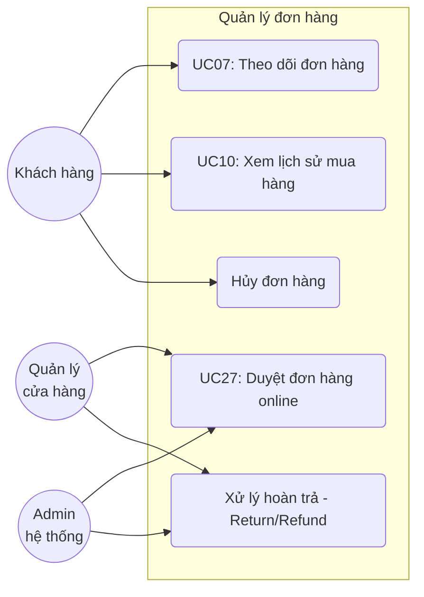

### 2.6 Package: Phân tích kinh doanh

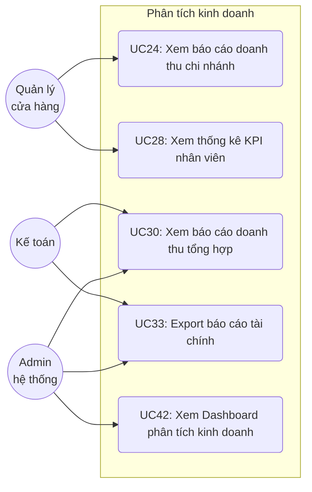

### 2.7 Package: Quản lý sản phẩm & nội dung (Admin)

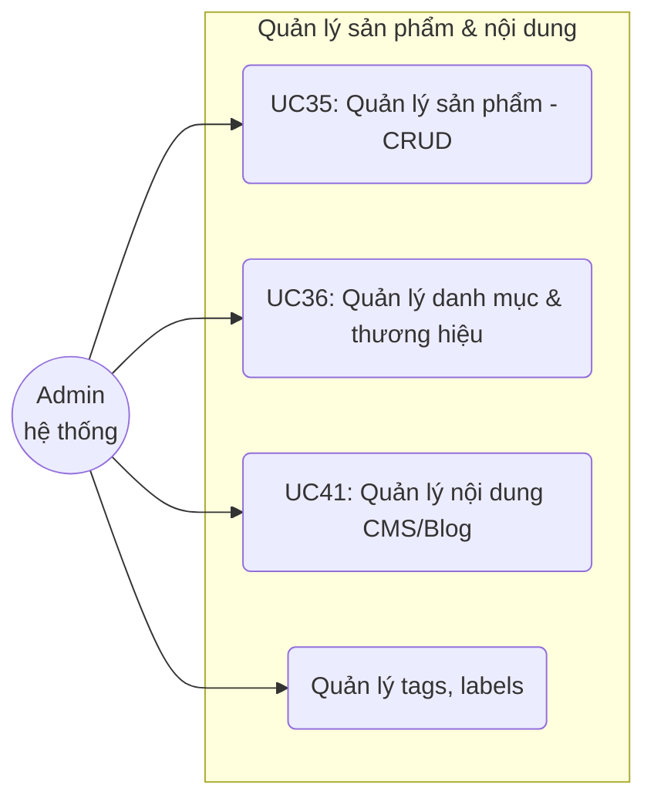

### 2.8 Package: Quản lý khuyến mãi & CRM

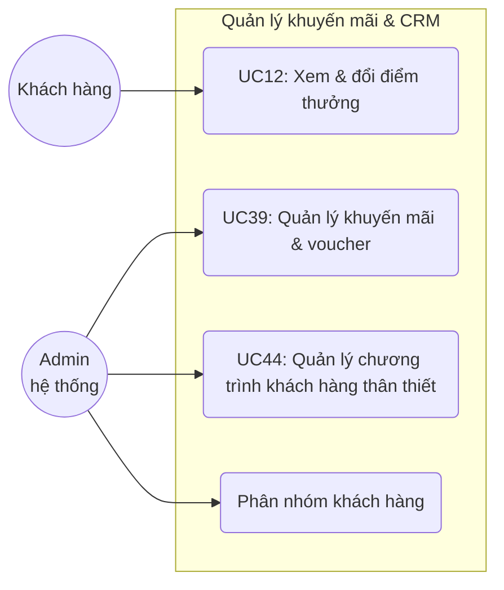

---

## 3. Đặc tả Use Case chi tiết

### UC03: Tìm kiếm sản phẩm
- **Mã UC:** UC03
- **Tên UC:** Tìm kiếm sản phẩm
- **Actor chính:** Khách vãng lai, Khách hàng
- **Actor phụ:** Hệ thống Elasticsearch
- **Mô tả:** Cho phép người dùng tìm kiếm sản phẩm theo từ khóa (tên, mô tả, thành phần) và lọc/sắp xếp kết quả (theo giá, danh mục, thương hiệu).
- **Tiền điều kiện:** Hệ thống đang hoạt động bình thường, dữ liệu sản phẩm đã được đồng bộ lên Elasticsearch.
- **Hậu điều kiện:** Hiển thị danh sách sản phẩm phù hợp với tiêu chí tìm kiếm.
- **Luồng sự kiện chính:**
  1. Người dùng nhập từ khóa vào thanh tìm kiếm hoặc chọn các bộ lọc (giá, danh mục).
  2. Người dùng nhấn nút "Tìm kiếm" hoặc nhấn Enter.
  3. Hệ thống (Frontend) gửi request chứa từ khóa và tiêu chí lọc đến Backend.
  4. Backend truy vấn dữ liệu từ Elasticsearch.
  5. Elasticsearch trả về kết quả phù hợp nhất dựa trên mức độ liên quan.
  6. Frontend hiển thị danh sách sản phẩm dưới dạng grid, có phân trang.
- **Luồng thay thế:** Nếu người dùng sử dụng tính năng "Gợi ý tìm kiếm", hệ thống sẽ hiển thị danh sách từ khóa và sản phẩm gợi ý ngay khi người dùng đang gõ.
- **Luồng ngoại lệ:**
  - Nếu không có sản phẩm phù hợp: Hiển thị thông báo "Không tìm thấy sản phẩm nào phù hợp với từ khóa của bạn" và đề xuất các sản phẩm phổ biến.
  - Nếu lỗi kết nối Elasticsearch: Hệ thống fallback về tìm kiếm trên PostgreSQL hoặc hiển thị thông báo lỗi hệ thống tạm thời.
- **Yêu cầu đặc biệt:** Thời gian phản hồi tìm kiếm phải dưới 200ms. Hỗ trợ tìm kiếm không dấu và sai chính tả (fuzzy search).
- **Giao diện liên quan:** Thanh tìm kiếm (Header), Trang kết quả tìm kiếm (Search Results Page).

### UC06: Đặt hàng & thanh toán online
- **Mã UC:** UC06
- **Tên UC:** Đặt hàng & thanh toán online
- **Actor chính:** Khách hàng
- **Actor phụ:** Cổng thanh toán (VNPay/MoMo/ZaloPay), Đơn vị vận chuyển (GHN/GHTK)
- **Mô tả:** Khách hàng tiến hành đặt mua các sản phẩm trong giỏ hàng, điền thông tin giao hàng và thực hiện thanh toán online hoặc chọn COD.
- **Tiền điều kiện:** Khách hàng đã đăng nhập, có ít nhất 1 sản phẩm trong giỏ hàng, các sản phẩm đều còn tồn kho.
- **Hậu điều kiện:** Đơn hàng được tạo thành công với trạng thái tương ứng, giỏ hàng được làm sạch.
- **Luồng sự kiện chính:**
  1. Khách hàng truy cập Giỏ hàng và chọn "Thanh toán".
  2. Hệ thống hiển thị trang Checkout, yêu cầu xác nhận/nhập địa chỉ giao hàng.
  3. Khách hàng chọn phương thức vận chuyển. Hệ thống tính toán và hiển thị phí ship qua API của Đơn vị vận chuyển.
  4. Khách hàng áp dụng voucher/điểm thưởng (nếu có).
  5. Khách hàng chọn phương thức thanh toán (ví dụ: VNPay) và nhấn "Đặt hàng".
  6. Hệ thống tạo đơn hàng với trạng thái "Pending" và chuyển hướng người dùng sang trang thanh toán của VNPay.
  7. Khách hàng thực hiện thanh toán thành công trên cổng VNPay.
  8. VNPay gọi callback/webhook báo thanh toán thành công về hệ thống.
  9. Hệ thống cập nhật trạng thái đơn hàng thành "Confirmed", trừ tồn kho, gửi email xác nhận.
  10. Chuyển hướng khách hàng về trang "Đặt hàng thành công".
- **Luồng thay thế:**
  - Ở bước 5, nếu chọn COD: Hệ thống tạo đơn hàng với trạng thái "Confirmed" (hoặc "Pending" chờ duyệt), trừ tồn kho tạm thời, hiển thị trang "Đặt hàng thành công".
- **Luồng ngoại lệ:**
  - Sản phẩm hết hàng tại thời điểm đặt: Hệ thống thông báo sản phẩm đã hết và yêu cầu khách hàng cập nhật giỏ hàng.
  - Thanh toán thất bại/Hủy thanh toán: Trạng thái đơn hàng đổi thành "Payment Failed", tồn kho được hoàn lại.
- **Yêu cầu đặc biệt:** Phải xử lý concurrency (race condition) khi trừ tồn kho nếu có nhiều người cùng mua mặt hàng sắp hết.
- **Giao diện liên quan:** Trang Giỏ hàng, Trang Checkout, Trang Thông báo thành công/thất bại.

### UC07: Theo dõi đơn hàng
- **Mã UC:** UC07
- **Tên UC:** Theo dõi đơn hàng
- **Actor chính:** Khách hàng
- **Actor phụ:** Đơn vị vận chuyển
- **Mô tả:** Khách hàng xem trạng thái hiện tại và lịch trình vận chuyển của đơn hàng đã đặt.
- **Tiền điều kiện:** Khách hàng đã đăng nhập và có đơn hàng trong hệ thống.
- **Hậu điều kiện:** Hiển thị chi tiết trạng thái đơn hàng.
- **Luồng sự kiện chính:**
  1. Khách hàng vào mục "Quản lý đơn hàng" trong Profile cá nhân.
  2. Hệ thống hiển thị danh sách đơn hàng.
  3. Khách hàng chọn "Xem chi tiết" một đơn hàng cụ thể.
  4. Hệ thống gọi API nội bộ và API của Đơn vị vận chuyển để lấy hành trình (tracking).
  5. Hệ thống hiển thị chi tiết trạng thái, thông tin người giao hàng, và lịch sử thay đổi trạng thái (vd: Đã lấy hàng, Đang giao, v.v.).
- **Luồng thay thế:** Không có.
- **Luồng ngoại lệ:**
  - Mất kết nối API Đơn vị vận chuyển: Hiển thị trạng thái cuối cùng lưu trên hệ thống cục bộ và thông báo "Không thể cập nhật trạng thái mới nhất từ bên vận chuyển".
- **Yêu cầu đặc biệt:** Giao diện trực quan dạng Timeline.
- **Giao diện liên quan:** Trang Quản lý đơn hàng, Trang Chi tiết đơn hàng.

### UC14: Tạo đơn hàng POS
- **Mã UC:** UC14
- **Tên UC:** Tạo đơn hàng POS
- **Actor chính:** Nhân viên bán hàng
- **Actor phụ:** Máy quét mã vạch (Barcode Scanner), Máy in hóa đơn
- **Mô tả:** Nhân viên bán hàng thực hiện tính tiền cho khách hàng tại cửa hàng.
- **Tiền điều kiện:** Nhân viên đã đăng nhập vào module POS và đã mở ca làm việc.
- **Hậu điều kiện:** Đơn hàng được lưu lại hệ thống, trừ tồn kho tại cửa hàng, doanh thu được ghi nhận.
- **Luồng sự kiện chính:**
  1. Nhân viên dùng máy quét đọc mã vạch sản phẩm (hoặc tìm thủ công bằng tên).
  2. Hệ thống tự động thêm sản phẩm vào giỏ hàng POS.
  3. Nhân viên điều chỉnh số lượng (nếu cần).
  4. Nhân viên nhập thông tin khách hàng (SĐT) để tích điểm/sử dụng điểm.
  5. Khách hàng chọn phương thức thanh toán (Tiền mặt, Chuyển khoản, Thẻ).
  6. Nhân viên xác nhận đã nhận tiền (nếu tiền mặt) và nhấn "Hoàn thành".
  7. Hệ thống lưu hóa đơn, cập nhật tồn kho tức thời tại cửa hàng, lưu lịch sử điểm thưởng cho khách.
  8. Hệ thống gửi lệnh in hóa đơn ra máy in.
- **Luồng thay thế:**
  - Nếu khách hàng không cung cấp SĐT: Thanh toán ẩn danh (Guest checkout), bỏ qua bước tích điểm.
- **Luồng ngoại lệ:**
  - Hàng không đủ tồn kho trên hệ thống nhưng thực tế có: Hệ thống cảnh báo nhưng vẫn cho phép bán, đồng thời ghi log cảnh báo lệch kho.
- **Yêu cầu đặc biệt:** Tốc độ phản hồi cực nhanh (< 100ms) để không làm chậm trễ tại quầy. Hỗ trợ phím tắt trên bàn phím.
- **Giao diện liên quan:** Màn hình POS (Point of Sale).

### UC18: Nhập kho từ nhà cung cấp
- **Mã UC:** UC18
- **Tên UC:** Nhập kho từ nhà cung cấp
- **Actor chính:** Nhân viên kho
- **Actor phụ:** Hệ thống mã vạch
- **Mô tả:** Nhân viên kho thực hiện ghi nhận hàng hóa nhận được từ nhà cung cấp dựa trên Đơn đặt hàng (Purchase Order - PO) đã tạo.
- **Tiền điều kiện:** Có PO đã được duyệt trên hệ thống; nhân viên kho được phân quyền.
- **Hậu điều kiện:** Số lượng tồn kho tăng lên, thông tin lô hàng và hạn sử dụng được cập nhật.
- **Luồng sự kiện chính:**
  1. Nhân viên kho truy cập chức năng "Nhập kho".
  2. Chọn Đơn đặt hàng (PO) tương ứng.
  3. Hệ thống hiển thị danh sách sản phẩm dự kiến nhập theo PO.
  4. Nhân viên kho nhập số lượng thực tế nhận, thông tin Lô (Batch number) và Hạn sử dụng (Expiry Date) cho từng mặt hàng.
  5. Nhân viên kiểm tra và xác nhận phiếu nhập kho.
  6. Hệ thống cập nhật tổng số tồn kho, lưu thông tin lô hàng, và cập nhật trạng thái PO (Hoàn thành hoặc Nhập một phần).
- **Luồng thay thế:** Nhập hàng không qua PO (Nhập kho trực tiếp) - chỉ áp dụng với quyền của Quản lý.
- **Luồng ngoại lệ:** Số lượng thực nhận khác với số lượng trên PO -> Hệ thống yêu cầu ghi chú lý do chênh lệch.
- **Yêu cầu đặc biệt:** Bắt buộc phải có hạn sử dụng (vì là mỹ phẩm).
- **Giao diện liên quan:** Trang Quản lý nhập kho, Form tạo phiếu nhập kho.

### UC35: Quản lý sản phẩm (CRUD)
- **Mã UC:** UC35
- **Tên UC:** Quản lý sản phẩm (CRUD)
- **Actor chính:** Admin hệ thống, Quản lý nội dung (được ủy quyền)
- **Actor phụ:** MinIO/S3 (lưu trữ hình ảnh)
- **Mô tả:** Thêm mới, cập nhật, xóa hoặc ẩn/hiện sản phẩm trên hệ thống. Bao gồm quản lý các biến thể (variants) của sản phẩm.
- **Tiền điều kiện:** Admin đã đăng nhập và có quyền.
- **Hậu điều kiện:** Thông tin sản phẩm được cập nhật vào PostgreSQL và đồng bộ sang Elasticsearch.
- **Luồng sự kiện chính:**
  1. Admin chọn "Thêm mới sản phẩm".
  2. Admin nhập các thông tin cơ bản: Tên, Mô tả, Danh mục, Thương hiệu, Thành phần.
  3. Admin tải lên hình ảnh sản phẩm. Hệ thống upload lên S3/MinIO và trả về URL.
  4. Admin thiết lập các Biến thể (ví dụ: Dung tích 50ml - Giá X, 100ml - Giá Y).
  5. Admin nhập SEO metadata.
  6. Admin nhấn "Lưu".
  7. Hệ thống validate dữ liệu, lưu vào CSDL chính (PostgreSQL).
  8. Hệ thống đẩy event qua Message Queue để đồng bộ dữ liệu sang Elasticsearch.
- **Luồng thay thế:** Chỉnh sửa sản phẩm hiện có (các bước tương tự).
- **Luồng ngoại lệ:** Hình ảnh quá dung lượng (> 5MB) hoặc sai định dạng -> Báo lỗi ngay trên Form.
- **Yêu cầu đặc biệt:** Hỗ trợ Rich Text Editor cho mô tả.
- **Giao diện liên quan:** Trang Danh sách sản phẩm, Trang Form sản phẩm.

### UC38: Quản lý người dùng & phân quyền
- **Mã UC:** UC38
- **Tên UC:** Quản lý người dùng & phân quyền
- **Actor chính:** Admin hệ thống
- **Actor phụ:** Không
- **Mô tả:** Cấp tài khoản cho nhân viên, gán vai trò (Roles) và quyền hạn (Permissions) dựa trên cơ chế RBAC.
- **Tiền điều kiện:** Admin đăng nhập bằng tài khoản Super Admin.
- **Hậu điều kiện:** Tài khoản nhân viên có thể đăng nhập và truy cập đúng các chức năng được phân quyền.
- **Luồng sự kiện chính:**
  1. Admin vào "Quản lý nhân viên".
  2. Chọn "Thêm nhân viên mới".
  3. Điền thông tin cá nhân (Tên, Email, SĐT, Chi nhánh trực thuộc).
  4. Chọn Vai trò (Role) cho nhân viên (VD: Nhân viên bán hàng, Quản lý cửa hàng).
  5. Nhấn "Lưu lại".
  6. Hệ thống tạo tài khoản sinh mật khẩu ngẫu nhiên, gửi email kích hoạt cho nhân viên.
- **Luồng thay thế:** Chỉnh sửa Role của một nhân viên đang tồn tại.
- **Luồng ngoại lệ:** Email hoặc SĐT đã tồn tại -> Hệ thống cảnh báo trùng lặp.
- **Yêu cầu đặc biệt:** Mọi thay đổi về phân quyền được ghi vào Audit Log.
- **Giao diện liên quan:** Danh sách nhân viên, Form phân quyền, Quản lý Roles.

### UC39: Quản lý khuyến mãi & voucher
- **Mã UC:** UC39
- **Tên UC:** Quản lý khuyến mãi & voucher
- **Actor chính:** Admin hệ thống, Marketing Manager
- **Actor phụ:** Redis (lưu cache voucher để truy xuất nhanh)
- **Mô tả:** Tạo và quản lý các chương trình giảm giá, flash sale, tạo mã voucher theo các quy tắc nhất định.
- **Tiền điều kiện:** Có quyền quản lý Marketing.
- **Hậu điều kiện:** Khuyến mãi/voucher được lưu lại và tự động áp dụng (hoặc cho phép áp dụng) cho khách hàng thỏa điều kiện trong khoảng thời gian quy định.
- **Luồng sự kiện chính:**
  1. Admin chọn "Tạo chiến dịch khuyến mãi mới".
  2. Admin chọn Loại khuyến mãi (VD: Voucher giảm giá).
  3. Thiết lập thông tin: Mã code (VD: GLOWUP100), Thời gian bắt đầu - kết thúc.
  4. Thiết lập quy tắc (Rule): Giảm 10%, tối đa 100k, áp dụng cho đơn hàng từ 500k trở lên.
  5. Giới hạn số lượng sử dụng (VD: 1000 lượt).
  6. Lưu chiến dịch.
  7. Hệ thống lưu vào DB và cache quy tắc xuống Redis để phục vụ quá trình Checkout nhanh chóng.
- **Luồng thay thế:** Tạo Flash Sale áp dụng giảm giá trực tiếp lên một nhóm sản phẩm.
- **Luồng ngoại lệ:** Cấu hình thời gian sai (Bắt đầu > Kết thúc) -> Hệ thống chặn không cho lưu.
- **Yêu cầu đặc biệt:** Cơ chế khóa bi quan/lạc quan để đảm bảo không bị vượt giới hạn số lượng voucher khi có hàng ngàn người áp dụng cùng lúc.
- **Giao diện liên quan:** Bảng điều khiển Khuyến mãi, Form tạo Rule.

### UC42: Xem Dashboard phân tích kinh doanh
- **Mã UC:** UC42
- **Tên UC:** Xem Dashboard phân tích kinh doanh
- **Actor chính:** Admin hệ thống, Store Manager (chỉ xem được nhánh của mình)
- **Actor phụ:** Không
- **Mô tả:** Xem các chỉ số KPI, biểu đồ doanh thu, xu hướng khách hàng theo thời gian thực hoặc theo kỳ báo cáo.
- **Tiền điều kiện:** Đã đăng nhập và có quyền xem báo cáo.
- **Hậu điều kiện:** Hiển thị Dashboard trực quan.
- **Luồng sự kiện chính:**
  1. Admin truy cập trang chủ Admin (Dashboard).
  2. Hệ thống gọi các GraphQL API / REST API để lấy dữ liệu thống kê.
  3. Frontend render các Widget (KPI cards: Doanh thu ngày, Đơn hàng mới; Biểu đồ Line doanh thu 7 ngày qua; Biểu đồ Pie tỷ trọng hàng bán).
  4. Admin sử dụng bộ lọc (Date Picker, Cửa hàng) để thay đổi khoảng thời gian/chi nhánh.
  5. Hệ thống gọi lại API và cập nhật biểu đồ.
- **Luồng thay thế:** Export báo cáo ra Excel/PDF.
- **Luồng ngoại lệ:** Lỗi truy vấn database phức tạp gây timeout -> Hệ thống hiển thị thông báo "Dữ liệu quá lớn, vui lòng thu hẹp khoảng thời gian".
- **Yêu cầu đặc biệt:** Dữ liệu lớn cần được tính toán trước (Cronjob/Materialized Views) để tránh truy vấn quá chậm khi load Dashboard.
- **Giao diện liên quan:** Admin Dashboard.

### UC44: Quản lý chương trình khách hàng thân thiết
- **Mã UC:** UC44
- **Tên UC:** Quản lý chương trình khách hàng thân thiết
- **Actor chính:** Admin hệ thống
- **Actor phụ:** Không
- **Mô tả:** Cấu hình tỷ lệ quy đổi điểm thưởng và điều kiện thăng hạng thành viên (Bronze, Silver, Gold, Diamond).
- **Tiền điều kiện:** Đã đăng nhập.
- **Hậu điều kiện:** Cấu hình được lưu và áp dụng cho các giao dịch mới.
- **Luồng sự kiện chính:**
  1. Admin vào trang "Cấu hình Loyalty".
  2. Xem cấu hình hiện tại (VD: 10.000 VNĐ = 1 điểm).
  3. Admin điều chỉnh tỷ lệ quy đổi mới.
  4. Admin cấu hình điều kiện thăng hạng (VD: Gold = Tổng chi tiêu > 5.000.000 VNĐ).
  5. Nhấn Lưu cấu hình.
  6. Hệ thống cập nhật bảng `settings` hoặc `loyalty_tiers`.
- **Luồng thay thế:** Không
- **Luồng ngoại lệ:** Không
- **Yêu cầu đặc biệt:** Khi thay đổi cấu hình thăng hạng, hệ thống có thể cần chạy một Background Job để tính toán và cập nhật lại hạng cho toàn bộ khách hàng cũ nếu được yêu cầu.
- **Giao diện liên quan:** Cấu hình Loyalty.

---

## 4. Activity Diagrams

### 4.1 Quy trình đặt hàng online (từ tìm kiếm đến thanh toán thành công)

```mermaid
flowchart TD
    Start((Bắt đầu)) --> Tìm_kiếm[Tìm kiếm & Chọn sản phẩm]
    Tìm_kiếm --> Thêm_giỏ[Thêm vào giỏ hàng]
    Thêm_giỏ --> Kiểm_tra_đăng_nhập{Đã đăng nhập?}
    
    Kiểm_tra_đăng_nhập -- Chưa --> Yêu_cầu_ĐN[Đăng nhập / Đăng ký]
    Yêu_cầu_ĐN --> Checkout[Vào trang Thanh toán]
    Kiểm_tra_đăng_nhập -- Rồi --> Checkout
    
    Checkout --> Nhập_địa_chỉ[Nhập/Chọn địa chỉ giao hàng]
    Nhập_địa_chỉ --> Chọn_vận_chuyển[Chọn đơn vị vận chuyển]
    Chọn_vận_chuyển --> Áp_dụng_KM[Áp dụng Voucher/Điểm (Tùy chọn)]
    Áp_dụng_KM --> Chọn_thanh_toán[Chọn phương thức thanh toán]
    
    Chọn_thanh_toán --> Rẽ_nhánh_TT{Loại thanh toán}
    
    Rẽ_nhánh_TT -- Online (VNPay/MoMo) --> Redirect_Cổng_TT[Chuyển hướng sang cổng thanh toán]
    Redirect_Cổng_TT --> KH_TT[Khách hàng thực hiện thanh toán]
    KH_TT --> Kiểm_tra_TT{Thanh toán thành công?}
    
    Kiểm_tra_TT -- Không --> Báo_lỗi[Thông báo lỗi & Giữ đơn hàng pending]
    Báo_lỗi --> Redirect_Cổng_TT
    
    Kiểm_tra_TT -- Có --> Cập_nhật_trạng_thái[Cập nhật trạng thái 'Confirmed']
    Rẽ_nhánh_TT -- COD --> Cập_nhật_trạng_thái
    
    Cập_nhật_trạng_thái --> Trừ_tồn_kho[Trừ tồn kho & Gửi Email xác nhận]
    Trừ_tồn_kho --> Thành_công[Hiển thị trang Đặt hàng thành công]
    Thành_công --> End((Kết thúc))
```

### 4.2 Quy trình xử lý đơn hàng (từ nhận đơn đến giao hàng)

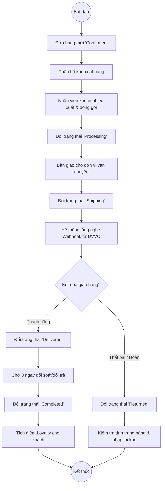

### 4.3 Quy trình bán hàng POS

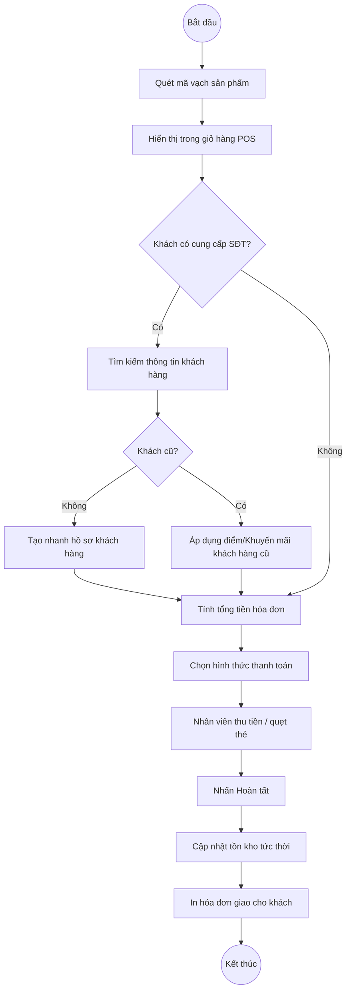

### 4.4 Quy trình nhập kho

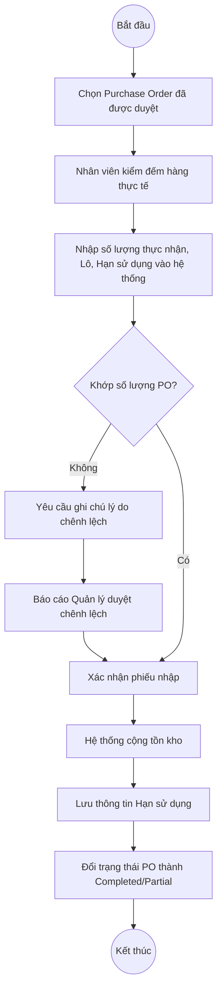

### 4.5 Quy trình đăng ký & xác thực tài khoản

```mermaid
flowchart TD
    Start((Bắt đầu)) --> Chọn_ĐK[Khách chọn Đăng ký]
    Chọn_ĐK --> Chọn_Social{Sử dụng Social Login?}
    
    Chọn_Social -- Google/FB --> Gọi_OAuth[Gọi OAuth2 Google/FB]
    Gọi_OAuth --> Nhận_Profile[Nhận Profile & Tạo tài khoản tự động]
    Nhận_Profile --> Cấp_JWT[Cấp JWT Access Token]
    
    Chọn_Social -- Bằng Email --> Nhập_Form[Nhập Form ĐK: Email, Pass, Tên]
    Nhập_Form --> Validate_Form{Hợp lệ?}
    Validate_Form -- Không --> Báo_Lỗi_Form[Báo lỗi Validation]
    Báo_Lỗi_Form --> Nhập_Form
    
    Validate_Form -- Có --> Kiểm_tra_Trùng{Email đã tồn tại?}
    Kiểm_tra_Trùng -- Có --> Báo_Trùng[Báo lỗi Email đã sử dụng]
    Báo_Trùng --> Nhập_Form
    
    Kiểm_tra_Trùng -- Không --> Mã_hóa[Mã hóa Password (Bcrypt)]
    Mã_hóa --> Lưu_DB[Lưu vào Database]
    Lưu_DB --> Cấp_JWT
    
    Cấp_JWT --> Trả_Client[Trả Token về Client, lưu Cookie/Local Storage]
    Trả_Client --> End((Kết thúc))
```

---

## 5. Sequence Diagrams

### 5.1 Đặt hàng & thanh toán VNPay

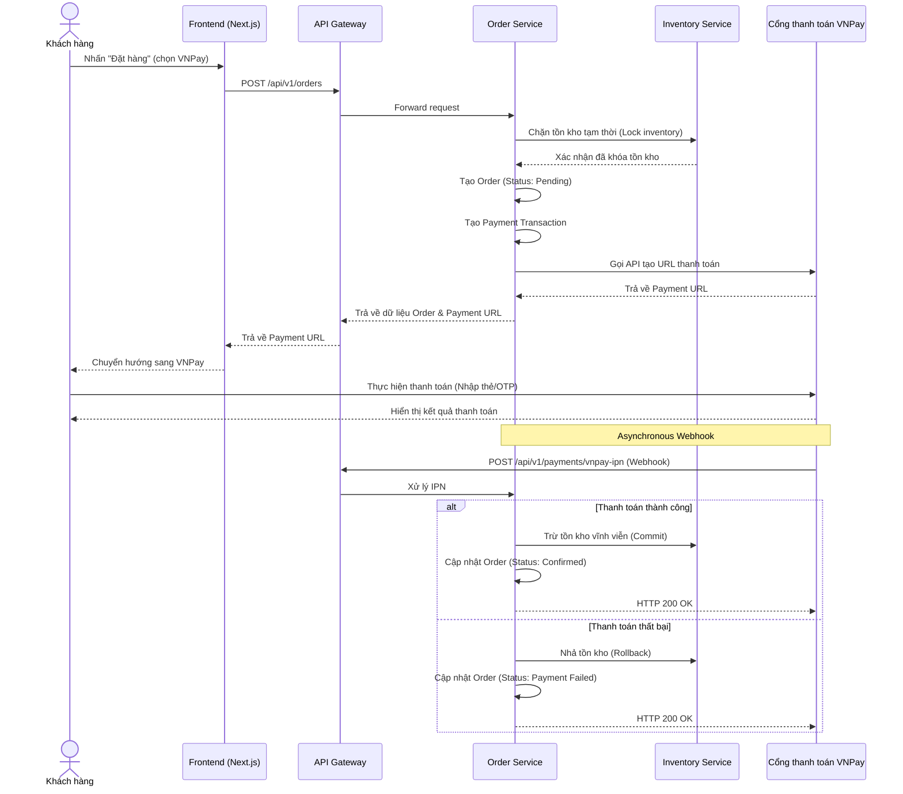

### 5.2 Tạo đơn hàng POS

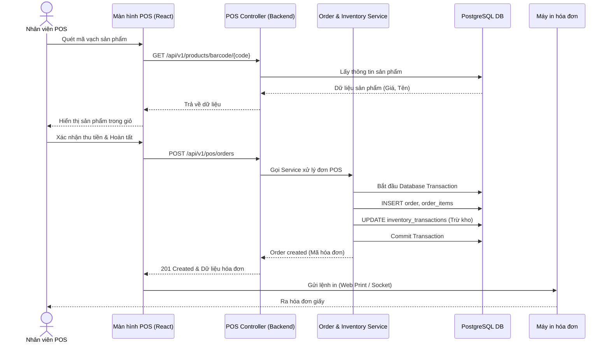

### 5.3 Đăng nhập (JWT authentication flow)

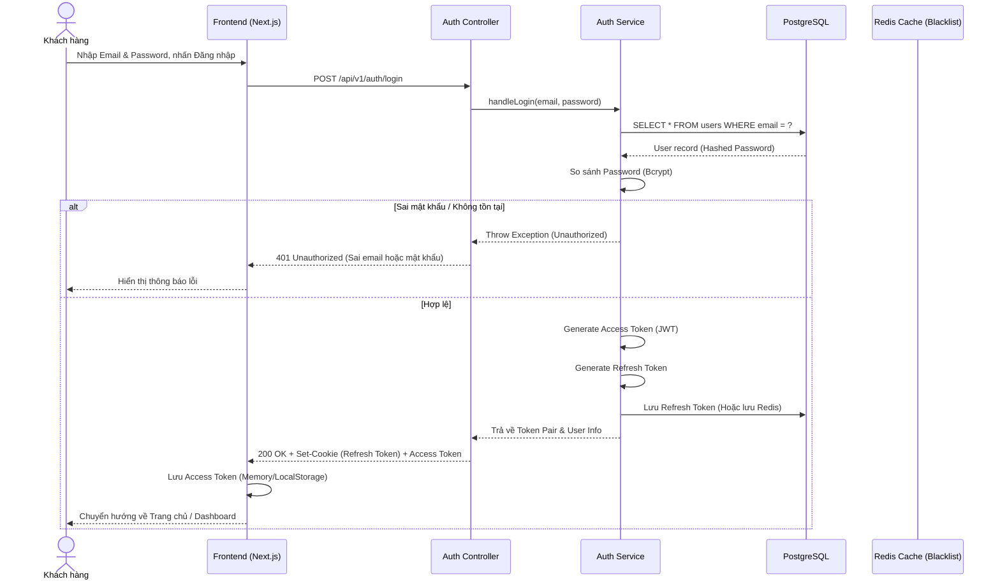

### 5.4 Tìm kiếm sản phẩm (with Elasticsearch)

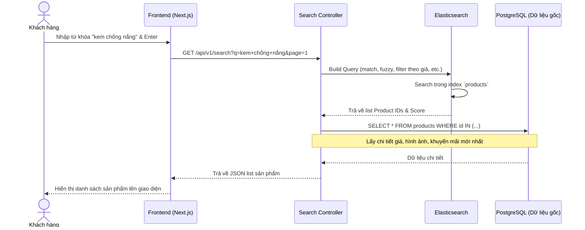

### 5.5 Xử lý hoàn trả đơn hàng

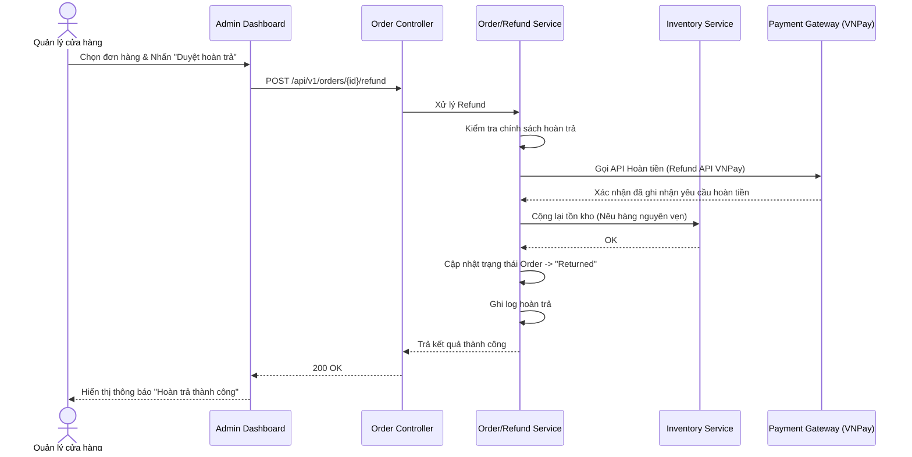
