# Tài liệu thiết kế Hệ thống - Document 4: Thiết Kế Cơ Sở Dữ Liệu

**Dự án:** GlowUp - Hệ thống quản lý bán hàng và phân tích kinh doanh cho chuỗi cửa hàng bán lẻ mỹ phẩm

---

## Mục lục

1. [Tổng quan thiết kế CSDL](#1-tổng-quan-thiết-kế-csdl)
2. [ERD - Sơ đồ quan hệ thực thể](#2-erd---sơ-đồ-quan-hệ-thực-thể)
3. [Chi tiết các bảng](#3-chi-tiết-các-bảng) (62 bảng, 12 phân hệ)
   - [3.1 Authentication & User Management](#31-authentication--user-management) (Bảng 1-6)
   - [3.2 Product & Catalog](#32-product--catalog) (Bảng 7-13)
   - [3.3 Store & Inventory](#33-store--inventory) (Bảng 14-21)
   - [3.4 Order, Cart, Logistics & RMA](#34-order-cart-logistics--rma-returns) (Bảng 22-30)
   - [3.5 Payment, POS Sessions & Settlement](#35-payment-pos-sessions--settlement) (Bảng 31-33)
   - [3.6 Customer & CRM](#36-customer--crm) (Bảng 34-39)
   - [3.7 HR & Employee](#37-hr--employee) (Bảng 40-44)
   - [3.8 Supplier & Procurement](#38-supplier--procurement) (Bảng 45-48)
   - [3.9 Marketing](#39-marketing) (Bảng 49-51)
   - [3.10 CMS](#310-cms) (Bảng 52-56)
   - [3.11 System](#311-system) (Bảng 57-60)
   - [3.12 Invoicing & Financial Documents](#312-invoicing--financial-documents-hóa-đơn--chứng-từ) (Bảng 61-62)
4. [Indexes & Performance](#4-indexes--performance)
5. [Data Migration & Seeding](#5-data-migration--seeding)
6. [Phụ lục A. Điều chỉnh chốt trước migration đầu tiên & Ràng buộc tầng Code](#phụ-lục-a-điều-chỉnh-chốt-trước-migration-đầu-tiên--ràng-buộc-nghiệp-vụ-tầng-code)

---

## 1. Tổng quan thiết kế CSDL

### 1.1 Hệ quản trị CSDL: PostgreSQL 15+
Hệ thống sử dụng **PostgreSQL 15+** làm hệ quản trị CSDL chính nhờ các ưu điểm:
- Hỗ trợ tốt JSONB cho các dữ liệu không cấu trúc cố định (địa chỉ, metadata, cài đặt).
- Khả năng xử lý Transaction mạnh mẽ, đáp ứng ACID, phù hợp với các nghiệp vụ tài chính, thanh toán và tồn kho.
- Khả năng Full-text search tốt, hỗ trợ các index như GIN/GiST.
- Hỗ trợ UUID nguyên bản, giúp bảo mật và phân tán dữ liệu tốt hơn.

### 1.2 Nguyên tắc thiết kế
- **Normalization (Chuẩn hóa):** Thiết kế đạt chuẩn 3NF (Third Normal Form) cho hầu hết các bảng để tránh dư thừa dữ liệu. Một số bảng báo cáo có thể được denormalize nhẹ để tối ưu read performance.
- **Data Integrity:** Sử dụng Foreign Keys (`REFERENCES`), `UNIQUE`, `CHECK` constraint chặt chẽ để đảm bảo tính toàn vẹn dữ liệu từ tầng CSDL.
- **Soft Delete:** Các bảng quan trọng như `users`, `products`, `orders` sử dụng trạng thái `status` hoặc `is_active` (boolean) thay vì xóa vật lý (`DELETE`), nhằm lưu vết và phục vụ báo cáo.
- **Audit Trails:** Thêm các trường `created_at`, `updated_at` trong tất cả các bảng chính. Thông tin thay đổi nhạy cảm sẽ được ghi log tại bảng `audit_logs`.

### 1.3 Quy ước đặt tên
- **Tên bảng:** Viết thường, số nhiều, cách nhau bằng dấu gạch dưới (`snake_case`). Ví dụ: `users`, `order_items`.
- **Tên cột:** Viết thường, số ít, sử dụng `snake_case`. Ví dụ: `first_name`, `created_at`.
- **Primary Key (Khóa chính):** Luôn đặt là `id`. Thường dùng kiểu `UUID` cho các bảng thực thể chính (`users`, `orders`, `products`) và `BIGINT`/`INTEGER` cho các bảng cấu hình/vai trò (`roles`, `permissions`) hoặc khóa chính phức hợp (`user_stores`).
- **Foreign Key (Khóa ngoại):** Định dạng `[tên_bảng_số_ít]_id`. Ví dụ: `user_id`, `product_id`.
- **Boolean:** Tiền tố `is_` hoặc `has_`. Ví dụ: `is_active`, `is_verified`.
- **Timestamp:** Hậu tố `_at`. Ví dụ: `created_at`, `updated_at`, `deleted_at`.

---

## 2. ERD - Sơ đồ quan hệ thực thể

### 2.1 ERD: Authentication & User Management

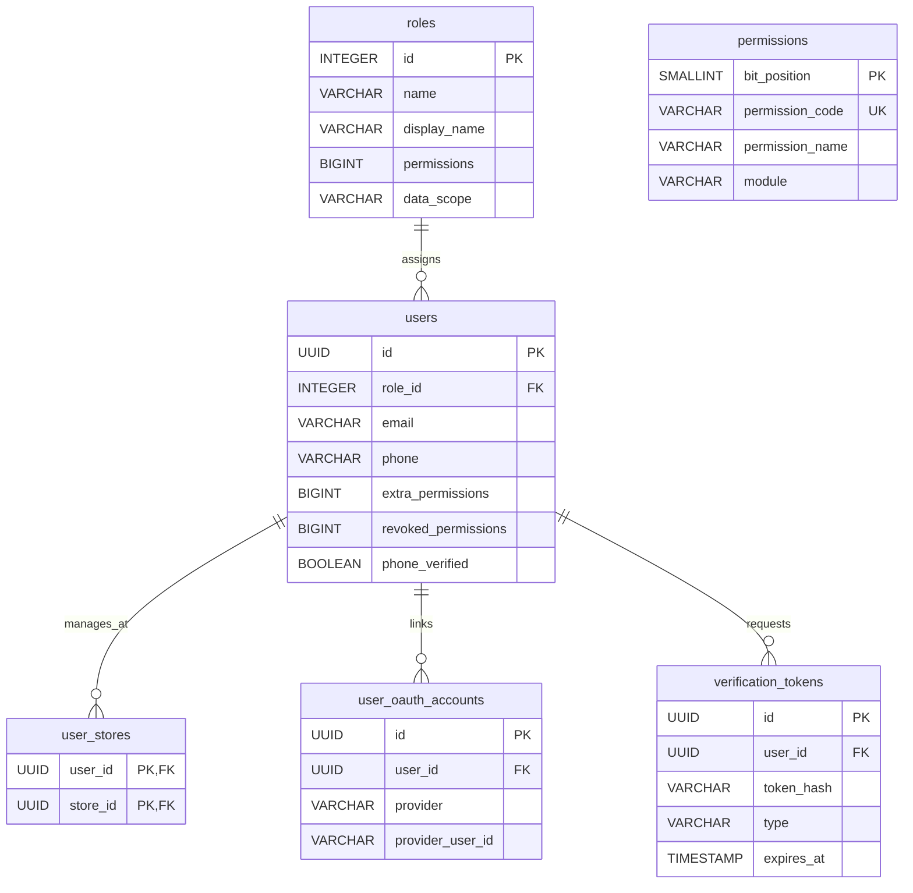

### 2.2 ERD: Product & Catalog

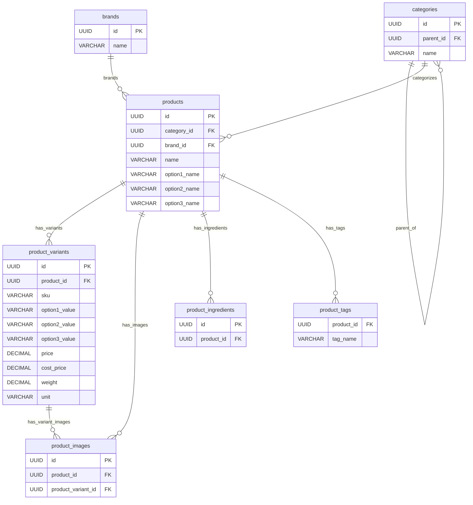

### 2.3 ERD: Inventory Management & Transfers

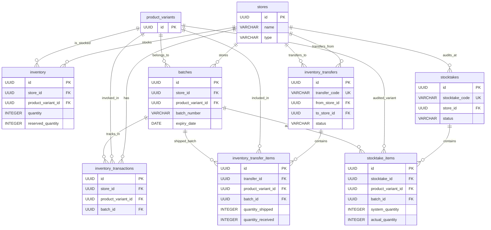

### 2.4 ERD: Order, Logistics, POS Sessions, Payments, Invoices & Returns

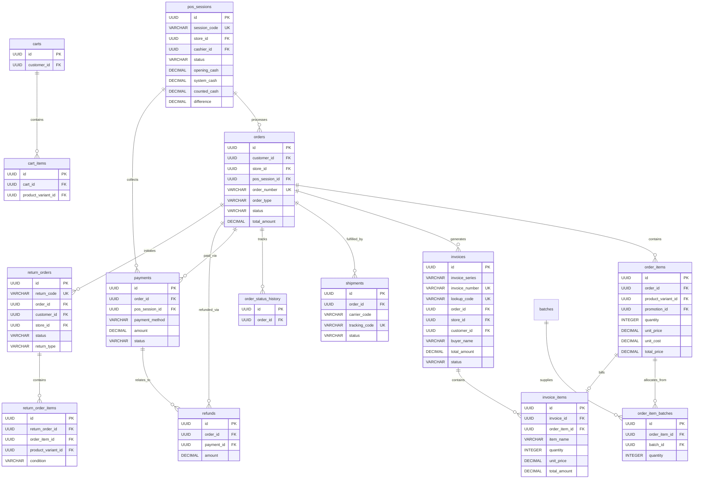

### 2.5 ERD: Customer & CRM

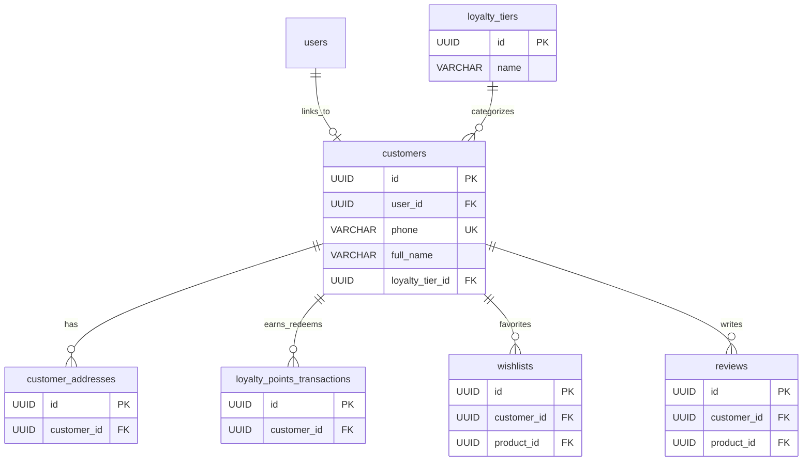

### 2.6 ERD: HR & Employee

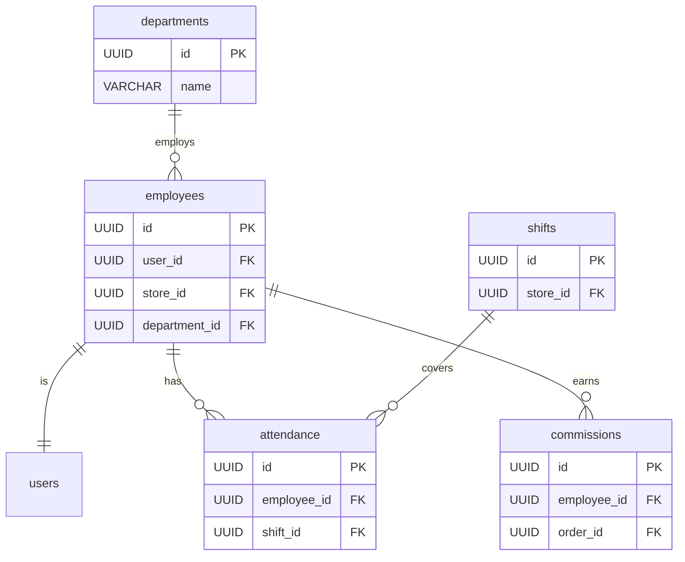

### 2.7 ERD: Supplier & Procurement

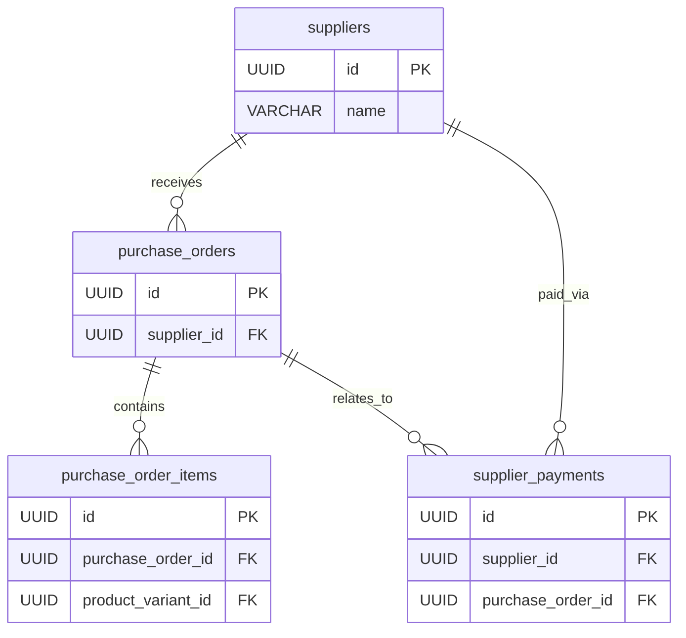

### 2.8 ERD: Marketing

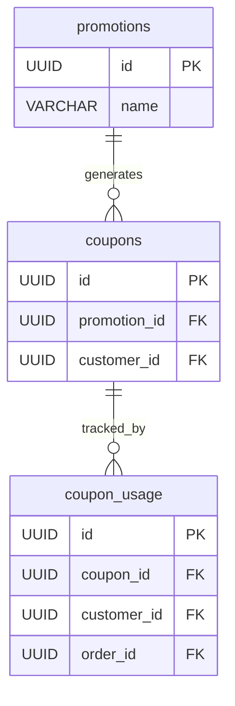

### 2.9 ERD: CMS

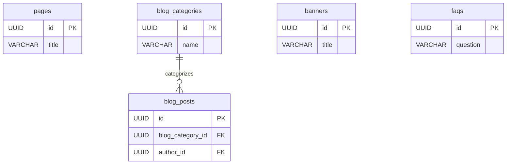

### 2.10 ERD: System

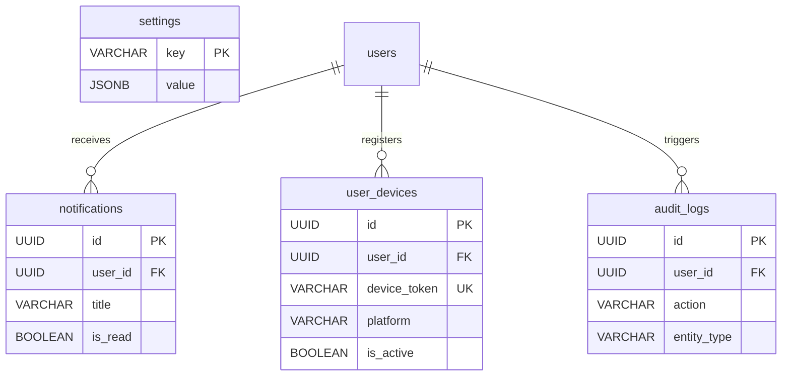

### 2.11 ERD: Invoicing & Supplier Traceability (Truy vết nguồn gốc Hóa đơn & Nhà cung cấp)

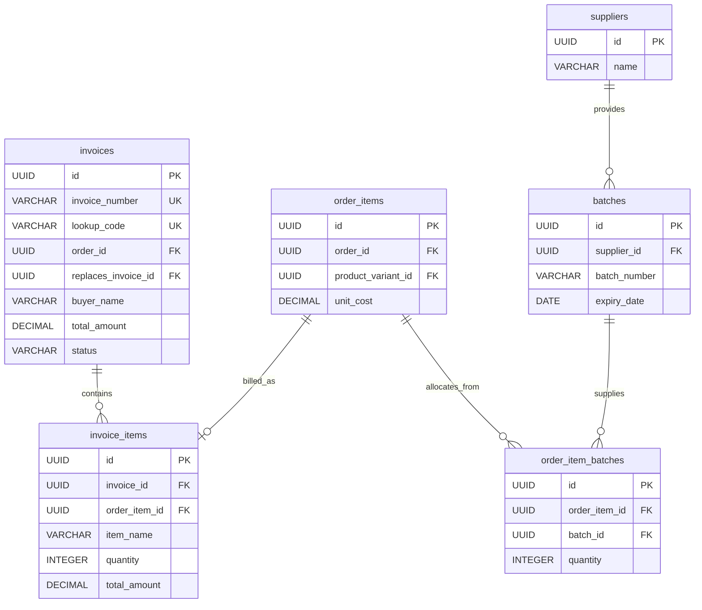

---

## 3. Chi tiết các bảng

### 3.1 Authentication & User Management

Phân hệ xác thực và phân quyền được thiết kế kết hợp giữa **Bitwise Permission Mask** (phân quyền chức năng hiệu năng cao bằng số nhị phân) và **Data Scope** (phân định phạm vi dữ liệu chi nhánh).

#### 1. Nguyên lý phân quyền và kiểm soát dữ liệu
- **Biểu diễn quyền bằng số nguyên lớn (`BIGINT` 64-bit):** Toàn bộ quyền thao tác trong hệ thống được định danh bởi một vị trí bit duy nhất từ $0$ đến $62$ (tương ứng các lũy thừa $2^{\text{bit\_position}}$). Quyền hạn của một vai trò hay cá nhân được lưu trữ dưới dạng một số nguyên duy nhất, loại bỏ hoàn toàn nhu cầu dùng bảng trung gian nhiều - nhiều (`role_permissions`, `user_roles`).
- **Phân định rạch ròi giữa Chức năng và Phạm vi:**
  - **Được làm gì (Functional Permission):** Quyết định bởi Bitmask thông qua phép toán `AND` bitwise với độ phức tạp $O(1)$.
  - **Được làm ở đâu (Data Scope):** Quyết định bởi cột `data_scope` (`SELF`, `STORE`, `ALL`) trên vai trò kết hợp với bảng `user_stores` (danh sách cửa hàng được giao quyền quản trị) và `employees.store_id` (cửa hàng công tác chính).
- **Cơ chế cấp / thu hồi quyền cá nhân (Direct User Overrides):**
  - Cột `extra_permissions` trên bảng `users`: Cấp thêm quyền cá nhân ngoài vai trò mặc định (dùng phép OR `|`).
  - Cột `revoked_permissions` trên bảng `users`: Thu hồi quyền cá nhân mà không cần đổi vai trò của người dùng (dùng phép AND NOT `& ~`).
- **Công thức tính quyền thực tế:**
  $$\text{effective\_permissions} = (\text{roles.permissions} \mid \text{users.extra_permissions}) \ \& \sim \text{users.revoked_permissions}$$
  *Quy ước bảo mật tối thượng:* **Quyền bị thu hồi luôn thắng quyền được cấp thêm (Explicit Deny trumps Allow).**

> [!IMPORTANT]
> **Quy tắc Kiến trúc Mã nguồn — Gom việc đọc Bitmask vào một hàm Service duy nhất:**
> - Giữ nguyên thiết kế bitmask trên CSDL, không đổi schema. Nhưng trong toàn bộ dự án, **chỉ duy nhất một hàm service** (`getUserEffectivePermissions(userId: string)`) được phép thực hiện các phép toán bitwise trên ba cột `roles.permissions`, `users.extra_permissions`, `users.revoked_permissions` theo công thức tại Mục 3.1.
> - Hàm này trả về danh sách mã quyền dạng chuỗi (ví dụ: `['PRODUCT_VIEW', 'ORDER_POS_CREATE', ...]`). Mọi tầng controller, middleware phân quyền (guards) và frontend chỉ làm việc với mảng chuỗi mã quyền.
> - **Lợi ích:** Khi hết bit (hiện dùng 53/63) và phải đổi sang kiểu mảng chuỗi `TEXT[]`, chỉ cần sửa nội dung một hàm duy nhất thay vì rà soát toàn bộ endpoint. Đồng thời log ghi được mã quyền dễ đọc và tránh lỗi `BigInt` không tuần tự hóa được trong JavaScript/JSON.
> - **Mốc theo dõi mở rộng:** Khi hệ thống sử dụng tới **bit 58** thì dừng lại để quyết định hướng mở rộng, bảo đảm luôn còn 5 bit dự phòng.
> - **Nguyên tắc tiết kiệm bit:** Không tạo bit mang nghĩa phạm vi dữ liệu (kiểu `REPORT_REVENUE_OWN_STORE`) vì cột `data_scope` đã đảm nhiệm phần "ở đâu". Bitmask chỉ trả lời "được làm việc gì".

---

#### 1. Bảng `users`
- **Mô tả:** Lưu trữ tài khoản người dùng thống nhất (Unified Identity). Một tài khoản có thể đồng thời là Nhân viên (có hồ sơ trong `employees`) và Khách hàng (có hồ sơ trong `customers`), cho phép nhân viên mua hàng và hưởng ưu đãi nội bộ.

| Tên cột | Kiểu dữ liệu | Ràng buộc | Mô tả |
|---|---|---|---|
| id | UUID | PRIMARY KEY | Khóa chính, tự sinh |
| role_id | INTEGER | FK(roles.id), NOT NULL, DEFAULT 6 | Vai trò chính của người dùng (mặc định role Customer) |
| email | VARCHAR(255) | UNIQUE, NOT NULL | Địa chỉ email đăng nhập |
| password_hash | VARCHAR(255) | NULL | Mật khẩu đã băm (NULL nếu đăng nhập bằng OAuth mạng xã hội) |
| phone | VARCHAR(20) | UNIQUE, NULL | Số điện thoại liên lạc |
| full_name | VARCHAR(100) | NOT NULL | Họ và tên người dùng |
| avatar_url | TEXT | NULL | Link ảnh đại diện |
| status | VARCHAR(20) | DEFAULT 'ACTIVE' | Trạng thái: ACTIVE, INACTIVE, BANNED |
| email_verified | BOOLEAN | DEFAULT FALSE | Đã xác thực email |
| phone_verified | BOOLEAN | DEFAULT FALSE | Đã xác thực số điện thoại qua OTP |
| extra_permissions | BIGINT | DEFAULT 0 | Bitmask quyền cá nhân được cấp thêm (phép OR) |
| revoked_permissions | BIGINT | DEFAULT 0 | Bitmask quyền cá nhân bị tước bỏ (phép AND NOT) |
| last_login_at | TIMESTAMP WITH TIME ZONE | NULL | Lần đăng nhập cuối |
| created_at | TIMESTAMP WITH TIME ZONE | DEFAULT NOW() | Ngày tạo |
| updated_at | TIMESTAMP WITH TIME ZONE | DEFAULT NOW() | Ngày cập nhật |

#### 2. Bảng `roles`
- **Mô tả:** Vai trò hệ thống. Lưu trữ bộ quyền mặc định và phạm vi dữ liệu chuẩn của vai trò.

| Tên cột | Kiểu dữ liệu | Ràng buộc | Mô tả |
|---|---|---|---|
| id | INTEGER | PRIMARY KEY | Khóa chính tự tăng |
| name | VARCHAR(50) | UNIQUE, NOT NULL | Tên mã vai trò hệ thống (`admin`, `store_manager`, `sales_staff`, ...) |
| display_name | VARCHAR(100) | NOT NULL | Tên hiển thị (VD: `Quản trị viên`, `Cửa hàng trưởng`) |
| description | TEXT | NULL | Mô tả chức năng của vai trò |
| permissions | BIGINT | DEFAULT 0 | Tổng hợp các bit quyền chuẩn của vai trò (Bitmask) |
| data_scope | VARCHAR(20) | DEFAULT 'SELF' | Phạm vi dữ liệu: `SELF` (chính mình), `STORE` (cửa hàng được gán), `ALL` (toàn chuỗi) |
| is_system | BOOLEAN | DEFAULT FALSE | Cờ cấm xóa nếu là role mặc định hệ thống |

#### 3. Bảng `permissions`
- **Mô tả:** Bảng danh mục / từ điển tra cứu định nghĩa bit quyền (Metadata Dictionary). Không dùng để JOIN kiểm tra quyền lúc runtime mà dùng để:
  1. Cung cấp danh mục cho màn hình Admin UI hiển thị danh sách checkbox phân quyền.
  2. Tra cứu dịch từ mã bitmask sang tên quyền phục vụ bảng nhật ký thao tác `audit_logs`.

| Tên cột | Kiểu dữ liệu | Ràng buộc | Mô tả |
|---|---|---|---|
| bit_position | SMALLINT | PRIMARY KEY, CHECK (bit_position BETWEEN 0 AND 62) | Vị trí bit từ 0 đến 62 (chặn tràn sang bit 63 là bit dấu của kiểu `BIGINT`) |
| bit_value | BIGINT | UNIQUE, NOT NULL | Giá trị lũy thừa tương ứng ($2^{\text{bit\_position}}$) |
| permission_code | VARCHAR(100) | UNIQUE, NOT NULL | Mã quyền chuẩn hóa (VD: `PRODUCT_VIEW`, `ORDER_POS_CREATE`) |
| permission_name | VARCHAR(100) | NOT NULL | Tên tiếng Việt hiển thị trên giao diện |
| module | VARCHAR(50) | NOT NULL | Phân hệ nghiệp vụ (`product`, `inventory`, `order`, ...) |
| description | TEXT | NULL | Mô tả chi tiết hành vi được phép thực hiện |

#### 4. Bảng `user_stores`
- **Mô tả:** Quản lý phạm vi chi nhánh được giao quyền quản trị cho người dùng (áp dụng cho vai trò có `data_scope = 'STORE'`). Cho phép một quản lý có thể phụ trách nhiều cửa hàng mà không cần nhân bản vai trò.

| Tên cột | Kiểu dữ liệu | Ràng buộc | Mô tả |
|---|---|---|---|
| user_id | UUID | PRIMARY KEY, FK(users.id) ON DELETE CASCADE | ID người dùng |
| store_id | UUID | PRIMARY KEY, FK(stores.id) ON DELETE CASCADE | ID cửa hàng phụ trách |
| assigned_at | TIMESTAMP WITH TIME ZONE | DEFAULT NOW() | Ngày phân công phụ trách |

#### 5. Bảng `user_oauth_accounts`
- **Mô tả:** Lưu trữ tài khoản liên kết đăng nhập mạng xã hội (Google, Facebook, Apple).

| Tên cột | Kiểu dữ liệu | Ràng buộc | Mô tả |
|---|---|---|---|
| id | UUID | PRIMARY KEY | Khóa chính tự sinh |
| user_id | UUID | FK(users.id) ON DELETE CASCADE | ID người dùng |
| provider | VARCHAR(50) | NOT NULL | Nhà cung cấp: `GOOGLE`, `FACEBOOK`, `APPLE` |
| provider_user_id | VARCHAR(255) | NOT NULL | ID định danh người dùng phía nhà cung cấp |
| created_at | TIMESTAMP WITH TIME ZONE | DEFAULT NOW() | Thời điểm liên kết |

*Ràng buộc:* `UNIQUE(provider, provider_user_id)` nhằm đảm bảo một tài khoản mạng xã hội chỉ liên kết với một tài khoản hệ thống.

#### 6. Bảng `verification_tokens`
- **Mô tả:** Quản lý mã OTP và token tạm thời có thời hạn cho các tác vụ: kích hoạt tài khoản, xác thực số điện thoại, khôi phục mật khẩu.

| Tên cột | Kiểu dữ liệu | Ràng buộc | Mô tả |
|---|---|---|---|
| id | UUID | PRIMARY KEY | Khóa chính tự sinh |
| user_id | UUID | FK(users.id) ON DELETE CASCADE, NULL | ID người dùng liên quan (có thể NULL lúc đăng ký mới) |
| token_hash | VARCHAR(255) | NOT NULL | Mã OTP hoặc Token đã băm bảo mật |
| type | VARCHAR(50) | NOT NULL | Loại xác thực: `EMAIL_VERIFY`, `PHONE_OTP`, `PASSWORD_RESET` |
| expires_at | TIMESTAMP WITH TIME ZONE | NOT NULL | Thời điểm hết hạn hiệu lực |
| is_used | BOOLEAN | DEFAULT FALSE | Đánh dấu đã sử dụng |
| created_at | TIMESTAMP WITH TIME ZONE | DEFAULT NOW() | Thời điểm phát hành mã |

---

#### 2. Danh mục 53 quyền hệ thống chuẩn (Tra cứu Bitmask)

Dưới đây là bảng phân bổ 53 quyền cốt lõi (từ bit 0 đến bit 52, còn dư 10 bit trên kiểu `BIGINT` 64-bit cho mở rộng sau này):

| Bit | Giá trị ($2^k$) | Mã quyền (`permission_code`) | Tên quyền (`permission_name`) | Phân hệ (`module`) |
|:---:|:---:|---|---|---|
| **0** | 1 | `PRODUCT_VIEW` | Xem danh mục & chi tiết sản phẩm | `product` |
| **1** | 2 | `PRODUCT_CREATE` | Tạo sản phẩm & biến thể mới | `product` |
| **2** | 4 | `PRODUCT_UPDATE` | Chỉnh sửa thông tin & giá bán sản phẩm | `product` |
| **3** | 8 | `PRODUCT_DELETE` | Xóa/ngừng kinh doanh sản phẩm | `product` |
| **4** | 16 | `PRODUCT_CATEGORY_MANAGE` | Quản lý danh mục & thương hiệu | `product` |
| **5** | 32 | `PRODUCT_IMPORT_EXPORT` | Xuất nhập file Excel danh sách sản phẩm | `product` |
| **6** | 64 | `INVENTORY_VIEW` | Xem tồn kho theo cửa hàng | `inventory` |
| **7** | 128 | `INVENTORY_CHECK` | Kiểm kê & điều chỉnh tồn kho | `inventory` |
| **8** | 256 | `INVENTORY_TRANSFER` | Chuyển hàng giữa các kho/chi nhánh | `inventory` |
| **9** | 512 | `INVENTORY_BATCH_MANAGE` | Quản lý hạn sử dụng & số lô mỹ phẩm | `inventory` |
| **10** | 1024 | `INVENTORY_WARN_LOW` | Cấu hình & nhận cảnh báo sắp hết hàng | `inventory` |
| **11** | 2048 | `ORDER_POS_CREATE` | Tạo đơn hàng bán lẻ tại quầy (POS) | `order` |
| **12** | 4096 | `ORDER_ONLINE_VIEW` | Xem danh sách đơn hàng online | `order` |
| **13** | 8192 | `ORDER_DISCOUNT_APPLY` | Áp dụng chiết khấu/mã giảm giá tại quầy | `order` |
| **14** | 16384 | `ORDER_STATUS_UPDATE` | Cập nhật tiến độ giao hàng/đóng gói | `order` |
| **15** | 32768 | `ORDER_CANCEL` | Hủy đơn hàng | `order` |
| **16** | 65536 | `PAYMENT_COLLECT` | Thu tiền, mở và kết ca làm việc POS | `payment` |
| **17** | 131072 | `PAYMENT_REFUND` | Duyệt hoàn tiền trả hàng cho khách | `payment` |
| **18** | 262144 | `PAYMENT_METHOD_CONFIG` | Quản lý phương thức thanh toán POS/Online | `payment` |
| **19** | 524288 | `PAYMENT_RECONCILE` | Đối soát doanh thu ca và cổng thanh toán | `payment` |
| **20** | 1048576 | `CUSTOMER_VIEW` | Xem danh sách & hồ sơ khách hàng | `customer` |
| **21** | 2097152 | `CUSTOMER_CREATE_UPDATE` | Tạo mới & cập nhật thông tin khách hàng | `customer` |
| **22** | 4194304 | `CUSTOMER_LOYALTY_ADJUST` | Điều chỉnh điểm tích lũy & hạng thành viên | `customer` |
| **23** | 8388608 | `CUSTOMER_FEEDBACK_MANAGE`| Duyệt & trả lời đánh giá, khiếu nại | `customer` |
| **24** | 16777216 | `CUSTOMER_EXPORT` | Xuất dữ liệu khách hàng CRM | `customer` |
| **25** | 33554432 | `EMPLOYEE_VIEW` | Xem danh sách nhân sự cửa hàng | `employee` |
| **26** | 67108864 | `EMPLOYEE_MANAGE` | Thêm mới, phân công ca làm việc nhân viên | `employee` |
| **27** | 134217728 | `EMPLOYEE_COMMISSION_VIEW`| Xem bảng hoa hồng doanh số | `employee` |
| **28** | 268435456 | `EMPLOYEE_COMMISSION_CALC`| Tính toán & chốt thưởng hoa hồng tháng | `employee` |
| **29** | 536870912 | `EMPLOYEE_ATTENDANCE` | Quản lý chấm công & duyệt xin nghỉ | `employee` |
| **30** | 1073741824 | `SUPPLIER_VIEW` | Xem danh bạ nhà cung cấp | `supplier` |
| **31** | 2147483648 | `SUPPLIER_MANAGE` | Thêm, sửa thông tin nhà cung cấp | `supplier` |
| **32** | 4294967296 | `PO_CREATE` | Lập đơn đặt hàng nhập kho (PO) | `supplier` |
| **33** | 8589934592 | `PO_APPROVE` | Phê duyệt đơn nhập hàng & thanh toán NCC | `supplier` |
| **34** | 17179869184 | `PO_RECEIVE` | Xác nhận nhập kho thực tế từ đơn PO | `supplier` |
| **35** | 34359738368 | `REPORT_VIEW_BASIC` | Xem báo cáo doanh số & tồn kho cơ bản | `report` |
| **36** | 68719476736 | `REPORT_REVENUE` | Xem báo cáo tài chính, lợi nhuận chi tiết | `report` |
| **37** | 137438953472 | `REPORT_STAFF_PERF` | Xem báo cáo hiệu suất bán hàng nhân viên | `report` |
| **38** | 274877906944 | `REPORT_FORECAST` | Xem dự báo nhu cầu & phân tích xu hướng | `report` |
| **39** | 549755813888 | `REPORT_EXPORT` | Xuất báo cáo PDF/Excel phân tích kinh doanh | `report` |
| **40** | 1099511627776 | `MARKETING_PROMO_VIEW` | Xem chương trình khuyến mãi & mã giảm giá | `marketing` |
| **41** | 2199023255552 | `MARKETING_PROMO_MANAGE` | Tạo & chỉnh sửa Flash Sale, Voucher | `marketing` |
| **42** | 4398046511104 | `MARKETING_BANNER_MANAGE` | Cài đặt banner, trang chủ website/app | `marketing` |
| **43** | 8796093022208 | `MARKETING_BLOG_MANAGE` | Đăng bài viết blog, review làm đẹp | `marketing` |
| **44** | 17592186044416 | `SYSTEM_USER_MANAGE` | Quản lý tài khoản đăng nhập & cấp quyền | `system` |
| **45** | 35184372088832 | `SYSTEM_ROLE_MANAGE` | Định nghĩa & hiệu chỉnh vai trò hệ thống | `system` |
| **46** | 70368744177664 | `SYSTEM_SETTING_UPDATE` | Thay đổi cấu hình thuế VAT, phí vận chuyển | `system` |
| **47** | 140737488355328 | `SYSTEM_AUDIT_VIEW` | Tra cứu nhật ký thao tác (Audit Logs) | `system` |
| **48** | 281474976710656 | `INVENTORY_TRANSFER_MANAGE` | Lập & phê duyệt phiếu chuyển kho liên chi nhánh | `inventory` |
| **49** | 562949953421312 | `INVENTORY_STOCKTAKE_MANAGE`| Tạo & chốt phiếu kiểm kê định kỳ cân bằng kho | `inventory` |
| **50** | 1125899906842624| `ORDER_SHIPMENT_MANAGE` | Đóng gói, in vận đơn & bàn giao 3PL giao hàng | `order` |
| **51** | 2251799813685248| `ORDER_RETURN_MANAGE` | Tiếp nhận thẩm định & xử lý đơn đổi trả hàng (RMA) | `order` |
| **52** | 4503599627370496| `INVOICE_MANAGE` | Phát hành, tra cứu & hủy hóa đơn điện tử VAT | `payment` |

---

---

#### 3. Quy trình xác thực và kiểm tra quyền tại Runtime

Giả sử:
- **Vai trò Nhân viên bán hàng (`role_id = 3`, mã vai trò `sales_staff`)** sở hữu các quyền cơ bản: bit 0, 11, 13, 16, 20, 21. *(Lưu ý: trong mã nguồn, hệ thống tra cứu vai trò theo `roles.name` chuẩn hóa thay vì hardcode số ID cố định)*.
  $$\text{roles.permissions} = 2^0 + 2^{11} + 2^{13} + 2^{16} + 2^{20} + 2^{21} = 1 + 2048 + 8192 + 65536 + 1048576 + 2097152 = 3.221.505$$
  $\text{data\_scope} = \text{'STORE'}$
- **Chị Mai (Nhân viên bán hàng tại CH01)** được quản lý tin tưởng giao thêm quyền xem Báo cáo doanh thu (bit 36, giá trị $68.719.476.736$), nhưng tạm thời bị tước quyền Thu tiền ca (bit 16, giá trị $65.536$) sau một sự cố bàn giao quỹ:
  $$\text{users.extra\_permissions} = 68.719.476.736$$
  $$\text{users.revoked\_permissions} = 65.536$$

**Khi chị Mai thực hiện thao tác trên hệ thống:**
1. **Kiểm tra quyền "Xem báo cáo doanh thu" (Bit 36):**
   * Bước 1: Lấy `roles.permissions`: $3.221.505$.
   * Bước 2: Gộp thêm `extra_permissions`: $3.221.505 \mid 68.719.476.736 = 68.722.698.241$.
   * Bước 3: Loại trừ `revoked_permissions`: $68.722.698.241 \ \& \sim 65.536 = 68.722.698.241$.
   * Bước 4: Kiểm tra bit 36: $(68.722.698.241 \ \& \ 68.719.476.736) == 68.719.476.736 \implies$ **HỢP LỆ (Cho phép truy cập chức năng)**.
   * Bước 5: Kiểm tra phạm vi dữ liệu: Do role có `data_scope = 'STORE'`, hệ thống tự động gán điều kiện lọc:
     `WHERE store_id IN (SELECT store_id FROM user_stores WHERE user_id = :user_id)`
     $\implies$ Chị Mai chỉ xem được số liệu doanh thu tại cửa hàng mình phụ trách, tuyệt đối không thấy số liệu của chi nhánh khác.
2. **Kiểm tra quyền "Thu tiền / Đóng mở ca" (Bit 16):**
   * Tính toán tương tự, tại bước 3 bit 16 đã bị loại bỏ ($\& \sim 65.536$). Phép kiểm tra:
     $68.722.698.241 \ \& \ 65.536 = 0 \implies$ **TỪ CHỐI TRUY CẬP (Access Denied)**.

---

#### 4. Lưu ý kỹ thuật khi triển khai
1. **Ép kiểu `BIGINT` trong PostgreSQL:** Khi thực hiện phép dịch bit trên PostgreSQL, số `1` mặc định là `INTEGER` 32-bit. Nếu dịch quá 31 bit sẽ gây lỗi tràn số. **Bắt buộc phải ép kiểu:**
   ```sql
   -- Truy vấn kiểm tra người dùng có bit 36 hay không:
   SELECT u.id, u.full_name
   FROM users u
   JOIN roles r ON u.role_id = r.id
   WHERE ((r.permissions | u.extra_permissions) & ~u.revoked_permissions & (1::BIGINT << 36)) != 0;
   ```
2. **Hằng số dịch bit trong Backend Code:** Không hardcode số thập phân lớn trong mã nguồn. Định nghĩa các hằng số rõ ràng:
   ```typescript
   export const PERMISSIONS = {
     PRODUCT_VIEW: 1n << 0n,
     ORDER_POS_CREATE: 1n << 11n,
     PAYMENT_COLLECT: 1n << 16n,
     REPORT_REVENUE: 1n << 36n,
   } as const;
   ```
3. **Serialization trong JavaScript / NodeJS:** Kiểu `BigInt` của JavaScript không thể tự động tuần tự hóa bằng `JSON.stringify()`. Khi gửi thông tin qua REST API, Backend cần chuyển đổi thành định dạng chuỗi (`toString()`) hoặc trả về mảng danh sách các `permission_code` đã giải mã.
4. **Audit Logs bắt buộc:** Mọi thao tác quản trị viên cập nhật `extra_permissions` hoặc `revoked_permissions` của người dùng phải được ghi vết vào bảng `audit_logs` để phục vụ thanh tra an toàn thông tin.


### 3.2 Product & Catalog

#### 7. Bảng `categories`
- **Mô tả:** Phân loại sản phẩm (hỗ trợ phân cấp cha-con).

| Tên cột | Kiểu dữ liệu | Ràng buộc | Mô tả |
|---|---|---|---|
| id | UUID | PRIMARY KEY | |
| parent_id | UUID | FK(categories.id), NULL | Danh mục cha (NULL nếu là cấp 1) |
| name | VARCHAR(150) | NOT NULL | Tên danh mục |
| slug | VARCHAR(150) | UNIQUE, NOT NULL | URL thân thiện |
| description | TEXT | NULL | |
| image_url | TEXT | NULL | Ảnh đại diện danh mục |
| sort_order | INTEGER | DEFAULT 0 | Thứ tự hiển thị |
| is_active | BOOLEAN | DEFAULT TRUE | Trạng thái hiển thị |
| meta_title | VARCHAR(255) | NULL | SEO Title |
| meta_description | TEXT | NULL | SEO Description |
| created_at | TIMESTAMP WITH TIME ZONE | DEFAULT NOW() | Thời điểm tạo |
| updated_at | TIMESTAMP WITH TIME ZONE | DEFAULT NOW() | Thời điểm cập nhật |

#### 8. Bảng `brands`
- **Mô tả:** Quản lý thương hiệu mỹ phẩm chính hãng (VD: L'Oréal, Innisfree, MAC, La Roche-Posay). Hỗ trợ hiển thị trang thương hiệu, banner quảng bá và tối ưu hóa SEO.

| Tên cột | Kiểu dữ liệu | Ràng buộc | Mô tả |
|---|---|---|---|
| id | UUID | PRIMARY KEY | Khóa chính tự sinh |
| name | VARCHAR(100) | NOT NULL | Tên thương hiệu |
| slug | VARCHAR(150) | UNIQUE, NOT NULL | Đường dẫn tĩnh thân thiện (URL Slug) |
| logo_url | TEXT | NULL | Link ảnh logo thương hiệu |
| banner_url | TEXT | NULL | Link ảnh bìa trang thương hiệu |
| description | TEXT | NULL | Giới thiệu câu chuyện thương hiệu |
| country_of_origin | VARCHAR(100) | NULL | Quốc gia xuất xứ (Pháp, Hàn Quốc, Nhật Bản...) |
| website_url | VARCHAR(255) | NULL | Website chính hãng của thương hiệu |
| sort_order | INTEGER | DEFAULT 0 | Thứ tự sắp xếp hiển thị |
| is_featured | BOOLEAN | DEFAULT FALSE | Đánh dấu thương hiệu nổi bật trên trang chủ |
| is_active | BOOLEAN | DEFAULT TRUE | Trạng thái kinh doanh |
| meta_title | VARCHAR(255) | NULL | Tiêu đề tối ưu SEO |
| meta_description | TEXT | NULL | Mô tả tối ưu SEO |
| created_at | TIMESTAMP WITH TIME ZONE | DEFAULT NOW() | Thời điểm tạo |
| updated_at | TIMESTAMP WITH TIME ZONE | DEFAULT NOW() | Thời điểm cập nhật |

#### 9. Bảng `products`
- **Mô tả:** Thông tin chung của sản phẩm. Hỗ trợ mô hình 3 thuộc tính biến thể linh hoạt (Shopify Option Model) phù hợp cho đa dạng ngành hàng mỹ phẩm (son, nước hoa, kem dưỡng, phấn nền). Giá vốn, khối lượng và đơn vị tính được quản lý chi tiết tại từng biến thể (`product_variants`).

| Tên cột | Kiểu dữ liệu | Ràng buộc | Mô tả |
|---|---|---|---|
| id | UUID | PRIMARY KEY | Khóa chính |
| category_id | UUID | FK(categories.id) | Danh mục sản phẩm |
| brand_id | UUID | FK(brands.id) | Thương hiệu mỹ phẩm |
| name | VARCHAR(255) | NOT NULL | Tên sản phẩm |
| slug | VARCHAR(255) | UNIQUE, NOT NULL | Đường dẫn SEO thân thiện |
| sku | VARCHAR(50) | UNIQUE, NOT NULL | Mã sản phẩm chung (Model SKU) |
| description | TEXT | NULL | Bài viết chi tiết, thành phần, công dụng |
| short_description | TEXT | NULL | Mô tả ngắn tóm tắt |
| base_price | DECIMAL(12,2) | NOT NULL | Giá niêm yết / khoảng giá tham chiếu hiển thị trên Catalog |
| sale_price | DECIMAL(12,2) | NULL | Giá khuyến mãi tham chiếu hiển thị trên Catalog |
| option1_name | VARCHAR(50) | NULL | Tên thuộc tính 1 (VD: 'Dung tích', 'Màu sắc') |
| option2_name | VARCHAR(50) | NULL | Tên thuộc tính 2 (VD: 'Nồng độ', 'Tone da') |
| option3_name | VARCHAR(50) | NULL | Tên thuộc tính 3 (VD: 'Quy cách đóng gói') |
| is_active | BOOLEAN | DEFAULT TRUE | Trạng thái kinh doanh |
| is_featured | BOOLEAN | DEFAULT FALSE | Đánh dấu sản phẩm nổi bật |
| avg_rating | DECIMAL(3,2) | DEFAULT 0 | Điểm đánh giá trung bình (1-5) |
| total_reviews | INTEGER | DEFAULT 0 | Tổng số lượt đánh giá hợp lệ |
| total_sold | INTEGER | DEFAULT 0 | Tổng số lượng đã bán toàn hệ thống |
| meta_title | VARCHAR(255) | NULL | Tiêu đề SEO |
| meta_description | TEXT | NULL | Thẻ mô tả SEO |
| meta_keywords | VARCHAR(255) | NULL | Từ khóa SEO |
| created_at | TIMESTAMP WITH TIME ZONE | DEFAULT NOW() | Thời điểm tạo |
| updated_at | TIMESTAMP WITH TIME ZONE | DEFAULT NOW() | Thời điểm cập nhật |

#### 10. Bảng `product_variants`
- **Mô tả:** Biến thể chi tiết của sản phẩm. Mỗi biến thể được định danh bởi bộ 3 giá trị thuộc tính tương ứng với khai báo ở bảng `products`. Đơn vị trực tiếp quản lý giá bán, giá vốn, quy cách đóng gói và khối lượng vận chuyển.

| Tên cột | Kiểu dữ liệu | Ràng buộc | Mô tả |
|---|---|---|---|
| id | UUID | PRIMARY KEY | Khóa chính |
| product_id | UUID | FK(products.id) ON DELETE CASCADE | Khóa ngoại trỏ về sản phẩm cha |
| sku | VARCHAR(50) | UNIQUE, NOT NULL | Mã biến thể duy nhất (SKU chi tiết) |
| option1_value | VARCHAR(100) | NULL | Giá trị thuộc tính 1 (VD: "50ml", "06 Figfig") |
| option2_value | VARCHAR(100) | NULL | Giá trị thuộc tính 2 (VD: "EDP", "Warm Sand") |
| option3_value | VARCHAR(100) | NULL | Giá trị thuộc tính 3 (VD: "Hộp quà", "Tuýp") |
| price | DECIMAL(12,2) | NOT NULL | Giá bán thực tế khi thanh toán đơn hàng |
| cost_price | DECIMAL(12,2) | NOT NULL | Giá vốn bình quân gia quyền hiện hành của biến thể (cập nhật khi nhập hàng) |
| weight | DECIMAL(8,2) | NULL | Khối lượng thực của biến thể (gram), phục vụ tính cước 3PL |
| unit | VARCHAR(20) | NULL | Đơn vị tính ('ml', 'g', 'thỏi', 'hộp', 'cái') |
| stock_quantity | INTEGER | DEFAULT 0 | Tổng tồn kho hiện tại toàn chuỗi (caching hiển thị nhanh) |
| barcode | VARCHAR(100) | UNIQUE, NULL | Mã vạch cho máy quét barcode tại quầy POS |
| is_active | BOOLEAN | DEFAULT TRUE | Trạng thái hoạt động |
| created_at | TIMESTAMP WITH TIME ZONE | DEFAULT NOW() | Thời điểm tạo |
| updated_at | TIMESTAMP WITH TIME ZONE | DEFAULT NOW() | Thời điểm cập nhật |

*Ràng buộc toàn vẹn:* `UNIQUE NULLS NOT DISTINCT (product_id, option1_value, option2_value, option3_value)` (theo chuẩn PostgreSQL 15+, đảm bảo không bị trùng lặp tổ hợp biến thể ngay cả khi các thuộc tính mang giá trị `NULL`).

> [!NOTE]
> **Quy ước Giá & Nguồn chuẩn Tồn kho:**
> 1. **Giá bán:** `product_variants.price` là giá bán thực tế khi tạo đơn hàng. Cột `base_price` và `sale_price` tại bảng `products` chỉ dùng để hiển thị khoảng giá trên danh mục.
> 2. **Giá vốn:** `product_variants.cost_price` là giá vốn bình quân gia quyền hiện hành, được tính toán lại sau mỗi lần nhận hàng theo công thức: $(	ext{tồn hiện có} 	imes 	ext{giá vốn cũ} + 	ext{số lượng nhập} 	imes 	ext{giá nhập}) / (	ext{tồn hiện có} + 	ext{số lượng nhập})$. Khi bán hàng, giá trị này được chụp lại (snapshot) vào `order_items.unit_cost`.
> 3. **Tồn kho:** Bảng `inventory` là nguồn chuẩn (Single Source of Truth) của tồn kho; `product_variants.stock_quantity` chỉ là số liệu tổng hợp (caching) hỗ trợ hiển thị nhanh trên Web/App.

#### 11. Bảng `product_images`
- **Mô tả:** Quản lý nhiều hình ảnh cho một sản phẩm và từng biến thể riêng biệt (mỗi màu son, tone phấn nền có hình ảnh hiển thị tương ứng).

| Tên cột | Kiểu dữ liệu | Ràng buộc | Mô tả |
|---|---|---|---|
| id | UUID | PRIMARY KEY | Khóa chính |
| product_id | UUID | FK(products.id) ON DELETE CASCADE | Khóa ngoại trỏ về sản phẩm cha |
| product_variant_id | UUID | FK(product_variants.id) ON DELETE CASCADE, NULL | Khóa ngoại trỏ về biến thể (NULL nếu là ảnh chung của sản phẩm) |
| image_url | TEXT | NOT NULL | Đường dẫn ảnh CDN / S3 |
| alt_text | VARCHAR(255) | NULL | Thẻ mô tả ảnh (hỗ trợ SEO & Accessibility) |
| sort_order | INTEGER | DEFAULT 0 | Thứ tự hiển thị trong bộ sưu tập ảnh |
| is_primary | BOOLEAN | DEFAULT FALSE | Đánh dấu ảnh chính đại diện |
| created_at | TIMESTAMP WITH TIME ZONE | DEFAULT NOW() | Thời điểm tải lên |

#### 12. Bảng `product_ingredients`
- **Mô tả:** Thành phần mỹ phẩm.

| Tên cột | Kiểu dữ liệu | Ràng buộc | Mô tả |
|---|---|---|---|
| id | UUID | PRIMARY KEY | |
| product_id | UUID | FK(products.id) | |
| ingredient_name | VARCHAR(150) | NOT NULL | Tên chất (VD: Niacinamide) |
| percentage | VARCHAR(20) | NULL | Tỉ lệ (VD: 5%) |
| is_key_ingredient | BOOLEAN | DEFAULT FALSE | Là thành phần chính |
| created_at | TIMESTAMP WITH TIME ZONE | DEFAULT NOW() | |

#### 13. Bảng `product_tags`
- **Mô tả:** Tags dán nhãn sản phẩm (bestseller, organic...).

| Tên cột | Kiểu dữ liệu | Ràng buộc | Mô tả |
|---|---|---|---|
| product_id | UUID | PRIMARY KEY, FK | |
| tag_name | VARCHAR(50) | PRIMARY KEY | VD: 'bestseller', 'new', 'organic' |
| created_at | TIMESTAMP WITH TIME ZONE | DEFAULT NOW() | |


### 3.3 Store & Inventory

#### 14. Bảng `stores`
- **Mô tả:** Các địa điểm vận hành trong chuỗi (cửa hàng bán lẻ kiêm kho tại chỗ và kho tổng trung tâm).

| Tên cột | Kiểu dữ liệu | Ràng buộc | Mô tả |
|---|---|---|---|
| id | UUID | PRIMARY KEY | Khóa chính |
| name | VARCHAR(150) | NOT NULL | Tên địa điểm (VD: `GlowUp Hai Bà Trưng`, `Kho Tổng Hà Nội`) |
| code | VARCHAR(20) | UNIQUE, NOT NULL | Mã chi nhánh (VD: `STORE-01`, `WH-HN`) |
| type | VARCHAR(20) | NOT NULL, DEFAULT 'STORE' | Phân loại: `STORE` (cửa hàng bán lẻ kiêm kho tại chỗ), `WAREHOUSE` (kho tổng chỉ lưu trữ & điều phối) |
| address | TEXT | NOT NULL | Địa chỉ chi tiết |
| city | VARCHAR(100) | NOT NULL | Thành phố/Tỉnh |
| district | VARCHAR(100) | NOT NULL | Quận/Huyện |
| phone | VARCHAR(20) | NULL | Số điện thoại liên hệ |
| email | VARCHAR(100) | NULL | Email liên hệ chi nhánh |
| manager_id | UUID | FK(employees.id), NULL | Cửa hàng trưởng / Quản lý kho |
| latitude | DECIMAL(10,8) | NULL | Tọa độ Google Map |
| longitude | DECIMAL(11,8)| NULL | Tọa độ Google Map |
| opening_hours | JSONB | NULL | Cấu hình giờ mở cửa hàng ngày |
| is_active | BOOLEAN | DEFAULT TRUE | Trạng thái hoạt động |
| created_at | TIMESTAMP WITH TIME ZONE | DEFAULT NOW() | Thời điểm tạo |
| updated_at | TIMESTAMP WITH TIME ZONE | DEFAULT NOW() | Thời điểm cập nhật |

#### 15. Bảng `inventory`
- **Mô tả:** Tồn kho hiện tại của một biến thể tại một chi nhánh. Tích hợp cơ chế **Inventory Reservation** (giữ chỗ tồn kho) để ngăn chặn hiện tượng bán vượt tồn (Overselling) khi kinh doanh Đa kênh (khách mua tại quầy POS và khách đặt Web/App đồng thời).

| Tên cột | Kiểu dữ liệu | Ràng buộc | Mô tả |
|---|---|---|---|
| id | UUID | PRIMARY KEY | |
| store_id | UUID | FK(stores.id) | |
| product_variant_id | UUID | FK(product_variants.id)| |
| quantity | INTEGER | DEFAULT 0, CHECK (quantity >= 0) | Tồn kho thực tế trong kho/kệ |
| reserved_quantity | INTEGER | DEFAULT 0, CHECK (reserved_quantity >= 0) | Số lượng đang giữ chỗ cho đơn Online chờ đóng gói |
| available_quantity | INTEGER | GENERATED ALWAYS AS (quantity - reserved_quantity) STORED | Số lượng khả dụng thực tế để bán (Available to Promise - ATP) |
| min_quantity | INTEGER | DEFAULT 5 | Hạn mức tối thiểu (cảnh báo) |
| max_quantity | INTEGER | NULL | Hạn mức tối đa |
| last_restock_at | TIMESTAMP WITH TIME ZONE | NULL | Thời điểm nhập hàng bổ sung cuối |
| created_at | TIMESTAMP WITH TIME ZONE | DEFAULT NOW() | Thời điểm khởi tạo bản ghi tồn |
| updated_at | TIMESTAMP WITH TIME ZONE | DEFAULT NOW() | Thời điểm cập nhật tồn kho |

*(Ràng buộc:* `UNIQUE(store_id, product_variant_id)`, `CHECK (quantity >= reserved_quantity)`*)*

> [!NOTE]
> **Nguyên lý Giữ chỗ Tồn kho (Inventory Reservation Logic):**
> 1. Khi khách đặt hàng Online (`PENDING` / `PROCESSING`): Hệ thống tăng `reserved_quantity` và kiểm tra điều kiện `available_quantity >= 0`. Tồn thực tế `quantity` không đổi. Nhân viên POS chỉ được bán tối đa bằng `available_quantity`.
> 2. Khi nhân viên kho xuất hàng đóng gói giao vận 3PL: Trừ đồng thời cả `quantity` và `reserved_quantity`.
> 3. Nếu đơn hàng Online bị hủy/hết hạn thanh toán: Hoàn trả `reserved_quantity` (giảm `reserved_quantity`), khôi phục ngay lập tức `available_quantity`.

#### 16. Bảng `inventory_transactions`
- **Mô tả:** Lịch sử biến động tồn kho (Thẻ kho điện tử). Lưu vết chi tiết từng giao dịch nhập, xuất, điều chuyển, kiểm kê điều chỉnh và hoàn trả kèm thông tin lô hàng cụ thể.

| Tên cột | Kiểu dữ liệu | Ràng buộc | Mô tả |
|---|---|---|---|
| id | UUID | PRIMARY KEY | Khóa chính |
| store_id | UUID | FK(stores.id), NOT NULL | Chi nhánh phát sinh biến động |
| product_variant_id | UUID | FK(product_variants.id), NOT NULL | Biến thể sản phẩm |
| batch_id | UUID | FK(batches.id), NULL | Lô hàng bị trừ/cộng (phục vụ FEFO và truy vết) |
| transaction_type | VARCHAR(20) | NOT NULL | `IN`, `OUT`, `TRANSFER_IN`, `TRANSFER_OUT`, `ADJUST`, `RETURN` |
| quantity | INTEGER | NOT NULL | Số lượng biến động (+/-) |
| reference_type | VARCHAR(50) | NULL | Loại chứng từ gốc: `ORDER`, `PO`, `TRANSFER`, `STOCKTAKE`, `RETURN` |
| reference_id | UUID | NULL | ID của chứng từ liên quan |
| note | TEXT | NULL | Ghi chú lý do biến động |
| created_by | UUID | FK(users.id) | Nhân viên thực hiện thao tác |
| created_at | TIMESTAMP WITH TIME ZONE | DEFAULT NOW() | Thời điểm phát sinh giao dịch |

#### 17. Bảng `batches`
- **Mô tả:** Quản lý lô hàng mỹ phẩm và hạn sử dụng (cốt lõi cho nghiệp vụ FEFO - First Expire First Out & Xử lý thu hồi mỹ phẩm lỗi theo lô).

| Tên cột | Kiểu dữ liệu | Ràng buộc | Mô tả |
|---|---|---|---|
| id | UUID | PRIMARY KEY | |
| product_variant_id | UUID | FK(product_variants.id)| |
| store_id | UUID | FK(stores.id) | |
| batch_number | VARCHAR(100) | NOT NULL | Số lô từ nhà sản xuất |
| quantity | INTEGER | NOT NULL, CHECK (quantity >= 0) | Số lượng còn trong lô tại chi nhánh |
| manufacture_date | DATE | NULL | Ngày sản xuất (NSX) |
| expiry_date | DATE | NOT NULL | Hạn sử dụng (HSD) |
| supplier_id | UUID | FK(suppliers.id), NULL | Nhà cung cấp |
| purchase_order_id | UUID | FK(purchase_orders.id), NULL| Lô nhập từ đơn nào |
| is_active | BOOLEAN | DEFAULT TRUE | Khóa xuất lô nếu phát hiện lỗi chất lượng |
| created_at | TIMESTAMP WITH TIME ZONE | DEFAULT NOW() | Thời điểm tạo lô |
| updated_at | TIMESTAMP WITH TIME ZONE | DEFAULT NOW() | Thời điểm cập nhật lô |

*(Ràng buộc:* `UNIQUE(store_id, product_variant_id, batch_number)`*)*

> [!NOTE]
> **Quy ước Tính nhất quán Lô hàng & Tồn kho:**
> 1. `inventory.quantity` tại một chi nhánh luôn bằng tổng `batches.quantity` của cùng biến thể đó ở cùng chi nhánh: $	ext{inventory.quantity} = \sum 	ext{batches.quantity}$. Mọi thao tác xuất nhập kho bắt buộc phải cập nhật đồng thời cả hai bảng trong cùng một Database Transaction.
> 2. Khi thực hiện điều chuyển kho giữa các chi nhánh (`inventory_transfers`): Giảm `quantity` ở bản ghi lô tại chi nhánh xuất và tăng `quantity` tại bản ghi lô tương ứng (cùng `batch_number`, sao chép `expiry_date`, `supplier_id`) tại chi nhánh nhận.

#### 18. Bảng `inventory_transfers`
- **Mô tả:** Quản lý vòng đời phiếu điều chuyển hàng hóa liên chi nhánh (Inter-store Transfer). Đảm bảo kiểm soát chặt chẽ hàng hóa đang đi trên đường (`IN_TRANSIT`).

| Tên cột | Kiểu dữ liệu | Ràng buộc | Mô tả |
|---|---|---|---|
| id | UUID | PRIMARY KEY | |
| transfer_code | VARCHAR(50) | UNIQUE, NOT NULL | Mã phiếu chuyển kho (VD: `TRF202609001`) |
| from_store_id | UUID | FK(stores.id), NOT NULL | Chi nhánh xuất chuyển |
| to_store_id | UUID | FK(stores.id), NOT NULL | Chi nhánh nhận hàng |
| status | VARCHAR(30) | NOT NULL | `DRAFT`, `REQUESTED`, `APPROVED`, `SHIPPED`, `RECEIVED`, `CANCELLED` |
| requested_by | UUID | FK(users.id) | Người tạo yêu cầu chuyển |
| approved_by | UUID | FK(users.id), NULL | Cửa hàng trưởng/Quản lý duyệt |
| shipped_at | TIMESTAMP WITH TIME ZONE | NULL | Thời điểm xuất kho chuyển đi |
| received_at | TIMESTAMP WITH TIME ZONE | NULL | Thời điểm chi nhánh đích nhận hàng |
| note | TEXT | NULL | Lý do chuyển (cân bằng tồn, phục vụ sự kiện) |
| created_at | TIMESTAMP WITH TIME ZONE | DEFAULT NOW() | |
| updated_at | TIMESTAMP WITH TIME ZONE | DEFAULT NOW() | |

#### 19. Bảng `inventory_transfer_items`
- **Mô tả:** Danh sách hàng hóa chi tiết trong phiếu chuyển kho, theo dõi chênh lệch hao hụt giữa nơi gửi và nơi nhận.

| Tên cột | Kiểu dữ liệu | Ràng buộc | Mô tả |
|---|---|---|---|
| id | UUID | PRIMARY KEY | |
| transfer_id | UUID | FK(inventory_transfers.id) ON DELETE CASCADE | |
| product_variant_id | UUID | FK(product_variants.id)| |
| batch_id | UUID | FK(batches.id), NULL | Lô hàng xuất kho chuyển đi |
| quantity_requested | INTEGER | NOT NULL | Số lượng đề xuất chuyển |
| quantity_shipped | INTEGER | DEFAULT 0 | Số lượng thực xuất tại kho gửi |
| quantity_received | INTEGER | DEFAULT 0 | Số lượng thực nhận tại kho đích |
| loss_quantity | INTEGER | GENERATED ALWAYS AS (quantity_shipped - quantity_received) STORED | Số lượng chênh lệch/thất thoát |
| loss_reason | TEXT | NULL | Lý do thất thoát (vỡ vạc trong quá trình vận chuyển, thiếu hàng) |
| created_at | TIMESTAMP WITH TIME ZONE | DEFAULT NOW() | Thời điểm tạo |

#### 20. Bảng `stocktakes`
- **Mô tả:** Phiếu kiểm kê kho định kỳ (Auditing / Stocktaking) tại từng chi nhánh nhằm phát hiện sai lệch thực tế và cân bằng tồn kho.

| Tên cột | Kiểu dữ liệu | Ràng buộc | Mô tả |
|---|---|---|---|
| id | UUID | PRIMARY KEY | |
| stocktake_code | VARCHAR(50) | UNIQUE, NOT NULL | Mã phiếu kiểm kê (VD: `STK20260930`) |
| store_id | UUID | FK(stores.id), NOT NULL | Cửa hàng kiểm kê |
| status | VARCHAR(20) | NOT NULL | `DRAFT`, `IN_PROGRESS`, `COMPLETED`, `CANCELLED` |
| total_variance_value | DECIMAL(12,2) | DEFAULT 0 | Tổng giá trị chênh lệch quy ra tiền (+/- VND) |
| note | TEXT | NULL | Ghi chú đợt kiểm kê |
| created_by | UUID | FK(users.id) | Nhân viên kiểm kê |
| completed_by | UUID | FK(users.id), NULL | Cửa hàng trưởng/Kế toán chốt cân bằng tồn |
| completed_at | TIMESTAMP WITH TIME ZONE | NULL | Thời điểm chính thức điều chỉnh số tồn |
| created_at | TIMESTAMP WITH TIME ZONE | DEFAULT NOW() | |

#### 21. Bảng `stocktake_items`
- **Mô tả:** Chi tiết kiểm đếm từng biến thể và từng lô hàng trong đợt kiểm kê.

| Tên cột | Kiểu dữ liệu | Ràng buộc | Mô tả |
|---|---|---|---|
| id | UUID | PRIMARY KEY | |
| stocktake_id | UUID | FK(stocktakes.id) ON DELETE CASCADE | |
| product_variant_id | UUID | FK(product_variants.id)| |
| batch_id | UUID | FK(batches.id), NULL | Lô hàng được đếm |
| system_quantity | INTEGER | NOT NULL | Tồn kho trên phần mềm lúc bắt đầu đếm |
| actual_quantity | INTEGER | NOT NULL | Số lượng đếm thực tế trên kệ |
| variance_quantity | INTEGER | GENERATED ALWAYS AS (actual_quantity - system_quantity) STORED | Số lượng lệch (+ thừa, - thiếu) |
| unit_cost | DECIMAL(12,2) | NOT NULL | Đơn giá vốn thời điểm kiểm kê để hạch toán lỗ lãi |
| variance_reason | VARCHAR(50) | NULL | `DAMAGED` (hư vỡ), `EXPIRED` (hết hạn), `THEFT` (mất cắp), `MISPLACED` (nhầm vị trí) |
| note | TEXT | NULL | Ghi chú chi tiết |
| created_at | TIMESTAMP WITH TIME ZONE | DEFAULT NOW() | Thời điểm tạo |


### 3.4 Order, Cart, Logistics & RMA (Returns)

#### 22. Bảng `carts`
- **Mô tả:** Giỏ hàng tạm thời. Hỗ trợ cả khách vãng lai (Guest session) và khách đã đăng nhập. Hỗ trợ chọn sẵn chi nhánh lấy hàng (Click-and-collect).

| Tên cột | Kiểu dữ liệu | Ràng buộc | Mô tả |
|---|---|---|---|
| id | UUID | PRIMARY KEY | |
| customer_id | UUID | FK(customers.id), NULL| ID khách hàng nếu đã login |
| session_id | VARCHAR(255) | NULL | ID session nếu chưa login (guest) |
| store_id | UUID | FK(stores.id), NULL | Trọng tâm cho click-and-collect |
| created_at | TIMESTAMP WITH TIME ZONE | DEFAULT NOW() | |
| updated_at | TIMESTAMP WITH TIME ZONE | DEFAULT NOW() | |

#### 23. Bảng `cart_items`
- **Mô tả:** Chi tiết sản phẩm trong giỏ hàng.

| Tên cột | Kiểu dữ liệu | Ràng buộc | Mô tả |
|---|---|---|---|
| id | UUID | PRIMARY KEY | |
| cart_id | UUID | FK(carts.id) ON DELETE CASCADE | |
| product_variant_id | UUID | FK(product_variants.id)| |
| quantity | INTEGER | NOT NULL, CHECK (quantity > 0)| |
| unit_price | DECIMAL(12,2) | NOT NULL | Giá tại thời điểm cho vào giỏ |
| created_at | TIMESTAMP WITH TIME ZONE | DEFAULT NOW() | Thời điểm tạo |

#### 24. Bảng `orders`
- **Mô tả:** Đơn hàng thống nhất (Cả Online và POS). Lưu trữ đầy đủ chiết khấu, thuế VAT, thông số đóng gói 3PL và thông tin Hóa đơn điện tử máy tính tiền chuẩn Thuế Việt Nam (Thông tư 78 / Nghị định 123).

| Tên cột | Kiểu dữ liệu | Ràng buộc | Mô tả |
|---|---|---|---|
| id | UUID | PRIMARY KEY | |
| order_number | VARCHAR(50) | UNIQUE, NOT NULL | Mã đơn hàng hiển thị (VD: `ORD202609001`) |
| customer_id | UUID | FK(customers.id), NULL| NULL nếu khách mua lẻ không định danh tại quầy POS |
| store_id | UUID | FK(stores.id), NOT NULL | Chi nhánh xuất bán / tiếp nhận đơn |
| order_type | VARCHAR(20) | NOT NULL | `ONLINE`, `POS` |
| pos_session_id | UUID | FK(pos_sessions.id), NULL| Phiên bán hàng POS tại quầy (NULL nếu đơn Online) |
| status | VARCHAR(30) | NOT NULL | `PENDING`, `CONFIRMED`, `PROCESSING`, `SHIPPING`, `DELIVERED`, `COMPLETED`, `CANCELLED`, `RETURNED` |
| subtotal | DECIMAL(12,2) | NOT NULL | Tổng tiền hàng trước chiết khấu |
| discount_amount | DECIMAL(12,2) | DEFAULT 0 | Tiền được giảm (từ coupon, point) |
| shipping_fee | DECIMAL(12,2) | DEFAULT 0 | Phí vận chuyển thu của khách |
| tax_amount | DECIMAL(12,2) | DEFAULT 0 | Tiền thuế VAT |
| total_amount | DECIMAL(12,2) | NOT NULL | Tổng tiền cuối cùng khách thanh toán |
| shipping_address | JSONB | NULL | Snapshot địa chỉ giao hàng (Tên, SĐT, Tỉnh/Huyện/Xã, Số nhà) |
| billing_address | JSONB | NULL | Địa chỉ & thông tin công ty xuất hóa đơn GTGT |
| note | TEXT | NULL | Ghi chú đơn hàng từ khách hoặc nhân viên |
| coupon_id | UUID | FK(coupons.id), NULL | Mã giảm giá áp dụng |
| loyalty_points_used| INTEGER | DEFAULT 0 | Số điểm thưởng đã cấn trừ |
| sales_staff_id | UUID | FK(employees.id), NULL| Nhân viên bán hàng trực tiếp (POS) |
| total_weight_grams | INTEGER | NULL | Tổng khối lượng kiện hàng phục vụ tính cước 3PL (gram) |
| package_dimensions | JSONB | NULL | Kích thước kiện: `{"length": 20, "width": 15, "height": 10}` (cm) |
| einvoice_status | VARCHAR(30) | DEFAULT 'PENDING'| Trạng thái phát hành HĐĐT: `PENDING`, `ISSUED`, `FAILED`, `CANCELLED` (phục vụ cron job quét đơn phát hành HĐĐT) |
| created_at | TIMESTAMP WITH TIME ZONE | DEFAULT NOW() | |
| updated_at | TIMESTAMP WITH TIME ZONE | DEFAULT NOW() | |

#### 25. Bảng `order_items`
- **Mô tả:** Chi tiết đơn hàng. Lưu Snapshot dữ liệu giá bán, giá vốn và tên sản phẩm lúc mua (tránh làm sai lệch báo cáo lợi nhuận khi giá thị trường và giá nhập biến động sau này). Số lượng xuất bán từ lô nào sẽ được phân bổ chi tiết trong bảng `order_item_batches`.

| Tên cột | Kiểu dữ liệu | Ràng buộc | Mô tả |
|---|---|---|---|
| id | UUID | PRIMARY KEY | Khóa chính |
| order_id | UUID | FK(orders.id) ON DELETE CASCADE | Khóa ngoại trỏ về đơn hàng |
| product_variant_id | UUID | FK(product_variants.id), NOT NULL | Biến thể sản phẩm mua |
| promotion_id | UUID | FK(promotions.id), NULL | Chương trình khuyến mãi áp dụng trực tiếp lên sản phẩm (Flash Sale, giảm giá dòng hàng) |
| product_name | VARCHAR(255) | NOT NULL | Snapshot tên sản phẩm lúc mua |
| variant_name | VARCHAR(150) | NOT NULL | Snapshot tên biến thể lúc mua (được ghép tự động từ các option có giá trị, VD: "50ml / EDP", "06 Figfig", bỏ qua các option NULL) |
| quantity | INTEGER | NOT NULL, CHECK (quantity > 0)| Số lượng mua |
| unit_price | DECIMAL(12,2) | NOT NULL | Giá bán đơn vị tại thời điểm mua |
| unit_cost | DECIMAL(12,2) | NOT NULL | Giá vốn đơn vị tại thời điểm mua (Snapshot từ product_variants.cost_price, phục vụ tính lãi gộp chính xác) |
| discount_amount | DECIMAL(12,2) | DEFAULT 0 | Giảm giá trên từng item (từ khuyến mãi dòng hàng) |
| total_price | DECIMAL(12,2) | NOT NULL | Thành tiền sau giảm = (unit_price * quantity) - discount_amount |
| created_at | TIMESTAMP WITH TIME ZONE | DEFAULT NOW() | Thời điểm tạo |

#### 26. Bảng `order_item_batches`
- **Mô tả:** Khớp nối trừ tồn kho theo Lô (Batch Allocation). Cho phép một dòng hàng (`order_item`) được trích xuất từ một hoặc nhiều lô khác nhau theo nguyên tắc FEFO (First Expire First Out).

| Tên cột | Kiểu dữ liệu | Ràng buộc | Mô tả |
|---|---|---|---|
| id | UUID | PRIMARY KEY | |
| order_item_id | UUID | FK(order_items.id) ON DELETE CASCADE | |
| batch_id | UUID | FK(batches.id), NOT NULL | Lô hàng thực tế xuất kho |
| quantity | INTEGER | NOT NULL, CHECK (quantity > 0) | Số lượng xuất từ lô này |
| allocated_at | TIMESTAMP WITH TIME ZONE | DEFAULT NOW() | Thời điểm xuất lô |
| created_at | TIMESTAMP WITH TIME ZONE | DEFAULT NOW() | Thời điểm tạo |

#### 27. Bảng `shipments`
- **Mô tả:** Quản lý giao vận và tích hợp các đơn vị vận chuyển bên thứ 3 (3PL: GHN, GHTK, Viettel Post, GrabExpress, Ahamove). Theo dõi hành trình đơn hàng thời gian thực.

| Tên cột | Kiểu dữ liệu | Ràng buộc | Mô tả |
|---|---|---|---|
| id | UUID | PRIMARY KEY | |
| order_id | UUID | FK(orders.id) ON DELETE CASCADE | |
| shipment_code | VARCHAR(50) | UNIQUE, NOT NULL | Mã kiện hàng nội bộ (VD: `PKG202609001`) |
| carrier_code | VARCHAR(50) | NOT NULL | Hãng vận chuyển: `GHN`, `GHTK`, `VIETTEL_POST`, `AHAMOVE`, `IN_HOUSE` |
| carrier_service_code| VARCHAR(50)| NULL | Mã gói cước (chuẩn, nhanh, hỏa tốc 2H) |
| tracking_code | VARCHAR(100) | UNIQUE, NULL | Mã vận đơn tra cứu từ hãng giao hàng |
| cod_amount | DECIMAL(12,2) | DEFAULT 0 | Tiền thu hộ COD shipper phải thu |
| shipping_fee_paid | DECIMAL(12,2) | NOT NULL | Cước vận chuyển thực tế phải thanh toán cho đối tác 3PL |
| status | VARCHAR(30) | NOT NULL | `PENDING`, `READY_TO_SHIP`, `PICKED_UP`, `DELIVERING`, `DELIVERED`, `RETURNING`, `RETURNED`, `CANCELLED` |
| shipping_label_url | TEXT | NULL | Link file PDF phiếu in vận đơn dán lên kiện |
| carrier_metadata | JSONB | NULL | Log toàn bộ phản hồi Webhook và trạng thái chi tiết từ hãng |
| handed_over_at | TIMESTAMP WITH TIME ZONE | NULL | Thời điểm giao kiện hàng cho shipper |
| delivered_at | TIMESTAMP WITH TIME ZONE | NULL | Thời điểm phát hàng thành công |
| failed_attempts | INTEGER | DEFAULT 0 | Số lần giao không thành công |
| created_at | TIMESTAMP WITH TIME ZONE | DEFAULT NOW() | |
| updated_at | TIMESTAMP WITH TIME ZONE | DEFAULT NOW() | |

#### 28. Bảng `order_status_history`
- **Mô tả:** Lưu vết lịch sử chuyển đổi trạng thái của đơn hàng.

| Tên cột | Kiểu dữ liệu | Ràng buộc | Mô tả |
|---|---|---|---|
| id | UUID | PRIMARY KEY | |
| order_id | UUID | FK(orders.id) ON DELETE CASCADE | |
| status | VARCHAR(30) | NOT NULL | Trạng thái chuyển đến |
| note | TEXT | NULL | Lý do (ví dụ lý do hủy, yêu cầu giao lại) |
| changed_by | UUID | FK(users.id), NULL | Nhân viên thao tác (NULL nếu là webhook tự động) |
| created_at | TIMESTAMP WITH TIME ZONE | DEFAULT NOW() | |

#### 29. Bảng `return_orders`
- **Mô tả:** Quản lý quy trình Đổi / Trả hàng hóa (RMA - Return Merchandise Authorization). Hỗ trợ đổi trả tại quầy POS cho cả đơn mua Online.

| Tên cột | Kiểu dữ liệu | Ràng buộc | Mô tả |
|---|---|---|---|
| id | UUID | PRIMARY KEY | |
| return_code | VARCHAR(50) | UNIQUE, NOT NULL | Mã phiếu đổi trả (VD: `RMA202609001`) |
| order_id | UUID | FK(orders.id), NOT NULL | Đơn hàng gốc cần đổi trả |
| customer_id | UUID | FK(customers.id), NOT NULL | Khách hàng yêu cầu |
| store_id | UUID | FK(stores.id), NOT NULL | Chi nhánh tiếp nhận xử lý |
| return_type | VARCHAR(20) | NOT NULL | `REFUND` (Trả hàng hoàn tiền), `EXCHANGE` (Đổi hàng khác) |
| status | VARCHAR(30) | NOT NULL | `REQUESTED`, `APPROVED`, `RECEIVED`, `INSPECTED`, `COMPLETED`, `REJECTED` |
| reason | VARCHAR(100) | NOT NULL | `WRONG_ITEM`, `DEFECTIVE` (vỡ/chảy son), `EXPIRED`, `ALLERGIC` (dị ứng), `CUSTOMER_CHANGE_MIND` |
| refund_amount | DECIMAL(12,2) | DEFAULT 0 | Tổng tiền duyệt hoàn cho khách |
| handled_by | UUID | FK(users.id), NULL | Nhân viên tiếp nhận & thẩm định chất lượng |
| admin_note | TEXT | NULL | Ghi chú kết quả thẩm định |
| created_at | TIMESTAMP WITH TIME ZONE | DEFAULT NOW() | |
| updated_at | TIMESTAMP WITH TIME ZONE | DEFAULT NOW() | |

#### 30. Bảng `return_order_items`
- **Mô tả:** Danh sách sản phẩm đổi trả chi tiết và phân loại tình trạng hàng thu hồi (có tái sử dụng bán tiếp được không hay hủy phế phẩm).

| Tên cột | Kiểu dữ liệu | Ràng buộc | Mô tả |
|---|---|---|---|
| id | UUID | PRIMARY KEY | |
| return_order_id | UUID | FK(return_orders.id) ON DELETE CASCADE | |
| order_item_id | UUID | FK(order_items.id)| Dòng đơn hàng gốc |
| product_variant_id | UUID | FK(product_variants.id)| |
| quantity | INTEGER | NOT NULL, CHECK (quantity > 0)| Số lượng trả |
| condition | VARCHAR(30) | NOT NULL | `RESALEABLE` (Nguyên seal, nhập lại kho bán), `DAMAGED` (Đã khui/vỡ/lỗi, chuyển kho hủy) |
| restock_store_id | UUID | FK(stores.id), NULL | Kho nhập lại (nếu `RESALEABLE`) |
| restock_batch_id | UUID | FK(batches.id), NULL | Lô nhập lại |
| note | TEXT | NULL | Chi tiết tình trạng vỏ hộp, tem nhãn |
| created_at | TIMESTAMP WITH TIME ZONE | DEFAULT NOW() | Thời điểm tạo |


### 3.5 Payment, POS Sessions & Settlement

#### 31. Bảng `pos_sessions`
- **Mô tả:** Quản lý phiên bán hàng và ca thu ngân tại quầy POS. Đảm bảo đối soát chặt chẽ doanh thu tiền mặt, chênh lệch tiền đầu ca/kết ca và phân định rõ trách nhiệm của thu ngân và quản lý.

| Tên cột | Kiểu dữ liệu | Ràng buộc | Mô tả |
|---|---|---|---|
| id | UUID | PRIMARY KEY | Khóa chính |
| session_code | VARCHAR(50) | UNIQUE, NOT NULL | Mã phiên làm việc (VD: `POS-CH01-20260919-01`) |
| store_id | UUID | FK(stores.id), NOT NULL | Chi nhánh mở ca bán hàng |
| cashier_id | UUID | FK(users.id), NOT NULL | Thu ngân trực tiếp phụ trách ca |
| opened_at | TIMESTAMP WITH TIME ZONE | NOT NULL, DEFAULT NOW() | Thời điểm mở ca |
| closed_at | TIMESTAMP WITH TIME ZONE | NULL | Thời điểm chốt/kết ca |
| opening_cash | DECIMAL(12,2) | NOT NULL, DEFAULT 0 | Tiền mặt đầu ca bàn giao trong két |
| system_cash | DECIMAL(12,2) | NOT NULL, DEFAULT 0 | Doanh số tiền mặt hệ thống ghi nhận từ các đơn trong ca |
| counted_cash | DECIMAL(12,2) | NULL | Tiền mặt thực tế đếm được khi chốt ca |
| difference | DECIMAL(12,2) | NULL | Chênh lệch tiền mặt (= counted_cash - (opening_cash + system_cash)) |
| status | VARCHAR(20) | NOT NULL, DEFAULT 'OPEN' | Trạng thái ca: `OPEN`, `CLOSED`, `RECONCILED` |
| note | TEXT | NULL | Ghi chú ca làm việc, giải trình nguyên nhân chênh lệch |
| approved_by | UUID | FK(users.id), NULL | Cửa hàng trưởng / Kế toán duyệt chốt ca |
| created_at | TIMESTAMP WITH TIME ZONE | DEFAULT NOW() | Thời điểm tạo |
| updated_at | TIMESTAMP WITH TIME ZONE | DEFAULT NOW() | Thời điểm cập nhật |

#### 32. Bảng `payments`
- **Mô tả:** Giao dịch thanh toán của đơn hàng (hỗ trợ cả thanh toán trực tuyến qua cổng và thanh toán tại quầy POS gắn với ca thu ngân).

| Tên cột | Kiểu dữ liệu | Ràng buộc | Mô tả |
|---|---|---|---|
| id | UUID | PRIMARY KEY | Khóa chính |
| order_id | UUID | FK(orders.id) ON DELETE CASCADE | Đơn hàng thanh toán |
| pos_session_id | UUID | FK(pos_sessions.id), NULL | Phiên bán hàng POS thu khoản tiền này (cho thanh toán tiền mặt tại quầy) |
| payment_method | VARCHAR(20) | NOT NULL | `VNPAY`, `MOMO`, `ZALOPAY`, `COD`, `CASH`, `CARD`, `TRANSFER` |
| amount | DECIMAL(12,2) | NOT NULL | Số tiền thanh toán |
| status | VARCHAR(20) | NOT NULL | `PENDING`, `PROCESSING`, `COMPLETED`, `FAILED`, `REFUNDED` |
| transaction_id | VARCHAR(100) | NULL | Mã giao dịch từ cổng thanh toán / ngân hàng |
| gateway_response | JSONB | NULL | Log toàn bộ kết quả trả về từ gateway |
| paid_at | TIMESTAMP WITH TIME ZONE | NULL | Thời điểm thanh toán thành công |
| reconciled_at | TIMESTAMP WITH TIME ZONE | NULL | Thời điểm đối soát thành công (với két POS hoặc đối soát cổng thanh toán) |
| created_at | TIMESTAMP WITH TIME ZONE | DEFAULT NOW() | Thời điểm tạo |
| updated_at | TIMESTAMP WITH TIME ZONE | DEFAULT NOW() | Thời điểm cập nhật |

#### 33. Bảng `refunds`
- **Mô tả:** Quá trình hoàn tiền sau khi duyệt yêu cầu đổi trả hoặc hủy đơn.

| Tên cột | Kiểu dữ liệu | Ràng buộc | Mô tả |
|---|---|---|---|
| id | UUID | PRIMARY KEY | |
| order_id | UUID | FK(orders.id) | |
| payment_id | UUID | FK(payments.id), NULL | Giao dịch thanh toán gốc |
| return_order_id | UUID | FK(return_orders.id), NULL | Phiếu RMA tương ứng (nếu có) |
| amount | DECIMAL(12,2) | NOT NULL | Số tiền hoàn |
| reason | TEXT | NOT NULL | Lý do hoàn trả |
| status | VARCHAR(20) | NOT NULL | `PENDING`, `COMPLETED`, `FAILED` |
| refund_transaction_id| VARCHAR(100)| NULL | Mã giao dịch hoàn tiền cổng gateway |
| processed_at | TIMESTAMP WITH TIME ZONE | NULL | Thời điểm hoàn tiền hoàn tất |
| created_at | TIMESTAMP WITH TIME ZONE | DEFAULT NOW() | |
| updated_at | TIMESTAMP WITH TIME ZONE | DEFAULT NOW() | Thời điểm cập nhật |


### 3.6 Customer & CRM

#### 34. Bảng `customers`
- **Mô tả:** Hồ sơ khách hàng phục vụ CRM, tích lũy điểm thưởng và phát hành hóa đơn. Thiết kế cho phép tạo hồ sơ linh hoạt cho cả khách hàng trực tuyến (có tài khoản `users`) và khách hàng mua lẻ vãng lai tại quầy POS (chưa có tài khoản, định danh nhanh qua số điện thoại).

| Tên cột | Kiểu dữ liệu | Ràng buộc | Mô tả |
|---|---|---|---|
| id | UUID | PRIMARY KEY | Khóa chính hồ sơ khách hàng |
| user_id | UUID | FK(users.id), UNIQUE, NULL | Ánh xạ tài khoản đăng nhập (NULL nếu là khách vãng lai tại quầy POS chưa tạo tài khoản) |
| phone | VARCHAR(20) | UNIQUE, NULL | Số điện thoại khách hàng (duy nhất, dùng tra cứu tích điểm tại quầy POS) |
| full_name | VARCHAR(100) | NULL | Họ và tên khách hàng (in trên hóa đơn và chứng từ giao hàng) |
| loyalty_tier_id | UUID | FK(loyalty_tiers.id), NULL| Hạng thành viên hiện tại |
| total_points | INTEGER | DEFAULT 0 | Tổng điểm thưởng hiện có (Balance) |
| total_spent | DECIMAL(12,2) | DEFAULT 0 | Tổng chi tiêu tích lũy (Lifetime Value - LTV) |
| total_orders | INTEGER | DEFAULT 0 | Số đơn hàng thành công |
| date_of_birth | DATE | NULL | Ngày sinh (phục vụ tặng voucher sinh nhật) |
| gender | VARCHAR(10) | NULL | Giới tính: `MALE`, `FEMALE`, `OTHER` |
| referral_code | VARCHAR(20) | UNIQUE, NULL | Mã giới thiệu cá nhân |
| referred_by | UUID | FK(customers.id), NULL| Khách hàng giới thiệu (Affiliate) |
| created_at | TIMESTAMP WITH TIME ZONE | DEFAULT NOW() | Thời điểm tạo hồ sơ |
| updated_at | TIMESTAMP WITH TIME ZONE | DEFAULT NOW() | Thời điểm cập nhật |

> [!NOTE]
> **Quy ước Đồng bộ Khách hàng POS & Online:**
> 1. **Khách mua tại quầy:** Thu ngân chỉ cần nhập Số điện thoại và Tên. Hệ thống tạo bản ghi `customers` với `user_id = NULL`. Khách vẫn được tích lũy điểm và in hóa đơn mang tên mình.
> 2. **Khách đăng ký tài khoản sau đó:** Khi khách hàng đăng ký tài khoản trên Web/App bằng cùng Số điện thoại đó, sau khi hoàn tất xác thực OTP (`users.phone_verified = TRUE`), hệ thống sẽ liên kết tài khoản `users` vào bản ghi `customers` sẵn có mà không làm mất lịch sử mua sắm và điểm thưởng tích lũy.

#### 35. Bảng `customer_addresses`
- **Mô tả:** Danh bạ địa chỉ nhận hàng của khách.

| Tên cột | Kiểu dữ liệu | Ràng buộc | Mô tả |
|---|---|---|---|
| id | UUID | PRIMARY KEY | |
| customer_id | UUID | FK(customers.id) | |
| label | VARCHAR(50) | NULL | VD: 'Nhà riêng', 'Công ty' |
| recipient_name | VARCHAR(100) | NOT NULL | Người nhận |
| phone | VARCHAR(20) | NOT NULL | Số ĐT nhận hàng |
| address_line | VARCHAR(255) | NOT NULL | Số nhà, đường |
| city | VARCHAR(100) | NOT NULL | |
| district | VARCHAR(100) | NOT NULL | |
| ward | VARCHAR(100) | NOT NULL | |
| is_default | BOOLEAN | DEFAULT FALSE | |
| created_at | TIMESTAMP WITH TIME ZONE | DEFAULT NOW() | |
| updated_at | TIMESTAMP WITH TIME ZONE | DEFAULT NOW() | |

#### 36. Bảng `loyalty_tiers`
- **Mô tả:** Các hạng khách hàng (Bronze, Silver, Gold, Diamond).

| Tên cột | Kiểu dữ liệu | Ràng buộc | Mô tả |
|---|---|---|---|
| id | UUID | PRIMARY KEY | |
| name | VARCHAR(50) | NOT NULL | Bronze, Silver, Gold, Diamond |
| min_points | INTEGER | NOT NULL | Điểm tối thiểu đạt hạng |
| discount_percentage| DECIMAL(5,2) | DEFAULT 0 | % giảm giá tự động |
| point_multiplier | DECIMAL(5,2) | DEFAULT 1.0 | Hệ số nhân điểm thưởng |
| benefits | JSONB | NULL | Các quyền lợi khác hiển thị UI |
| created_at | TIMESTAMP WITH TIME ZONE | DEFAULT NOW() | Thời điểm tạo |
| updated_at | TIMESTAMP WITH TIME ZONE | DEFAULT NOW() | Thời điểm cập nhật |

#### 37. Bảng `loyalty_points_transactions`
- **Mô tả:** Lịch sử biến động tích/tiêu điểm thưởng.

| Tên cột | Kiểu dữ liệu | Ràng buộc | Mô tả |
|---|---|---|---|
| id | UUID | PRIMARY KEY | |
| customer_id | UUID | FK(customers.id) | |
| order_id | UUID | FK(orders.id), NULL | NULL nếu điểm tặng sinh nhật/admin buff |
| points | INTEGER | NOT NULL | + hoặc - số điểm |
| type | VARCHAR(20) | NOT NULL | ENUM: EARN, REDEEM, EXPIRE, ADJUST |
| description | VARCHAR(255) | NULL | |
| expires_at | TIMESTAMP WITH TIME ZONE | NULL | Ngày hết hạn điểm |
| created_at | TIMESTAMP WITH TIME ZONE | DEFAULT NOW() | |

#### 38. Bảng `wishlists`
- **Mô tả:** Sản phẩm yêu thích.

| Tên cột | Kiểu dữ liệu | Ràng buộc | Mô tả |
|---|---|---|---|
| id | UUID | PRIMARY KEY | |
| customer_id | UUID | FK(customers.id) | |
| product_id | UUID | FK(products.id) | |
| created_at | TIMESTAMP WITH TIME ZONE | DEFAULT NOW() | |

#### 39. Bảng `reviews`
- **Mô tả:** Đánh giá sản phẩm.

| Tên cột | Kiểu dữ liệu | Ràng buộc | Mô tả |
|---|---|---|---|
| id | UUID | PRIMARY KEY | |
| customer_id | UUID | FK(customers.id) | |
| product_id | UUID | FK(products.id) | |
| order_id | UUID | FK(orders.id), NULL | Chứng minh đã mua (Verified) |
| rating | INTEGER | CHECK(rating>=1 AND rating<=5) | |
| title | VARCHAR(255) | NULL | |
| content | TEXT | NULL | |
| is_verified_purchase| BOOLEAN | DEFAULT FALSE | Đã mua thực tế |
| is_approved | BOOLEAN | DEFAULT FALSE | Trạng thái kiểm duyệt (chống spam) |
| admin_reply | TEXT | NULL | Phản hồi của cửa hàng |
| created_at | TIMESTAMP WITH TIME ZONE | DEFAULT NOW() | |
| updated_at | TIMESTAMP WITH TIME ZONE | DEFAULT NOW() | Thời điểm cập nhật |


### 3.7 HR & Employee

#### 40. Bảng `departments`
- **Mô tả:** Phòng ban.

| Tên cột | Kiểu dữ liệu | Ràng buộc | Mô tả |
|---|---|---|---|
| id | UUID | PRIMARY KEY | |
| name | VARCHAR(100) | NOT NULL | Kế toán, Kho, Sales... |
| description | TEXT | NULL | |
| created_at | TIMESTAMP WITH TIME ZONE | DEFAULT NOW() | Thời điểm tạo |
| updated_at | TIMESTAMP WITH TIME ZONE | DEFAULT NOW() | Thời điểm cập nhật |

#### 41. Bảng `employees`
- **Mô tả:** Hồ sơ nhân viên.

| Tên cột | Kiểu dữ liệu | Ràng buộc | Mô tả |
|---|---|---|---|
| id | UUID | PRIMARY KEY | |
| user_id | UUID | FK(users.id), UNIQUE | Tài khoản login |
| store_id | UUID | FK(stores.id), NULL | Cửa hàng công tác (nếu có) |
| department_id | UUID | FK(departments.id) | |
| employee_code | VARCHAR(20) | UNIQUE, NOT NULL | Mã NV |
| position | VARCHAR(100) | NOT NULL | Chức vụ |
| hire_date | DATE | NOT NULL | Ngày vào làm |
| salary | DECIMAL(12,2) | NULL | Lương cơ bản |
| commission_rate | DECIMAL(5,2) | DEFAULT 0 | % hoa hồng bán hàng |
| status | VARCHAR(20) | DEFAULT 'ACTIVE' | ACTIVE, RESIGNED, ON_LEAVE |
| created_at | TIMESTAMP WITH TIME ZONE | DEFAULT NOW() | Thời điểm tạo |
| updated_at | TIMESTAMP WITH TIME ZONE | DEFAULT NOW() | Thời điểm cập nhật |

#### 42. Bảng `shifts`
- **Mô tả:** Ca làm việc tại cửa hàng.

| Tên cột | Kiểu dữ liệu | Ràng buộc | Mô tả |
|---|---|---|---|
| id | UUID | PRIMARY KEY | |
| store_id | UUID | FK(stores.id) | |
| name | VARCHAR(50) | NOT NULL | Ca Sáng, Ca Chiều... |
| start_time | TIME | NOT NULL | Giờ bắt đầu |
| end_time | TIME | NOT NULL | Giờ kết thúc |
| created_at | TIMESTAMP WITH TIME ZONE | DEFAULT NOW() | Thời điểm tạo |
| updated_at | TIMESTAMP WITH TIME ZONE | DEFAULT NOW() | Thời điểm cập nhật |

#### 43. Bảng `attendance`
- **Mô tả:** Chấm công.

| Tên cột | Kiểu dữ liệu | Ràng buộc | Mô tả |
|---|---|---|---|
| id | UUID | PRIMARY KEY | |
| employee_id | UUID | FK(employees.id) | |
| shift_id | UUID | FK(shifts.id) | |
| date | DATE | NOT NULL | Ngày chấm công |
| check_in_at | TIMESTAMP WITH TIME ZONE | NULL | Giờ vào ca |
| check_out_at | TIMESTAMP WITH TIME ZONE | NULL | Giờ ra ca |
| status | VARCHAR(20) | NULL | PRESENT, LATE, ABSENT |
| note | TEXT | NULL | |
| created_at | TIMESTAMP WITH TIME ZONE | DEFAULT NOW() | Thời điểm tạo |
| updated_at | TIMESTAMP WITH TIME ZONE | DEFAULT NOW() | Thời điểm cập nhật |

#### 44. Bảng `commissions`
- **Mô tả:** Hoa hồng nhân viên Sales.

| Tên cột | Kiểu dữ liệu | Ràng buộc | Mô tả |
|---|---|---|---|
| id | UUID | PRIMARY KEY | |
| employee_id | UUID | FK(employees.id) | |
| order_id | UUID | FK(orders.id) | |
| amount | DECIMAL(12,2) | NOT NULL | Tiền hoa hồng nhận được |
| rate | DECIMAL(5,2) | NOT NULL | % áp dụng lúc đó |
| period_month | INTEGER | NOT NULL | Tháng xét duyệt |
| period_year | INTEGER | NOT NULL | Năm xét duyệt |
| status | VARCHAR(20) | DEFAULT 'PENDING'| PENDING, PAID, CANCELLED (do hoàn đơn) |
| created_at | TIMESTAMP WITH TIME ZONE | DEFAULT NOW() | Thời điểm tạo |


### 3.8 Supplier & Procurement

#### 45. Bảng `suppliers`
- **Mô tả:** Nhà cung cấp mỹ phẩm.

| Tên cột | Kiểu dữ liệu | Ràng buộc | Mô tả |
|---|---|---|---|
| id | UUID | PRIMARY KEY | |
| name | VARCHAR(200) | NOT NULL | |
| contact_person| VARCHAR(100) | NULL | Người liên hệ |
| email | VARCHAR(100) | NULL | |
| phone | VARCHAR(20) | NULL | |
| address | TEXT | NULL | |
| tax_code | VARCHAR(50) | NULL | Mã số thuế |
| payment_terms | TEXT | NULL | Điều khoản thanh toán (VD: Net 30) |
| rating | DECIMAL(3,2) | NULL | Đánh giá uy tín |
| is_active | BOOLEAN | DEFAULT TRUE | |
| created_at | TIMESTAMP WITH TIME ZONE | DEFAULT NOW() | Thời điểm tạo |
| updated_at | TIMESTAMP WITH TIME ZONE | DEFAULT NOW() | Thời điểm cập nhật |

#### 46. Bảng `purchase_orders`
- **Mô tả:** Đơn đặt hàng từ nhà cung cấp (PO).

| Tên cột | Kiểu dữ liệu | Ràng buộc | Mô tả |
|---|---|---|---|
| id | UUID | PRIMARY KEY | |
| po_number | VARCHAR(50) | UNIQUE, NOT NULL | Mã đơn đặt |
| supplier_id | UUID | FK(suppliers.id) | |
| store_id | UUID | FK(stores.id) | Nhập thẳng kho cửa hàng nào |
| status | VARCHAR(30) | NOT NULL | `DRAFT`, `SENT`, `CONFIRMED`, `PARTIALLY_RECEIVED`, `RECEIVED`, `CANCELLED` (Hỗ trợ nhận hàng nhiều đợt) |
| total_amount | DECIMAL(12,2) | NOT NULL | Tổng tiền nhập |
| note | TEXT | NULL | |
| created_by | UUID | FK(users.id) | |
| expected_date | DATE | NULL | Ngày dự kiến nhận |
| received_date | DATE | NULL | Ngày thực nhận |
| created_at | TIMESTAMP WITH TIME ZONE | DEFAULT NOW() | |
| updated_at | TIMESTAMP WITH TIME ZONE | DEFAULT NOW() | Thời điểm cập nhật |

#### 47. Bảng `purchase_order_items`
- **Mô tả:** Chi tiết nhập hàng.

| Tên cột | Kiểu dữ liệu | Ràng buộc | Mô tả |
|---|---|---|---|
| id | UUID | PRIMARY KEY | |
| purchase_order_id| UUID | FK(purchase_orders.id)| |
| product_variant_id| UUID | FK(product_variants.id)| |
| quantity_ordered| INTEGER | NOT NULL | Số lượng đặt |
| quantity_received| INTEGER | DEFAULT 0 | Số lượng thực nhận |
| unit_cost | DECIMAL(12,2) | NOT NULL | Đơn giá nhập |
| total_cost | DECIMAL(12,2) | NOT NULL | |
| created_at | TIMESTAMP WITH TIME ZONE | DEFAULT NOW() | Thời điểm tạo |

#### 48. Bảng `supplier_payments`
- **Mô tả:** Thanh toán công nợ cho nhà cung cấp.

| Tên cột | Kiểu dữ liệu | Ràng buộc | Mô tả |
|---|---|---|---|
| id | UUID | PRIMARY KEY | |
| supplier_id | UUID | FK(suppliers.id) | |
| purchase_order_id| UUID | FK(purchase_orders.id)| |
| amount | DECIMAL(12,2) | NOT NULL | Số tiền thanh toán |
| payment_method | VARCHAR(50) | NOT NULL | BANK_TRANSFER, CASH |
| payment_date | DATE | NOT NULL | |
| status | VARCHAR(20) | NOT NULL | PENDING, COMPLETED |
| note | TEXT | NULL | |
| created_at | TIMESTAMP WITH TIME ZONE | DEFAULT NOW() | Thời điểm tạo |


### 3.9 Marketing

#### 49. Bảng `promotions`
- **Mô tả:** Chiến dịch khuyến mãi toàn cục (giảm giá hiển thị thẳng trên sản phẩm).

| Tên cột | Kiểu dữ liệu | Ràng buộc | Mô tả |
|---|---|---|---|
| id | UUID | PRIMARY KEY | |
| name | VARCHAR(200) | NOT NULL | Tên chương trình (VD: Black Friday) |
| description | TEXT | NULL | |
| type | VARCHAR(30) | NOT NULL | `PERCENTAGE`, `FIXED_AMOUNT`, `FREE_SHIPPING` |
| value | DECIMAL(12,2) | NOT NULL | % giảm, hoặc số tiền giảm cứng |
| min_order_amount| DECIMAL(12,2) | DEFAULT 0 | Điều kiện áp dụng |
| max_discount_amount| DECIMAL(12,2)| NULL | Mức giảm tối đa (với % giảm) |
| start_date | TIMESTAMP WITH TIME ZONE | NOT NULL | Bắt đầu chạy |
| end_date | TIMESTAMP WITH TIME ZONE | NOT NULL | Kết thúc chạy |
| is_active | BOOLEAN | DEFAULT TRUE | |
| usage_limit | INTEGER | NULL | Giới hạn tổng số suất |
| used_count | INTEGER | DEFAULT 0 | Đã dùng |
| applicable_products| JSONB | NULL | [array_of_product_ids] |
| applicable_categories| JSONB | NULL | [array_of_category_ids] |
| created_at | TIMESTAMP WITH TIME ZONE | DEFAULT NOW() | Thời điểm tạo |
| updated_at | TIMESTAMP WITH TIME ZONE | DEFAULT NOW() | Thời điểm cập nhật |

#### 50. Bảng `coupons`
- **Mô tả:** Mã giảm giá phải nhập thủ công (Voucher Code). Hỗ trợ cả mã phát hành chung toàn chuỗi và voucher cấp riêng cho từng khách hàng cụ thể (đổi từ điểm thưởng CRM).

| Tên cột | Kiểu dữ liệu | Ràng buộc | Mô tả |
|---|---|---|---|
| id | UUID | PRIMARY KEY | Khóa chính |
| promotion_id | UUID | FK(promotions.id), NULL| Thuộc chiến dịch khuyến mãi (Tùy chọn) |
| customer_id | UUID | FK(customers.id), NULL| Khách hàng sở hữu mã riêng (NULL nếu là mã voucher dùng chung toàn hệ thống) |
| code | VARCHAR(50) | UNIQUE, NOT NULL | Mã Voucher (VD: `GLOWUP20`, `VIP-SN-8372`) |
| discount_type | VARCHAR(20) | NOT NULL | PERCENTAGE, FIXED |
| discount_value | DECIMAL(12,2) | NOT NULL | |
| min_order_amount| DECIMAL(12,2) | DEFAULT 0 | |
| max_uses | INTEGER | NULL | Tối đa cho toàn chiến dịch |
| used_count | INTEGER | DEFAULT 0 | Đã nhập bao nhiêu lần |
| max_uses_per_customer| INTEGER| DEFAULT 1 | Số lần dùng mỗi khách |
| start_date | TIMESTAMP WITH TIME ZONE | NOT NULL | |
| end_date | TIMESTAMP WITH TIME ZONE | NOT NULL | |
| is_active | BOOLEAN | DEFAULT TRUE | |
| created_at | TIMESTAMP WITH TIME ZONE | DEFAULT NOW() | Thời điểm tạo |
| updated_at | TIMESTAMP WITH TIME ZONE | DEFAULT NOW() | Thời điểm cập nhật |

#### 51. Bảng `coupon_usage`
- **Mô tả:** Theo dõi việc sử dụng voucher. Áp dụng quy ước nghiệp vụ chốt **mỗi đơn hàng chỉ áp dụng tối đa 1 mã giảm giá coupon** (`UNIQUE(order_id)`), tránh sự phức tạp của việc cộng dồn nhiều voucher trên một giao dịch.

| Tên cột | Kiểu dữ liệu | Ràng buộc | Mô tả |
|---|---|---|---|
| id | UUID | PRIMARY KEY | |
| coupon_id | UUID | FK(coupons.id) | |
| customer_id | UUID | FK(customers.id) | |
| order_id | UUID | FK(orders.id) | |
| discount_amount | DECIMAL(12,2) | NOT NULL | Tiền thực sự được giảm |
| used_at | TIMESTAMP WITH TIME ZONE | DEFAULT NOW() | |
| created_at | TIMESTAMP WITH TIME ZONE | DEFAULT NOW() | Thời điểm tạo |

*(Ràng buộc:* `UNIQUE(order_id)`*)*


### 3.10 CMS

#### 52. Bảng `pages`
- **Mô tả:** Nội dung trang tĩnh (About Us, Policy).

| Tên cột | Kiểu dữ liệu | Ràng buộc | Mô tả |
|---|---|---|---|
| id | UUID | PRIMARY KEY | |
| title | VARCHAR(255) | NOT NULL | |
| slug | VARCHAR(255) | UNIQUE, NOT NULL | |
| content | TEXT | NOT NULL | HTML Content |
| meta_title | VARCHAR(255) | NULL | |
| meta_description| TEXT | NULL | |
| is_published | BOOLEAN | DEFAULT FALSE | |
| sort_order | INTEGER | DEFAULT 0 | |
| created_at | TIMESTAMP WITH TIME ZONE | DEFAULT NOW() | Thời điểm tạo |
| updated_at | TIMESTAMP WITH TIME ZONE | DEFAULT NOW() | Thời điểm cập nhật |

#### 53. Bảng `blog_posts`
- **Mô tả:** Bài viết Blog làm SEO / Marketing.

| Tên cột | Kiểu dữ liệu | Ràng buộc | Mô tả |
|---|---|---|---|
| id | UUID | PRIMARY KEY | |
| title | VARCHAR(255) | NOT NULL | |
| slug | VARCHAR(255) | UNIQUE, NOT NULL | |
| content | TEXT | NOT NULL | |
| excerpt | TEXT | NULL | Trích dẫn ngắn |
| featured_image | TEXT | NULL | |
| blog_category_id| UUID | FK(blog_categories.id)| |
| author_id | UUID | FK(users.id) | Người viết |
| status | VARCHAR(20) | DEFAULT 'DRAFT' | `DRAFT`, `SCHEDULED`, `PUBLISHED`, `ARCHIVED` (Hỗ trợ lên lịch hẹn giờ đăng bài) |
| published_at | TIMESTAMP WITH TIME ZONE | NULL | |
| meta_title | VARCHAR(255) | NULL | |
| meta_description| TEXT | NULL | |
| views_count | INTEGER | DEFAULT 0 | |
| created_at | TIMESTAMP WITH TIME ZONE | DEFAULT NOW() | Thời điểm tạo |
| updated_at | TIMESTAMP WITH TIME ZONE | DEFAULT NOW() | Thời điểm cập nhật |

#### 54. Bảng `blog_categories`
- **Mô tả:** Chuyên mục Blog (Tips, Review, News).

| Tên cột | Kiểu dữ liệu | Ràng buộc | Mô tả |
|---|---|---|---|
| id | UUID | PRIMARY KEY | |
| name | VARCHAR(150) | NOT NULL | |
| slug | VARCHAR(150) | UNIQUE, NOT NULL | |
| description | TEXT | NULL | |
| created_at | TIMESTAMP WITH TIME ZONE | DEFAULT NOW() | Thời điểm tạo |
| updated_at | TIMESTAMP WITH TIME ZONE | DEFAULT NOW() | Thời điểm cập nhật |

#### 55. Bảng `banners`
- **Mô tả:** Quản lý Carousel/Banner quảng cáo trên Website/App.

| Tên cột | Kiểu dữ liệu | Ràng buộc | Mô tả |
|---|---|---|---|
| id | UUID | PRIMARY KEY | |
| title | VARCHAR(150) | NULL | |
| image_url | TEXT | NOT NULL | |
| link_url | TEXT | NULL | Link chuyển hướng khi click |
| position | VARCHAR(50) | NOT NULL | ENUM: HOME_HERO, HOME_SUB, CATEGORY, POPUP |
| sort_order | INTEGER | DEFAULT 0 | |
| start_date | TIMESTAMP WITH TIME ZONE | NULL | |
| end_date | TIMESTAMP WITH TIME ZONE | NULL | |
| is_active | BOOLEAN | DEFAULT TRUE | |
| created_at | TIMESTAMP WITH TIME ZONE | DEFAULT NOW() | Thời điểm tạo |
| updated_at | TIMESTAMP WITH TIME ZONE | DEFAULT NOW() | Thời điểm cập nhật |

#### 56. Bảng `faqs`
- **Mô tả:** Câu hỏi thường gặp.

| Tên cột | Kiểu dữ liệu | Ràng buộc | Mô tả |
|---|---|---|---|
| id | UUID | PRIMARY KEY | |
| question | VARCHAR(500) | NOT NULL | |
| answer | TEXT | NOT NULL | |
| category | VARCHAR(100) | NULL | Nhóm FAQ (Shipping, Product...) |
| sort_order | INTEGER | DEFAULT 0 | |
| is_active | BOOLEAN | DEFAULT TRUE | |
| created_at | TIMESTAMP WITH TIME ZONE | DEFAULT NOW() | Thời điểm tạo |
| updated_at | TIMESTAMP WITH TIME ZONE | DEFAULT NOW() | Thời điểm cập nhật |


### 3.11 System

#### 57. Bảng `notifications`
- **Mô tả:** Hệ thống thông báo In-app cho người dùng (Khách hàng & Staff).

| Tên cột | Kiểu dữ liệu | Ràng buộc | Mô tả |
|---|---|---|---|
| id | UUID | PRIMARY KEY | |
| user_id | UUID | FK(users.id) | |
| title | VARCHAR(255) | NOT NULL | |
| message | TEXT | NOT NULL | |
| type | VARCHAR(50) | NOT NULL | ORDER, SYSTEM, PROMO... |
| data | JSONB | NULL | Metadata đính kèm (link tới OrderID) |
| is_read | BOOLEAN | DEFAULT FALSE | |
| created_at | TIMESTAMP WITH TIME ZONE | DEFAULT NOW() | |

#### 58. Bảng `user_devices`
- **Mô tả:** Quản lý mã định danh thiết bị (Device Token / FCM Registration Token) của người dùng để phục vụ đẩy thông báo (Push Notifications) tới ứng dụng di động (Flutter Mobile App) khi đơn hàng biến động trạng thái hoặc có chương trình khuyến mãi mới. Một tài khoản có thể đăng nhập trên nhiều thiết bị.

| Tên cột | Kiểu dữ liệu | Ràng buộc | Mô tả |
|---|---|---|---|
| id | UUID | PRIMARY KEY | Khóa chính tự sinh |
| user_id | UUID | FK(users.id) ON DELETE CASCADE, NOT NULL | Người dùng sở hữu thiết bị |
| device_token | VARCHAR(255) | UNIQUE, NOT NULL | Token thiết bị từ Firebase Cloud Messaging (FCM) |
| platform | VARCHAR(20) | NOT NULL | Nền tảng: `IOS`, `ANDROID`, `WEB` |
| device_name | VARCHAR(100) | NULL | Tên thiết bị (VD: `iPhone 15 Pro`, `Galaxy S24`) |
| app_version | VARCHAR(20) | NULL | Phiên bản ứng dụng đang cài đặt |
| is_active | BOOLEAN | DEFAULT TRUE | Trạng thái thiết bị nhận thông báo |
| last_active_at | TIMESTAMP WITH TIME ZONE | NULL | Thời điểm hoạt động gần nhất |
| created_at | TIMESTAMP WITH TIME ZONE | DEFAULT NOW() | Thời điểm đăng ký thiết bị |
| updated_at | TIMESTAMP WITH TIME ZONE | DEFAULT NOW() | Thời điểm cập nhật |

#### 59. Bảng `audit_logs`
- **Mô tả:** Ghi nhận lịch sử thao tác của Admin/Nhân viên.

| Tên cột | Kiểu dữ liệu | Ràng buộc | Mô tả |
|---|---|---|---|
| id | UUID | PRIMARY KEY | |
| user_id | UUID | FK(users.id), NULL | Người thực hiện (NULL nếu Auto Task) |
| action | VARCHAR(50) | NOT NULL | CREATE, UPDATE, DELETE |
| entity_type | VARCHAR(100) | NOT NULL | Bảng thao tác (VD: "product") |
| entity_id | UUID | NOT NULL | ID bản ghi |
| old_data | JSONB | NULL | Dữ liệu trước sửa |
| new_data | JSONB | NULL | Dữ liệu sau sửa |
| ip_address | VARCHAR(45) | NULL | |
| user_agent | TEXT | NULL | |
| created_at | TIMESTAMP WITH TIME ZONE | DEFAULT NOW() | |

#### 60. Bảng `settings`
- **Mô tả:** Cấu hình hệ thống chung toàn cục. (Key-Value bằng JSON).

| Tên cột | Kiểu dữ liệu | Ràng buộc | Mô tả |
|---|---|---|---|
| id | UUID | PRIMARY KEY | |
| key | VARCHAR(100) | UNIQUE, NOT NULL | (VD: `system_config`, `fee_config`) |
| value | JSONB | NOT NULL | {"vat_rate": 10, "free_ship_threshold": 500000} |
| group | VARCHAR(50) | NULL | (VD: 'general', 'payment') |
| description | TEXT | NULL | |
| created_at | TIMESTAMP WITH TIME ZONE | DEFAULT NOW() | |
| updated_at | TIMESTAMP WITH TIME ZONE | DEFAULT NOW() | |

### 3.12 Invoicing & Financial Documents (Hóa đơn & Chứng từ)

Phân hệ Hóa đơn đóng vai trò pháp lý cốt lõi, bảo đảm yêu cầu bài toán: **từ hóa đơn bán hàng biết được ai mua, mua mặt hàng gì và suy ngược được nguồn gốc lô hàng cùng nhà cung cấp.**

#### 61. Bảng `invoices`
- **Mô tả:** Hóa đơn bán hàng / Hóa đơn giá trị gia tăng điện tử (HĐĐT) chính thức phát hành cho khách hàng theo Nghị định 123/2020/NĐ-CP và Thông tư 78/2021/TT-BTC. Chụp lại nguyên vẹn thông tin pháp lý tại thời điểm xuất và không bị thay đổi khi đơn hàng có biến động sau này.

| Tên cột | Kiểu dữ liệu | Ràng buộc | Mô tả |
|---|---|---|---|
| id | UUID | PRIMARY KEY | Khóa chính |
| invoice_series | VARCHAR(20) | NOT NULL | Ký hiệu mẫu số hóa đơn (VD: `1C26TAA`) |
| invoice_number | VARCHAR(50) | UNIQUE, NOT NULL | Số hóa đơn chính thức (VD: `00001234`) |
| lookup_code | VARCHAR(100) | UNIQUE, NOT NULL | Mã bí mật tra cứu hóa đơn trên cổng cơ quan thuế/nhà mạng |
| order_id | UUID | FK(orders.id), NOT NULL | Đơn hàng phát hành hóa đơn (bỏ UNIQUE để hỗ trợ xuất hóa đơn thay thế/điều chỉnh) |
| replaces_invoice_id | UUID | FK(invoices.id), NULL | Hóa đơn cũ bị thay thế/điều chỉnh (NULL nếu là hóa đơn gốc ban đầu) |
| store_id | UUID | FK(stores.id), NOT NULL | Chi nhánh xuất hóa đơn |
| customer_id | UUID | FK(customers.id), NULL | Khách hàng mua hàng |
| buyer_name | VARCHAR(150) | NOT NULL | Snapshot họ tên người mua / Tên công ty mua hàng |
| buyer_tax_code | VARCHAR(50) | NULL | Mã số thuế đơn vị mua hàng (nếu xuất hóa đơn công ty) |
| buyer_address | TEXT | NULL | Snapshot địa chỉ người mua trên hóa đơn |
| buyer_email | VARCHAR(255) | NULL | Email nhận bản thể hiện điện tử (PDF/XML) |
| buyer_phone | VARCHAR(20) | NULL | Số điện thoại người mua |
| subtotal | DECIMAL(12,2) | NOT NULL | Tổng tiền hàng trước thuế |
| tax_rate | DECIMAL(5,2) | NOT NULL, DEFAULT 10.00 | Thuế suất GTGT áp dụng (%) |
| tax_amount | DECIMAL(12,2) | NOT NULL | Tổng tiền thuế GTGT |
| total_amount | DECIMAL(12,2) | NOT NULL | Tổng tiền thanh toán sau thuế |
| payment_method | VARCHAR(50) | NOT NULL | Hình thức thanh toán ghi trên HĐ (Tiền mặt, Chuyển khoản...) |
| status | VARCHAR(30) | NOT NULL, DEFAULT 'ISSUED' | Trạng thái: `DRAFT`, `ISSUED`, `CANCELLED`, `REPLACED`, `ADJUSTED` |
| einvoice_provider | VARCHAR(50) | NULL | Đơn vị cung cấp giải pháp HĐĐT: `MISA_MEINVOICE`, `VNPT`, `VIETTEL` |
| einvoice_url | TEXT | NULL | Đường dẫn tải file PDF hóa đơn chính thức |
| issued_at | TIMESTAMP WITH TIME ZONE | NOT NULL, DEFAULT NOW() | Thời điểm ký số phát hành hóa đơn |
| issued_by | UUID | FK(users.id), NOT NULL | Thu ngân hoặc Kế toán phát hành |
| created_at | TIMESTAMP WITH TIME ZONE | DEFAULT NOW() | Thời điểm tạo |
| updated_at | TIMESTAMP WITH TIME ZONE | DEFAULT NOW() | Thời điểm cập nhật |

> [!NOTE]
> **Quy ước Hóa đơn Thay thế / Điều chỉnh (Nghị định 123/TT 78):**
> Cột `order_id` không đặt ràng buộc `UNIQUE` để hỗ trợ xuất hóa đơn thay thế (`REPLACED`) hoặc hóa đơn điều chỉnh (`ADJUSTED`) khi phát hiện sai sót thông tin hoặc tiền thuế. Hệ thống đảm bảo mỗi đơn hàng tại một thời điểm chỉ có tối đa **một** hóa đơn ở trạng thái `ISSUED`; các bản hóa đơn cũ sẽ được cập nhật trạng thái sang `CANCELLED` hoặc `REPLACED`.

#### 62. Bảng `invoice_items`
- **Mô tả:** Chi tiết các dòng hàng hóa trên hóa đơn bán hàng. Tham chiếu trực tiếp đến dòng hàng đơn hàng (`order_items`) để thiết lập chuỗi truy vết nguồn gốc sản phẩm và nhà cung cấp.

| Tên cột | Kiểu dữ liệu | Ràng buộc | Mô tả |
|---|---|---|---|
| id | UUID | PRIMARY KEY | Khóa chính |
| invoice_id | UUID | FK(invoices.id) ON DELETE CASCADE, NOT NULL | Hóa đơn chứa dòng hàng |
| order_item_id | UUID | FK(order_items.id), NOT NULL | Dòng đơn hàng tương ứng (khóa khớp nối truy vết) |
| item_name | VARCHAR(255) | NOT NULL | Snapshot tên hàng hóa xuất hóa đơn |
| unit | VARCHAR(20) | NOT NULL | Đơn vị tính (hộp, chai, thỏi, cái...) |
| quantity | INTEGER | NOT NULL, CHECK (quantity > 0) | Số lượng xuất hóa đơn |
| unit_price | DECIMAL(12,2) | NOT NULL | Đơn giá trước thuế |
| tax_rate | DECIMAL(5,2) | NOT NULL, DEFAULT 10.00 | Thuế suất GTGT (%) |
| tax_amount | DECIMAL(12,2) | NOT NULL | Tiền thuế GTGT của dòng hàng |
| total_amount | DECIMAL(12,2) | NOT NULL | Thành tiền sau thuế |
| created_at | TIMESTAMP WITH TIME ZONE | DEFAULT NOW() | Thời điểm tạo |

> [!NOTE]
> **Chuỗi truy vết nguồn gốc nhà cung cấp từ Hóa đơn (Audit Trail to Supplier):**
> $$\text{invoices} \longrightarrow \text{invoice\_items} \longrightarrow \text{order\_items} \longrightarrow \text{order\_item\_batches} \longrightarrow \text{batches} \longrightarrow \text{suppliers}$$
> Từ bất kỳ hóa đơn nào phát hành cho khách hàng, kiểm toán viên hoặc quản lý có thể xác định chính xác từng sản phẩm được xuất từ số lô nào, hạn sử dụng ra sao và nhập từ Nhà cung cấp nào với giá nhập bao nhiêu theo đúng yêu cầu đề bài.

---

## 4. Indexes & Performance

Chiến lược Index đóng vai trò quan trọng trong việc tăng tốc độ phản hồi API cho hệ thống GlowUp.

### 4.1. B-tree Indexes (Composite Index / Đa cột)
- Phục vụ truy vấn có cấu trúc, tìm kiếm chính xác, sắp xếp:
  - `idx_products_category_brand` ON `products(category_id, brand_id, is_active)`
  - `idx_product_variants_options` ON `product_variants(product_id, option1_value, option2_value, option3_value)` (Tìm kiếm biến thể nhanh theo thuộc tính)
  - `idx_orders_customer_date` ON `orders(customer_id, created_at DESC)`
  - `idx_orders_store_status` ON `orders(store_id, status)`
  - `idx_orders_pos_session` ON `orders(pos_session_id)` (Lọc đơn hàng theo ca làm việc POS)
  - `idx_order_items_promotion` ON `order_items(promotion_id)` (Thống kê doanh thu theo chiến dịch khuyến mãi)
  - `idx_coupons_customer` ON `coupons(customer_id)` (Tra cứu mã giảm giá cá nhân của khách hàng)
  - `idx_user_devices_token` ON `user_devices(device_token)` (Xác thực và cập nhật token thiết bị FCM)
  - `idx_user_devices_user` ON `user_devices(user_id, is_active)` (Lấy danh sách thiết bị active để gửi Push Notification)
  - `idx_users_phone` ON `users(phone)` (Đăng nhập và tra cứu SĐT)
  - `idx_users_role` ON `users(role_id)` (Lấy vai trò và quyền khi xác thực người dùng)
  - `idx_user_oauth` ON `user_oauth_accounts(provider, provider_user_id)` (Đăng nhập mạng xã hội)
  - `idx_pos_sessions_store_status` ON `pos_sessions(store_id, status)` (Quản lý phiên POS theo chi nhánh)
  - `idx_invoices_order` ON `invoices(order_id)` (Tra cứu hóa đơn từ đơn hàng)
  - `idx_invoices_lookup` ON `invoices(lookup_code)` (Khách hàng tra cứu HĐĐT trực tuyến)
  - `idx_invoices_number` ON `invoices(invoice_number)` (Kế toán tìm kiếm số hóa đơn)
  - `idx_inventory_transfers_status` ON `inventory_transfers(from_store_id, to_store_id, status)` (Điều chuyển kho)
  - `idx_stocktakes_store_status` ON `stocktakes(store_id, status)` (Kiểm kê định kỳ)
  - `idx_order_item_batches_lookup` ON `order_item_batches(order_item_id, batch_id)` (Tra cứu lô xuất bán)
  - `idx_shipments_tracking` ON `shipments(tracking_code)` (Tra cứu vận đơn 3PL)
  - `idx_shipments_order_status` ON `shipments(order_id, status)` (Trạng thái giao vận)
  - `idx_return_orders_order` ON `return_orders(order_id, status)` (Xử lý đơn đổi trả)

> [!NOTE]
> **Chuẩn hóa loại bỏ Index trùng lặp:** Hệ thống không khai báo các index trùng với ràng buộc có sẵn của PostgreSQL:
> - Không tạo `idx_users_email` vì cột `email` đã có ràng buộc `UNIQUE` (PostgreSQL tự động tạo B-tree index tương ứng).
> - Không tạo `idx_inventory_lookup` vì bảng `inventory` đã có ràng buộc `UNIQUE(store_id, product_variant_id)`.
> - Không tạo `idx_user_stores` vì bảng `user_stores` đã có khóa chính phức hợp `PRIMARY KEY(user_id, store_id)`.

### 4.2. GIN / GiST Indexes (Tìm kiếm toàn văn & JSON)
- Phục vụ Full-text search cho tìm kiếm sản phẩm:
  - `idx_products_fts` ON `products USING GIN (to_tsvector('simple', name || ' ' || COALESCE(description, '')))` (PostgreSQL Full-Text Search chuẩn hóa cấu hình `simple`, bọc `COALESCE` an toàn khi `description` là NULL).
- Phục vụ tra cứu JSON:
  - `idx_settings_value` ON `settings USING GIN (value)` (nếu cần query trong JSON).
  - `idx_orders_shipping_address` ON `orders USING GIN (shipping_address)`.
  - `idx_shipments_carrier_metadata` ON `shipments USING GIN (carrier_metadata)`.

### 4.3. Partial Indexes (Index một phần)
- Tối ưu không gian Index, chỉ đánh index cho dữ liệu có điều kiện cụ thể:
  - `idx_products_active` ON `products(id)` WHERE `is_active = TRUE`.
  - `idx_coupons_active` ON `coupons(code)` WHERE `is_active = TRUE` (Chỉ index các voucher đang hoạt động; điều kiện `end_date >= NOW()` được kiểm tra tại tầng câu lệnh SELECT lúc runtime để đảm bảo tính bất biến - IMMUTABLE của Index predicate).
  - `idx_inventory_low_stock` ON `inventory(store_id, product_variant_id)` WHERE `quantity <= min_quantity`.
  - `idx_batches_fefo_active` ON `batches(product_variant_id, store_id, expiry_date ASC)` WHERE `is_active = TRUE AND quantity > 0` (Tối ưu thuật toán tự động gợi ý xuất kho theo hạn sử dụng sớm nhất - FEFO).
  - `idx_orders_einvoice_pending` ON `orders(id)` WHERE `einvoice_status = 'PENDING'` (Job tự động quét phát hành hóa đơn điện tử hàng loạt).

---

## 5. Data Migration & Seeding

### 5.1. Initial Data (Dữ liệu bắt buộc lúc khởi tạo DB)
Hệ thống cần có dữ liệu hạt giống (Seed Data) ở các bảng danh mục cốt lõi trước khi đi vào hoạt động:
- **Roles (Kèm Bitmask & Data Scope chuẩn):**
  - `id = 1`: `Admin` — `permissions = (1::BIGINT << 53) - 1` (Sở hữu trọn vẹn 53 bit quyền hệ thống từ bit 0 đến 52), `data_scope = 'ALL'`
  - `id = 2`: `Store Manager` (Cửa hàng trưởng) — `permissions` bao gồm các bit thuộc module Product, Inventory, Order, Staff, Basic Report kèm các quyền quản lý chuyển kho (bit 48), kiểm kê (bit 49), đổi trả hàng (bit 51); `data_scope = 'STORE'`
  - `id = 3`: `Sales Staff` (NV bán hàng) — `permissions = 3.221.505` (bit 0, 11, 13, 16, 20, 21), `data_scope = 'STORE'`
  - `id = 4`: `Warehouse Staff` (NV kho) — `permissions` gồm bit 0, 6, 7, 8, 9, 10, 34 kèm quyền chuyển kho (bit 48), kiểm kê kho (bit 49), giao vận 3PL (bit 50); `data_scope = 'STORE'`
  - `id = 5`: `Accountant` (Kế toán) — `permissions` gồm các bit tài chính, doanh thu, thanh toán nhà cung cấp, xuất hóa đơn GTGT (bit 52), báo cáo tổng thể; `data_scope = 'ALL'`
  - `id = 6`: `Customer` (Khách mua hàng) — `permissions = 0` (không có quyền trang quản trị), `data_scope = 'SELF'` (mặc định lúc đăng ký)
- **Permissions:** Nạp đầy đủ 53 bản ghi từ bit 0 đến bit 52 vào bảng `permissions` làm từ điển tra cứu cho màn hình phân quyền Admin UI.
- **Loyalty Tiers:**
  - `Bronze`: 0 điểm (Default)
  - `Silver`: 1000 điểm
  - `Gold`: 5000 điểm
  - `Diamond`: 15000 điểm
- **Settings:** Khởi tạo cấu hình cấu trúc JSONB cho phí ship cơ bản, % thuế VAT, tích hợp cổng giao vận 3PL, tài khoản xuất Hóa đơn điện tử máy tính tiền.

### 5.2. Sample Data (Phục vụ Development / Staging)
- **Stores:** 3 chi nhánh mô phỏng tại Hà Nội và TP.HCM.
- **Categories & Brands:** Top 5 hãng mỹ phẩm lớn (L'Oreal, Innisfree, MAC...), khoảng 10 categories chính (Chăm sóc da, Trang điểm, Nước hoa...).
- **Products:** Cần generate ~100 sản phẩm mẫu x 3 biến thể = 300 records variants.
- **Inventory:** Tồn kho random từ 10 - 50 cho từng mặt hàng ở mỗi cửa hàng kèm phân bổ số lô HSD tương ứng.
- **Users:** Dummy 1 Admin user, 3 Store Managers, 50 Customers.

_(Lưu ý: Sample data phải dùng ảnh dummy từ các placeholder service hoặc link S3 public)_


### 5.3. Thứ tự nạp dữ liệu xử lý quan hệ phụ thuộc vòng (Circular Dependency)
Hệ thống tồn tại mối quan hệ tham chiếu hai chiều giữa chi nhánh và nhân sự: cột `stores.manager_id` tham chiếu `employees.id`, đồng thời cột `employees.store_id` tham chiếu `stores.id`. Cả hai cột này đều được thiết kế cho phép `NULL` (`NULLABLE`).

Khi khởi tạo dữ liệu mẫu (Seeding) hoặc chạy Migration, bắt buộc tuân thủ thứ tự 3 bước sau để tránh lỗi vi phạm khóa ngoại (`Foreign Key Constraint Violation`):
1. **Bước 1: Nạp danh sách chi nhánh (`stores`):** Khởi tạo toàn bộ các bản ghi cửa hàng với cột `manager_id = NULL`.
2. **Bước 2: Nạp tài khoản và nhân sự (`users` & `employees`):** Khởi tạo tài khoản `users` và hồ sơ nhân sự `employees`, trong đó cột `store_id` trỏ về ID chi nhánh đã tạo ở Bước 1.
3. **Bước 3: Cập nhật Cửa hàng trưởng (`stores.manager_id`):** Chạy câu lệnh SQL `UPDATE stores SET manager_id = <employee_id> WHERE id = <store_id>;` để gán nhân sự quản lý tương ứng.

---

## Phụ lục A. Điều chỉnh chốt trước migration đầu tiên & Ràng buộc nghiệp vụ tầng Code

Tài liệu này ghi nhận các điều chỉnh thiết kế đã được chốt trước khi chạy migration đầu tiên, các điểm để lại theo dõi trong quá trình triển khai và 4 ràng buộc toàn vẹn bắt buộc phải bảo đảm bằng tầng ứng dụng (Application Code).

### A.1. Bảng `invoices` — Bỏ `UNIQUE` trên `order_id` & Bổ sung `replaces_invoice_id`
- **Đã điều chỉnh:** Bỏ ràng buộc `UNIQUE` ở cột `order_id` trên bảng `invoices`, bổ sung cột `replaces_invoice_id UUID FK(invoices.id) NULL`.
- **Lý do:** Cột `status` đã có `REPLACED` và `ADJUSTED`, nghĩa là một đơn hàng cần phát hành được hóa đơn thay thế khi có sai sót thông tin hoặc tiền thuế. Ràng buộc `UNIQUE` cũ chặn việc này. Mỗi đơn chỉ có tối đa một hóa đơn ở trạng thái `ISSUED`, các bản cũ chuyển sang `CANCELLED` hoặc `REPLACED`.

### A.2. Bảng `orders` — Bỏ 4 cột hóa đơn trùng lặp
- **Đã điều chỉnh:** Bỏ `einvoice_series`, `einvoice_number`, `einvoice_lookup_code`, `einvoice_url`. Giữ lại `einvoice_status`.
- **Lý do:** Bốn cột này lặp lại dữ liệu đã có ở bảng `invoices`, lưu trữ song song lâu dài sẽ dẫn tới lệch dữ liệu giữa đơn hàng và hóa đơn. Khi cần thông tin hóa đơn, hệ thống thực hiện JOIN sang bảng `invoices`. Cột `einvoice_status` được giữ lại phục vụ Background Worker quét đơn chưa xuất hóa đơn (kèm partial index `idx_orders_einvoice_pending`).

### A.3. Bảng `permissions` — Thêm ràng buộc chặn tràn bit
- **Đã điều chỉnh:** Bổ sung ràng buộc `CHECK (bit_position BETWEEN 0 AND 62)`.
- **Lý do:** Kiểu dữ liệu `BIGINT` trong PostgreSQL là số nguyên 64-bit có dấu, chỉ biểu diễn được an toàn từ bit 0 đến bit 62 (bit 63 là bit dấu). Ràng buộc này ngăn chặn việc nạp nhầm dữ liệu vào bit 63 trở lên, tránh lỗi kiểm tra quyền âm thầm.

### A.4. Quy tắc mã nguồn — Gom việc đọc Bitmask vào một chỗ
- Chỉ duy nhất một hàm service (`getUserEffectivePermissions`) được phép tính toán trên bitmask và trả về mảng chuỗi mã quyền (`string[]`). Mọi tầng bảo vệ quyền (Guards/Middleware) và Frontend chỉ làm việc với mã quyền dạng chuỗi.
- Mốc theo dõi: Dùng tới **bit 58** thì dừng lại để quyết định hướng mở rộng (chuyển sang `TEXT[]`), bảo đảm còn 5 bit dự phòng.
- Nguyên tắc tiết kiệm bit: Bitmask chỉ trả lời "được làm việc gì", phần "ở đâu" do `data_scope` (`SELF`, `STORE`, `ALL`) đảm nhiệm.

### A.5. Các điểm để lại theo dõi & hoàn thiện trong quá trình triển khai

| Bảng | Nội dung cần hoàn thiện trong quá trình code |
|---|---|
| `invoice_items` | Bổ sung cột chiết khấu (`discount_amount`) nếu cần hiển thị chi tiết khoản giảm giá của từng sản phẩm trên hóa đơn, tránh lệch tổng tiền khi có khuyến mãi dòng hàng. |
| `reviews` | Kiểm tra chống một khách hàng gửi nhiều đánh giá cho cùng một sản phẩm trong cùng một đơn hàng (xử lý tại tầng Backend Validation). |
| `carts` | Rà soát logic tầng nghiệp vụ để đảm bảo mỗi khách hàng đã đăng nhập chỉ sở hữu duy nhất 1 giỏ hàng hoạt động (`is_active = TRUE`). |
| `inventory_transactions` | Bổ sung Composite Index `(store_id, created_at)` khi lượng giao dịch thẻ kho tăng cao, phục vụ tra cứu lịch sử xuất nhập theo kỳ báo cáo. |
| `refunds` | Đối chiếu chặt chẽ quan hệ giữa `refunds` và `return_orders` khi hoàn thiện nghiệp vụ hoàn tiền tương ứng với hoàn hàng thực tế. |

### A.6. Bốn ràng buộc bắt buộc phải giữ bằng Code (Application-level Invariants)

Bốn quy tắc nghiệp vụ sống còn sau đây không thể biểu diễn hoàn toàn bằng ràng buộc CSDL mà bắt buộc phải được bảo đảm bằng logic mã nguồn (Database Transaction & Service Layer):

1. **Đồng bộ Tồn kho và Lô hàng trong cùng Transaction:**
   Mọi thao tác xuất/nhập/điều chuyển kho bắt buộc phải cập nhật `inventory.quantity` và `batches.quantity` trong cùng một Database Transaction. Nếu một bên thất bại, toàn bộ giao dịch phải được Rollback ngay lập tức:
   $$	ext{inventory.quantity} = \sum 	ext{batches.quantity} \quad (orall 	ext{variant, store})$$

2. **Vòng đời Giữ chỗ Tồn kho (`reserved_quantity`) khép kín đủ 3 nhánh:**
   - *Nhánh 1 (Khách đặt đơn Online):* Tăng `reserved_quantity`, kiểm tra ATP: $	ext{quantity} - 	ext{reserved\_quantity} \ge 0$.
   - *Nhánh 2 (Xuất kho giao vận 3PL):* Trừ đồng thời cả `quantity` và `reserved_quantity`.
   - *Nhánh 3 (Hủy đơn hoặc Hết hạn thanh toán):* Bắt buộc phải hoàn trả (giảm) `reserved_quantity` để khôi phục tồn khả dụng. Thiếu nhánh này sẽ gây hiện tượng "tồn ảo bị khóa vĩnh viễn".

3. **Snapshot Giá vốn (`order_items.unit_cost`) ghi ngay lúc tạo đơn:**
   `unit_cost` bắt buộc phải được đọc từ `product_variants.cost_price` hiện hành và ghi vào `order_items` ngay tại thời điểm tạo đơn. Không được trì hoãn việc ghi giá vốn vì khi giá nhập mới thay đổi, báo cáo lợi nhuận gộp của các kỳ trước sẽ bị sai lệch hoàn toàn và không thể tính bù lại được.

4. **Phân bổ Lô bắt buộc vào `order_item_batches`:**
   Mọi đơn hàng xuất kho (POS hoặc Online) bắt buộc phải tạo bản ghi phân bổ lô trong `order_item_batches`. Đây là mắt xích cốt lõi để duy trì chuỗi truy vết từ hóa đơn bán hàng về nhà cung cấp ban đầu theo yêu cầu bắt buộc của đề bài đồ án:
   $$	ext{invoices} \longrightarrow 	ext{invoice\_items} \longrightarrow 	ext{order\_items} \longrightarrow 	ext{order\_item\_batches} \longrightarrow 	ext{batches} \longrightarrow 	ext{suppliers}$$